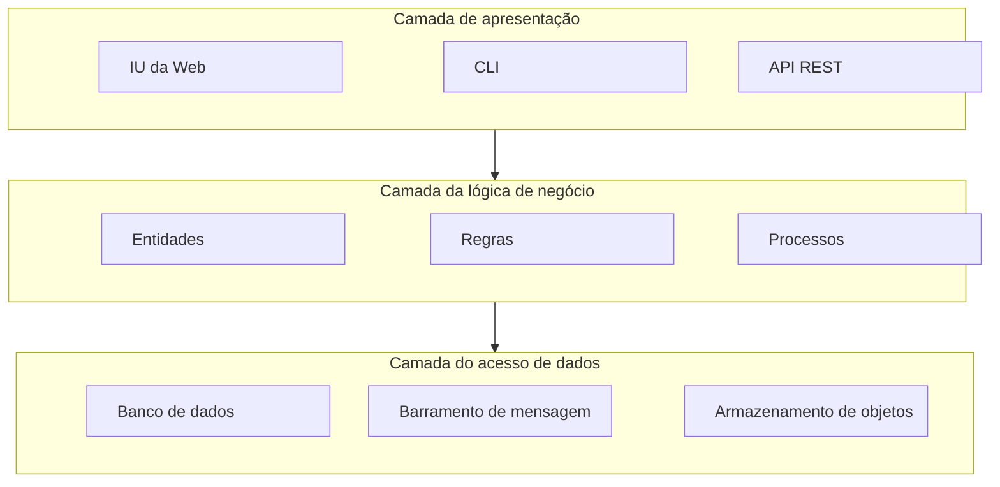
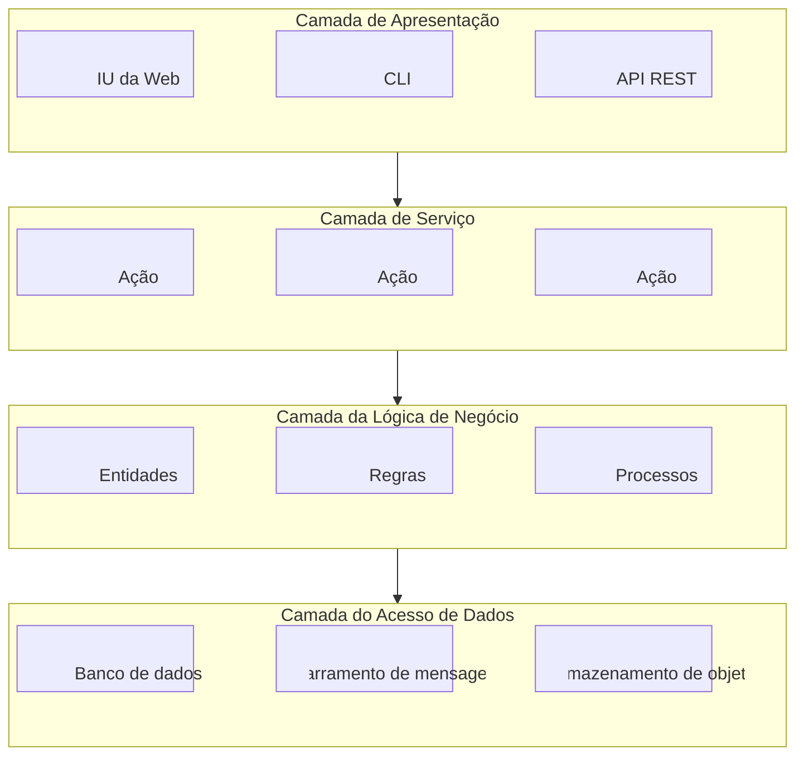
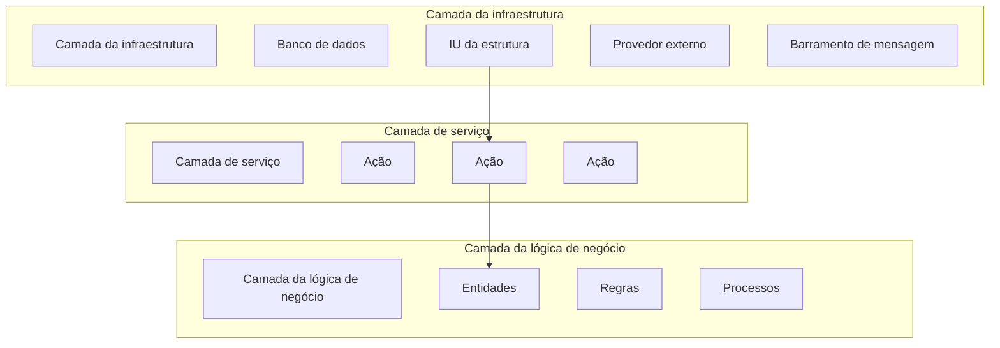

# Aprenda Domain Driven Design: Alinhando arquitetura de software e estratégia de negócio
Exemplos de código do livro: https://github.com/forks-projects/learning-ddd

Wolfdesk: gestão de tickets de help desk    
- cobra pelo número de tickets e não pelo número de usuários
- utiliza um algoritmo para fechar tickets automaticamente e tem sistema detecção de fraudes
- "suporte em piloto automático": tenta encontrar um solução adequada com base no histórico
- sistema de autenticação e autorização
- administração de categorias para o tickets
- permite inserção de cronogramas de turnos para equipe de suporte
- escala de forma elastica utilizando computação sem servidor (serverless)


## Parte I
### Capítulo 1
- design estratégico
  - domínio
    - subdomínio principal
    - subdomínio genérico
    - subdomínio suporte
- design tático

### Capítulo 2
- linguagem ubíqua: liguagem comum utilizada entre pessoas técnicas e de negócio. Como ferramentas podemos utilizar uma wiki, a linguagem gherkin e NDpend para verificar o uso de termos da linguagem ubíqua.
- modelo: representação do mundo real, por exemplo, todo mapa é um modelo. A representação de negócio dos especialistas têm como resultado um modelo de negócio.


### Capítulo 3
Inconsistência:
- lead no marketing: receber informações de um cliente
- lead no departamento de vendas: todo o ciclo do processo de vendas
- Uma solução é trazer o modelo simples do marketing para a vendas ou o complexo de vendas para o marketing, mas ambos trazem problemas. Outra solução é adicionar uma palavra no final de cada item: lead de marketing e lead de vendas. O lado ruim, é que aumenta a carga cognitiva e o modelo de negócio estará diferente da linguagem obiqua.
- Contexto delimitado: é a ferramenta do design estratégico que organiza a complexidade do software ao separar grandes problemas em "caixas" menores e independentes.
- uma equipe pode trabalhar com um ou mais contextos delimitados, mas duas equipes não podem trabalhar num mesmo contexto delimitado


### Capítulo 4
comunicação e integração de contexto delimitado
- cooperação
  - padrão parceria: equipes se cooperam e se adaptam - sem dramas ou conflitos
  - padrão de núcleo compartilhado: contextos delimitados compartilham um mesmo modelo compartilhado
- cliente-fornecedor:
  - conformista: O cliente aceita o modelo do fornecedor sem mudanças.
  - camada anti-corrupção: O cliente traduz o modelo do fornecedor para o seu próprio modelo para não se "sujar".
  - Serviço de host aberto - Open Host Service (OHS): O fornecedor expõe uma "Linguagem Publicada" (contrato estável) para que múltiplos clientes possam se integrar de forma uniforme.
- caminhos separados:

Mapa de contexto: é a representação visual das relações e integrações entre os diferentes Contextos Delimitados (Bounded Contexts) de um sistema. É a fotografia estratégica do sistema. Ele não mostra tabelas ou classes, mas sim como os Bounded Contexts estão ligados e qual o nível de acoplamento (técnico e organizacional) entre eles.

## Parte II
### Capítulo 5 - Implementando uma lógica de negócio simples
- script de tranasação (transcation script): organiza a lógica de negócio em que cada procedimento lida com uma única solicitação de apresentação (Martin Fowler). O comportamento do procedimento é manter consistente em caso de sucesso e falha, isso significa que no caso de falha, deve reverter ou executar ações compensatórias.
  - Focado no processo. Um método faz tudo (lógica + banco). Ideal para fluxos lineares em subdomínios de baixo valor.
  - utilizado em subdomínio genérico e subdomínio de suporte
```python
def criar_pedido(cliente_id, itens):
    cliente = db.buscar_cliente(cliente_id)
    
    if not cliente.ativo:
        raise Exception("Cliente inativo")

    pedido_id = db.inserir_pedido(cliente_id)

    for item in itens:
        db.inserir_item(pedido_id, item)

    return pedido_id


def criar_pedido():
    # tudo aqui dentro
```

- registro ativo: um objeto que envolve uma linha em uma tabela ou uma visão do banco de dados encapsula o acesso ao banco de dados e adiciona a lógica de domínio nesses dados (Martin Fowler)
  - Focado na estrutura. O objeto de dados tem métodos para persistência (Save, Update). Ideal para CRUDs em subdomínios de suporte onde a estrutura do banco é o espelho do negócio.
  - utilizado em subdomínio de suporte
  - Muito comum em frameworks (ex: ORM)
```python
class Pedido:
    def __init__(self, cliente):
        self.cliente = cliente
        self.itens = []

    def adicionar_item(self, item):
        self.itens.append(item)

    def salvar(self):
        if not self.cliente.ativo:
            raise Exception("Cliente inativo")

        db.inserir_pedido(self)

pedido = Pedido(cliente)
pedido.adicionar_item(item)
pedido.salvar()
```


### Capítulo 6 - Lidando com a Lógica de Negócio Complexa
- Modelo de domínio
  - invariantes: regras de negócio que devem ser cumpridas o tempo todo
  - padrões táticos do DDD: agregações, objetos de valor, eventos de domínio e serviços de domínio
#### Blocos de construção
- objetos de valor: Não tem uma propriedade de identificação. O conjunto das propriedades combinadas, diferenciam um objeto de outro. Ao alterar uma das propriedades já torno um objeto de valores diferente de outros. Evite sempre usar tipos primitivos para todas as propriedades.
- entidades: Utiliza um identificador. A entidade é mutável.
- agregados: é uma entidade, uma hierarquia de entidades que compartilham um limite transacional. 
  - devem garantir as invariantes e regras de negócio
  - garantir a simultaneidade através de transações do banco de dados. No livro é apresentado o lock otimista, onde uma transação não é bloqueada ao utilizar uma coluna no banco de dados. Para isso, é realizado o versionamento do registro do banco dados utilizando uma coluna no banco de dados. Sempre que for realizada uma atualização, é necessário passar o identificador do agregado e um versionamento, normalmente recuperado em tempo de execução. O registro somente é atualizado quando atender a esta condição:
```sql
UPDATE tickets 
SET ticket_status = @new_status, 
    agg_version = agg_version + 1
WHERE ticket_id = @id AND agg_version = @expected_version;
```
  - transação atômica
  - hierarquia de entidades:
  - referência a outros agregados: dados eventualmente consistentes
  - raiz do agregado: é a entidade principal que esconde do mundo externo as entidades que fazem parte do agregado. Toda mudança deve passar pela raiz do agregado, protegendo que alterações não respeitem as invariantes e regras de negócio. Uma atualização de valor somente deve ocorrer passando pela raiz do agregado.
  - eventos de domínio: é uma mensagem que descreve um evento significativo que ocorreu no domínio de negócio: ticket atribuído, ticket escalonado e mensagem recebida.
- serviços de domínio: lógica de negócio que não pertence ao agregado e nem objetos de valor. Ou relevante para multiplos agregados. É um objeto sem estados que implementa lógica de negócios.
- administando a complexidade: os agregados e objetos de valor tratam a complexidade das regras de negócio. Uma estrutura de dados (classe) que possui mais elementos de dados (limites) é mais complexa. No livro apresenta duas classes, uma tem diversos atributos e outro somente 2. A classe com somente 2 atributos é menos complexa porque possui menos atributos (limites) mesmo que possua uma lógica maior devidos as invariantes, mas têm apenas 2 atributos (limites) que podem ser modificados.


> relembrando sobre o design estratégico, neste momento estamos falando de um subdomínio principal, onde existe uma lógica de negócio complexa e traz uma vantagem competitiva em relação a seus concorrentes. Neste cenário estamos trazendo a abordangem do design tático utilizando o modelo de domínio. Já passamos por outras duas lógicas de negócio simples: transação de scripts e registro ativo.

code smell: https://wiki.c2.com/?PrimitiveObsession


**Entidade não é um "bloco independente"?**    
Este é o "pulo do gato" do Khononov. Em outros livros de DDD, a Entidade é apresentada como algo que você cria sozinho. O Khononov diz que **não implementamos entidades sozinhas**, mas dentro de um **Agregado**.

**Por que isso?**    
Imagine uma Entidade `ItemPedido` e uma Entidade `Pedido`.
* Se você pudesse alterar o `ItemPedido` diretamente, sem passar pelo `Pedido`, você poderia corromper a regra de negócio (ex: o valor total do pedido ficaria errado).
* Portanto, a Entidade só faz sentido dentro de uma fronteira de consistência chamada **Agregado**. O Agregado é o "pai" que protege suas entidades filhas.


**Diferença entre invariante e regra de negócio**    
1. Invariante (O "Sempre" do Sistema)
Uma **invariante** é uma regra de negócio que **não pode ser violada em nenhum momento**. Ela define a integridade básica do Agregado. Se uma invariante for quebrada, o estado do objeto é considerado "corrompido" ou inválido.

* **Foco:** Consistência e Proteção.
* **Onde fica:** Dentro do Agregado
* **Exemplo:** "O saldo de uma conta nunca pode ser negativo" ou "Um pedido não pode ter zero itens". 
* **No código:** O método `AddMessage` na imagem deveria verificar se o `body` está vazio. Se estiver, ele lança uma exceção. Essa é uma proteção de invariante.

2. Regra de Negócio (A Lógica de Fluxo)
Uma **regra de negócio** é um conceito mais amplo. Ela descreve *como* o negócio funciona, as políticas e os cálculos. Algumas regras de negócio podem mudar dependendo do contexto ou do tempo, enquanto as invariantes costumam ser mais rígidas.

* **Foco:** Comportamento e Decisão.
* **Exemplo:** "Se o cliente for VIP, dê 10% de desconto" ou "Se o ticket não for resolvido em 24h, escalone para o gerente".
* **No código:** Na imagem, o método `Escalate` (linha 01 do segundo bloco) aplica uma regra de negócio de escalonamento baseada em uma razão.

Analogia para não esquecer (O Avião)

Imagine que estamos modelando um **Avião**:

* **Invariante:** "O avião não pode decolar com as portas abertas." (Se isso acontecer, o sistema está num estado perigoso/inválido. O Agregado `Aviao` garante isso no método `Decolar()`).
* **Regra de Negócio:** "O valor da passagem para crianças tem 50% de desconto." (É uma regra de como o negócio opera, mas se o desconto for aplicado errado, o avião ainda voa com segurança; o estado técnico do sistema não está corrompido, apenas a regra comercial falhou).


### Capítulo 7 - Modelando a dimensão do Tempo
#### Event Sourcing
> Não adianta me mostrar o fluxo do seu código (if/else e loops) se eu não puder ver o seu Event Store. Se você me mostrar a sua tabela de eventos, eu vou entender a lógica do seu negócio na hora; o estado atual do sistema será apenas uma consequência óbvia.

> O código explica o processo, mas os eventos explicam o domínio. No Event Sourcing, a fonte da verdade não é o que o sistema é agora, mas tudo o que ele foi até chegar aqui.

- Modelo de domínio: persiste em um estado do agregado
- Modelo de domínio orientado a eventos: gera eventos de domínio que descrevem cada estado


---
**Busca**    
Vlad Khononov explica que o **Event Sourcing** muda a forma como pensamos sobre os dados. Em sistemas tradicionais, se você altera um telefone, o valor antigo some para sempre. No Event Sourcing, o "passado" é preservado no **Armazenamento de Eventos (Event Store)**.

Vamos entender por que essa "Busca" específica da imagem é necessária e quando usá-la:

**🎯 O Cenário de Uso**    
Imagine um sistema de vendas (CRM). Um lead chamado **"Carlos Silva"** trocou de telefone e de sobrenome (agora é **"Carlos Souza"**). 

* **O Problema:** Um vendedor que falou com ele há seis meses só o conhece como "Carlos Silva" e tem apenas o telefone antigo anotado num papel. Se ele buscar pelo nome antigo no "estado atual" do sistema, **não encontrará nada**.
* **A Necessidade:** O negócio exige que os agentes consigam localizar leads usando **qualquer informação que já foi verdade um dia**.


Aqui é onde cada mudança é salva como um fato imutável. Não existe "update", apenas novos registros.

| Sequência | Lead_Id | Tipo do Evento | Dados (JSON/Payload) | Data_Hora |
| :--- | :--- | :--- | :--- | :--- |
| 1 | 101 | `LeadInitialized` | `{"nome": "Carlos", "sobrenome": "Silva", "tel": "11999"}` | 10/01/2026 |
| 2 | 101 | `ContactDetailsChanged` | `{"novo_sobrenome": "Souza", "novo_tel": "11888"}` | 15/04/2026 |


**2. A Projeção de Busca: Tabela de Leitura (`LeadSearchModel`)**
Esta é a tabela baseada no código que você enviou. Ela é "alimentada" pelos eventos acima para facilitar a busca por qualquer valor histórico.

| Lead_Id | Nomes (Histórico) | Sobrenomes (Histórico) | Telefones (Histórico) | Versão |
| :--- | :--- | :--- | :--- | :--- |
| 101 | `["Carlos"]` | `["Silva", "Souza"]` | `["11999", "11888"]` | 2 |


<details>

```c#
public class LeadSearchModelProjection
{
    public long LeadId { get; private set; }
    public HashSet<string> FirstNames { get; private set; }
    public HashSet<string> LastNames { get; private set; }
    public HashSet<PhoneNumber> PhoneNumbers { get; private set; }
    public int Version { get; private set; }

    public void Apply(LeadInitialized @event)
    {
        LeadId = @event.LeadId;
        FirstNames = new HashSet < string > ();
        LastNames = new HashSet < string > ();
        PhoneNumbers = new HashSet < PhoneNumber > ();
        FirstNames.Add(@event.FirstName);
        LastNames.Add(@event.LastName);
        PhoneNumbers.Add(@event.PhoneNumber);
        Version = 0;
    }

    public void Apply(ContactDetailsChanged @event)
    {
        FirstNames.Add(@event.FirstName);
        LastNames.Add(@event.LastName);
        PhoneNumbers.Add(@event.PhoneNumber);
        Version += 1;
    }

    public void Apply(Contacted @event)
    {
        Version += 1;
    }

    public void Apply(FollowupSet @event)
    {
        Version += 1;
    }

    public void Apply(OrderSubmitted @event)
    {
        Version += 1;
    }

    public void Apply(PaymentConfirmed @event)
    {
        Version += 1;
    }
}
```
</details>


---
**Análise**    
Enquanto a "Busca" (que vimos antes) foca em localizar um registro específico (como achar um Lead pelo telefone antigo), a **Análise** foca em **derivar novos conhecimentos** a partir do histórico de eventos para apoiar decisões de negócio.


**🏛️ 1. Explicação Arquitetural (O que é Análise?)**    
No Event Sourcing, os eventos são a base para tudo. A "Análise" é uma **Projeção de Estado** que acumula dados para responder perguntas gerenciais ou estatísticas. 

Diferente do Agregado (que só precisa do estado atual para validar regras), a Projeção de Análise olha para o fluxo de eventos e extrai métricas. No exemplo das imagens, o objetivo é contar "Follow-ups" (acompanhamentos). O sistema não "salva" o número 1 no histórico; ele conta quantas vezes o evento `FollowupScheduled` ocorreu.


**🎯 Cenário de Uso: Inteligência Comercial**    
Imagine que o Diretor de Vendas faça a seguinte pergunta:
> *"Nossos Leads convertidos estão recebendo atenção suficiente? Qual a média de contatos que fazemos antes de fechar uma venda?"*

* **A Necessidade:** O departamento de Inteligência Comercial precisa filtrar leads por status (`Converted`) e ver o contador de interações (`Followups`).
* **O Valor:** Com essa projeção, eles descobrem que leads com mais de 3 follow-ups têm 80% mais chance de conversão. Isso permite otimizar o processo de vendas.


**🗄️ 3. Representação no Banco de Dados**    
Diferente da tabela de busca (que tinha listas de nomes), a tabela de **Análise** foca em contadores e status consolidados.

Tabela de Eventos (`EventStore`) - A Origem
| Sequência | Lead_Id | Tipo do Evento | Payload |
| :--- | :--- | :--- | :--- |
| 1 | 12 | `LeadInitialized` | `{"status": "New"}` |
| 2 | 12 | `FollowupScheduled` | `{"date": "2026-04-20"}` |
| 3 | 12 | `LeadConverted` | `{"value": 5000}` |

Tabela de Projeção de Análise (`LeadAnalytics`) - O Resultado    
Essa é a tabela física que o SQL do pessoal de BI vai consultar:
| Lead_Id | Followups (Contador) | Status (Atual) | Versão (Último Evento) |
| :--- | :--- | :--- | :--- |
| **12** | **1** | **Converted** | **6** |


<details>

```c#
public class AnalysisModelProjection
{
    public long LeadId { get; private set; }
    public int Followups { get; private set; }
    public LeadStatus Status { get; private set; }
    public int Version { get; private set; }

    public void Apply(LeadInitialized @event)
    {
        LeadId = @event.LeadId;
        Followups = 0;
        Status = LeadStatus.NEW_LEAD;
        Version = 0;
    }

    public void Apply(Contacted @event)
    {
        Version += 1;
    }

    public void Apply(FollowupSet @event)
    {
        Status = LeadStatus.FOLLOWUP_SET;
        Followups += 1;
        Version += 1;
    }

    public void Apply(ContactDetailsChanged @event)
    {
        Version += 1;
    }

    public void Apply(OrderSubmitted @event)
    {
        Status = LeadStatus.PENDING_PAYMENT;
        Version += 1;
    }

    public void Apply(PaymentConfirmed @event)
    {
        Status = LeadStatus.CONVERTED;
        Version += 1;
    }
}
```
</details>


---

**Fonte confiável**    
**🏛️ 1. Explicação Arquitetural**    
Em sistemas tradicionais, a "verdade" é o estado atual (ex: o saldo atual de uma conta). No **Event Sourcing**, a **Fonte Confiável** não é o estado, mas sim a **sequência de eventos** que levou a esse estado. 

O **Armazenamento de Eventos** (*Event Store*) é o único lugar onde os dados são gravados com consistência forte. Como mostra a imagem que você enviou, o Agregado é "reidratado" lendo esses eventos. Se a tabela de "Busca" ou de "Análise" (projeções) sumir, você não perde nada, pois pode reconstruí-las inteiras lendo a Fonte Confiável.

**🎯 2. Cenário de Uso: Auditoria e Reconstrução**    
Imagine que o departamento de conformidade (Compliance) questiona por que um Lead foi marcado como "Convertido" se não há registros de chamadas.

* **Sem Event Sourcing:** Você olha o banco de dados e vê `status: Converted`. Você não sabe *como* ou *quem* mudou, apenas que está assim agora.
* **Com Fonte Confiável (Event Sourcing):** Você recorre ao Event Store e vê a linha do tempo exata:
    1.  `LeadInitialized` (10:00)
    2.  `FollowupScheduled` (10:05)
    3.  `LeadConverted` (10:10)
    A Fonte Confiável prova que a conversão seguiu o processo. Se houver um erro na tabela de análise (ex: o contador de follow-ups estiver em 0 por um bug), a Fonte Confiável é usada para corrigir a projeção.


| Global_Pos | Stream_ID (Lead_Id) | Tipo_Evento | Dados (Payload JSON) | Versão |
| :--- | :--- | :--- | :--- | :--- |
| 1 | 12 | `LeadInitialized` | `{"vendedor": "Ana"}` | 1 |
| 2 | 12 | `FollowupScheduled` | `{"canal": "WhatsApp"}` | 2 |
| 3 | 12 | `LeadConverted` | `{"valor": 1500}` | 3 |


---
**Armazenamento de eventos**    
O **Armazenamento de Eventos** (*Event Store*) é o coração do padrão *Event Sourcing*. Em vez de salvar apenas o estado final de um objeto, ele registra cada mudança individual como um evento imutável. 📜

Aqui estão os pontos fundamentais do resumo:

* **Imutabilidade (Append-only) 🚫**: Diferente de bancos de dados tradicionais, você nunca altera ou exclui um evento. Novas informações são apenas anexadas ao fim do registro, como em um livro-razão financeiro.
* **Funcionalidades Básicas 🛠️**: O armazenamento precisa permitir duas ações principais:
    1.  **Buscar (Fetch)**: Recuperar todos os eventos de uma entidade específica para reconstruir seu estado.
    2.  **Anexar (Append)**: Adicionar novos eventos ao histórico.
* **Controle de Concorrência 🔄**: O uso do parâmetro `expectedVersion` garante que você não salve eventos baseados em informações obsoletas. Se outra pessoa alterou a entidade enquanto você tomava uma decisão, o sistema gera uma exceção para evitar conflitos.
* **Projeção de Estado 📈**: O "estado atual" (como um saldo bancário) não é o dado primário, mas sim o resultado da soma de todos os eventos registrados até aquele momento.


---
#### Modelo de domínio orientado a eventos
**1. Explicação Arquitetural 🏗️**    
Diferente de um modelo baseado em estado, onde o banco de dados reflete o "agora", a arquitetura de Event Sourcing funciona como um livro-razão contábil.

**Fluxo de Poder e Dados:**
1.  **Comando**: O usuário solicita uma mudança (ex: `MudarEndereco`).
2.  **Agregado**: Carrega todos os eventos passados do `Event Store` para reconstruir seu estado interno.
3.  **Lógica de Negócio**: O Agregado decide se a mudança é válida.
4.  **Evento**: Se válida, o Agregado gera um evento (`EnderecoAlterado`).
5.  **Append**: O evento é anexado ao `Event Store`.

<details>

```c#
public class TicketAPI
{
    private ITicketsRepository _ticketsRepository;
    // ...
  
    public void RequestEscalation(TicketId id)
    {
        var events = _ticketsRepository.LoadEvents(id);
        var ticket = new Ticket(events);
        var originalVersion = ticket.Version;
        var cmd = new RequestEscalation();
        ticket.Execute(cmd);
        _ticketsRepository.CommitChanges(ticket, originalVersion);
    }
 
    // ...
}
```

```c#
public class Ticket
{
    // ...
    private List<DomainEvent> _domainEvents = new List<DomainEvent>();
    private TicketState _state;
    // ...
  
    public Ticket(IEnumerable<IDomainEvents> events)
    {
        _state = new TicketState();
        foreach (var e in events)
        {
            AppendEvent(e);
        }
    }

    private void AppendEvent(IDomainEvent @event)
    {
        _domainEvents.Append(@event);
        // Dynamically call the correct overload of the “Apply” method.
        ((dynamic)state).Apply((dynamic)@event);
    }

    public void Execute(RequestEscalation cmd)
    {
        if (!_state.IsEscalated && _state.RemainingTimePercentage <= 0)
        {
            var escalatedEvent = new TicketEscalated(_id, cmd.Reason);
            AppendEvent(escalatedEvent);
        }
    }
    
    // ...
}
```


```c#
public class TicketState
{
    public TicketId Id { get; private set; }
    public int Version { get; private set; }
    public bool IsEscalated { get; private set; }
    // ...
    public void Apply(TicketInitialized @event)
    {
        Id = @event.Id;
        Version = 0;
        IsEscalated = false;
        // ....
    }
 
    public void Apply(TicketEscalated @event)
    {
        IsEscalated = true;
        Version += 1;
    }
 
    // ...
}
```
</details>

- Vantagens
  - Viagem no tempo
  - Insight profundo
  - Log de auditoria
  - Gerenciamento avançado de concorrência otimista
- Desvantagens
  - curva de aprendizado
  - desenvolvendo o modelo
  - complexidade arquitetônica


- Perguntas mais frequentes
  - Desempenho
  - Deletando dados: **forgatteble payload**: informações sensíveis são armazenadas em eventos de forma criptografada. A chave de criptografia é armazenada em local externo. Quando é necessário excluir é apagada do armazenamento de chaves
  - Por que não posso simplesmente ...:
    - gravar logs em arquivos e usar como log de auditoria?: o autor dá um exemplo de falha após o log ser gerado. Se o primeiro (banco de dados) falha, o segundo tem que ser revertido (log)
    - trabalhar com um modelo baseado em estado e na mesma tranasação, anexar logs em uma tabela de logs? R: o autor lembra do caso de engenheiro esquecer de anexar o registro de log. Outro exemplo quando se utiliza a representação de estado com confiável, a tabela de logs adicional pode não conter todas as informações necessárias
    -trabalhar com um modelo baseado em estado e acrescentar um gatilho no banco de dados para salvar um snapshot? R: o histórico resultante gera dados secos, falta contexto de negócio informando o que foi alterado e o motivo.


#### Gerado por IA
**Sobre armazenamento de eventos**    
No Capítulo 7 de Vlad Khononov, o armazenamento de eventos (**Event Store**) deixa de ser apenas um banco de dados comum para se tornar a **única fonte da verdade** 📜. Enquanto em sistemas tradicionais salvamos o "estado atual" (o saldo final), no Event Sourcing salvamos a "história" (cada depósito e cada saque).

O ponto principal que você deve se atentar é a **Imutabilidade** 🛡️. Em um Event Store purista, operações de `UPDATE` ou `DELETE` são proibidas. Se algo aconteceu no passado, aquilo é um fato imutável. Para corrigir um erro, você não apaga o evento; você anexa um novo "evento de compensação".


### Capítulo 8 - Padrões de arquitetura
#### Arquitetura em camadas
Camadas horizontais com as seguintes preocupações: 
- camada de apresentação (interação com clientes)
- camada lógica de negócio (implementação da lógica de negócio)
- camada de acesso a dados (persintência dos dados)

**camada de apresentação**    
- Interface Gráfica do Usuário (GUI) 
- Interface da linha de comando (CLI) 
- API para integração programática com outros sistemas Assinatura de eventos em um intermediário de mensagens 
- Tópicos de mensagem para a publicação dos eventos de saída 
```
Camada de apresentação [IU da web] [CLI] [API REST]
```


**camada lógica de negócio**   
Nesta camada vemos os padrões de lógicas discutidos anteriormente: script de transação, registro ativo, modelo de domínio e modelo de dominio orientado a eventos (Event Storm)

```
Camada logica de negócio [Entidades] [Regras] [Processos]
```

**camada de acesso a dados**
- banco de dados
- eventos
- mensagens
```
Camada de acesso a dados [Entidades] [Regras] [Processos]
```

**Comunicação entre camadas**



**VARIAÇÂO - Camada de Serviços**
<details>
<summary>Exemplo de camada de serviço utilizando o MVC para criar um novo usuário. A criação de usuário utilizado o padrão REGISTRO ATIVO (active record) para armazenar no banco de dados</summary>

```c#
namespace MvcApplication.Controllers
{
    public class UserController: Controller
    {
        // ...

        [AcceptVerbs(HttpVerbs.Post)]
        public ActionResult Create(ContactDetails contactDetails)
        {
            OperationResult result = null;

            try
            {
                _db.StartTransaction();
                
                var user = new User();
                user.SetContactDetails(contactDetails)
                user.Save();
                
                _db.Commit();
                result = OperationResult.Success;
            } catch (Exception ex) {
                _db.Rollback();
                result = OperationResult.Exception(ex);
            }

            return View(result);
        }
    }
}
```
</details>


Para desacoplar a camada de apresentação da camada de negócio é possível utilizar uma camada de serviço. Ex:


<details>
<summary>Exemplo de separação da acamada de apresentação utilizando uma camada de serviço</summary>

```c#
interface CampaignManagementService
{
      OperationResult CreateCampaign(CampaignDetails details);
      OperationResult Publish(CampaignId id, PublishingSchedule schedule);
      OperationResult Deactivate(CampaignId id);
      OperationResult AddDisplayLocation(CampaignId id, DisplayLocation newLocation);
      // ...
}
```

```c#
namespace ServiceLayer
{
    public class UserService
    {
        // ...
        
        public OperationResult Create(ContactDetails contactDetails)
        {
            OperationResult result = null;

            try
            {
                _db.StartTransaction();
                
                var user = new User();
                user.SetContactDetails(contactDetails)
                user.Save();

                _db.Commit();
                result = OperationResult.Success;
            } catch (Exception ex) {
                _db.Rollback();
                result = OperationResult.Exception(ex);
            }

            return result;
        }

        // ...
    }
}
```

```c#
namespace MvcApplication.Controllers
{
    public class UserController: Controller
    {
        // ...

        [AcceptVerbs(HttpVerbs.Post)]
        public ActionResult Create(ContactDetails contactDetails)
        {
            var result = _userService.Create(contactDetails);
            return View(result);
        }
    }
}
```
</details>

**Quando utilizar?**    
Quando a lógica de negócio utiliza o padrão **script de transação** ou **registro ativo**.


#### Portas e adaptadores
Utilizada para implementar a lógica de negócio mais complexa.

Princípio da inmversão de dependência é um conceito forte no portas e adaptadores.



Arquitetura porta de adaptadores:


Exemplo de implementação de adaptador concreto na camada de infraestrutura para um barramento de mensagem:
```c#
namespace App.BusinessLogicLayer
{
    public interface IMessaging
    {
        void Publish(Message payload);
        void Subscribe(Message type, Action callback);
    }
}

namespace App.Infrastructure.Adapters
{
    public class SQSBus: IMessaging { 
    /*  
      implementação dos métodos Publish e Subscribe
     */ 
    }
}
```

A arquitetura de portas e adaptadores também é conhecida como arquitetura hexagonal, arquitetura cebola e arquitetura limpa, mas a terminologia pode ser diferente.


```
Camada do aplicativo = camada de serviço = camada do caso de uso 
Camada da lógica de negócio = camada de domínio = camada principal
```

**Quando utilizar?**
Perfeita para aplicar a lógica de negócio utilizando o padrão de modelo de domínio.


#### CQRS (Command Query Responsability Segregation)
Segregação de Responsabilidade de Comando e Consulta

1- Sistemas que utilizam o processamento de transação online (OLTP) e processamento analítico online(OLAP)
2- Um único sistema utilizar um banco de dados para armazenamento de documentos, um armazenamento para colunas/relatório e um mecanismo de buscas robustas


**MAPEAMENTO ARQUITETURAL: Ferramentas de Mercado 🏛️**    
No **CQRS**, cada armazenamento resolve um problema específico de acesso a dados:

* **Armazenamento de Documentos (Escrita/Comando):** Foca em consistência e atomicidade do Agregado.
    * *Exemplos:* **DynamoDB**,**MongoDB** 🍃 ou **PostgreSQL** (usando tipos JSONB).
* **Armazenamento de Colunas (Analítico):** Otimizado para ler grandes volumes e agregar valores (Soma, Média).
    * *Exemplos:* **Redshift**, **ClickHouse** 🏠 ou **Google BigQuery**.
* **Mecanismo de Busca (Consulta Complexa):** Foca em pesquisa textual e filtros dinâmicos.
    * *Exemplos:* **Elasticsearch** 🔍 ou **Apache Solr**.

> Está relacionado ao **event source** (modelo de domínio orientado a eventos) falado no capítulo 7.


O padrão separa em dois tipos:
- modelo de execução de comando
- modelo de leitura


**Modelo de execução de comando**    
- Utiliza somente um modelo para executar operações que alteram o estado do sistema
- Aplica a lógica de negócio, valida regras e aplica invariantes
- É modelo que representa dados fortemente consistentes, ou seja, após um comando ser executado, o estado resultante é imediatamente consistente, não existe “eventualmente correto”
- Tem suporte a concorrência otimista


**Modelo de leitura**    
- Utiliza quantos modelos forem necessários
- É uma projeção pré-cache, pode residir em banco de dados durável, um arquivo simples ou cachê de memória
- Nenhuma operação do sistema pode modificar diretamente os dados do modelo de leitura


**Projeção síncrona**    
A assinatura catch-up (ou busca ativa) é o mecanismo que permite ao sistema de leitura "alcançar" o estado do sistema de escrita de forma incremental e resiliente. No contexto do CQRS, ela funciona como um processo de sincronização contínua.

- mecanismo de projeção busca informação no banco de dados OLTP
- mecanismo de projeção atualiza o modelo de leitura do sistema
- mecanismo de projeção armazena o último registro atualizado (checkpoint)


*   **Ponto 1: Consulta de Incrementos (Onde paramos?):** O mecanismo de projeção utiliza o checkpoint para identificar a posição exata do último registro processado no banco de dados OLTP. Ele solicita apenas os dados que possuem um valor de versão ou ID superior a esse marcador, garantindo que apenas as novidades sejam capturadas.
*   **Ponto 2: Atualização do Modelo (Transformação):** Os dados obtidos a partir do checkpoint são usados para regenerar ou atualizar os modelos de leitura. Esse processo transforma a informação bruta do modelo de comando em uma estrutura otimizada para consultas rápidas no destino.
*   **Ponto 3: Persistência do Progresso (Garantia de Continuidade):** Após o processamento bem-sucedido, o novo valor do último registro é gravado como o checkpoint atualizado. Esse registro de progresso é o que permite ao sistema retomar o trabalho corretamente em uma próxima iteração ou reconstruir toda a projeção do zero caso o valor seja resetado para 0.


**Projeção assíncrona**    
Nas projeções assíncronas, o modelo de execução de comando publica as mudanças para um barramento de mensagem.

O mecanismo de projeção utiliza as mensagens para atualizar o modelo de leitura.


**Segregação do modelo**    
A segregação do modelo no CQRS não é apenas uma separação de tabelas ou classes; é uma separação de intenções e garantias de consistência.

- Comandos (Escrita): Focam na execução da lógica de negócio e operam no modelo fortemente consistente. Khononov é enfático: o comando deve informar se teve sucesso ou falhou e, se necessário, retornar dados resultantes da operação para evitar idas e vindas (roundtrips) desnecessárias.
- Consultas (Leitura): Operam em modelos que frequentemente são eventualmente consistentes. Elas não podem modificar o estado do sistema.


**Quando utilizar?**    
o CQRS serve naturalmente para modelos de domínio orientado a eventos


**Conclusão**    
A escolha da arquitetura não é uma questão de preferência estética, mas sim de **complexidade do domínio** e **estratégia de consistência**. 

- **Arquitetura em Camadas (Layered):** Decompõe o sistema por preocupações tecnológicas (Apresentação -> Negócio -> Dados). É adequada para padrões de **Registro Ativo (Active Record)** onde a lógica de negócio e o acesso a dados estão acoplados.
- **Portas e Adaptadores (Hexagonal):** Inverte as relações, colocando a **Lógica de Negócio no centro** e isolando-a de dependências externas (bancos de dados, APIs). É o padrão ideal para o **Modelo de Domínio (Domain Model)** purista.
- **CQRS:** Segrega os modelos de leitura e escrita. É obrigatório para sistemas baseados em **Event Sourcing** ou quando múltiplos modelos persistentes são necessários para atender diferentes requisitos de performance e busca.


