# Aprenda Domain Driven Design: Alinhando arquitetura de software e estratégia de negócio
Exemplos de código do livro: https://github.com/forks-projects/learning-ddd

Wolfdesk: gestão de tickets de help desk    
- cobra pelo número de tickets e não pelo número de usuários
- utiliza um algoritmo para fechar tickets automaticamente e tem sistema detecção de fraudes
- "suporte em piloto automático": tenta encontrar um solução adequada com base no histórico
- sistema de autenticação e autorização
- administração de categorias para o tickets
- permite inserção de cronogramas de turnos para equipe de suporte
- escala de forma elastica utilizando computação sem servidor (serverless)


## Parte I
### Capítulo 1
- design estratégico
  - domínio
    - subdomínio principal
    - subdomínio genérico
    - subdomínio suporte
- design tático

### Capítulo 2
- linguagem ubíqua: liguagem comum utilizada entre pessoas técnicas e de negócio. Como ferramentas podemos utilizar uma wiki, a linguagem gherkin e NDpend para verificar o uso de termos da linguagem ubíqua.
- modelo: representação do mundo real, por exemplo, todo mapa é um modelo. A representação de negócio dos especialistas têm como resultado um modelo de negócio.


### Capítulo 3
Inconsistência:
- lead no marketing: receber informações de um cliente
- lead no departamento de vendas: todo o ciclo do processo de vendas
- Uma solução é trazer o modelo simples do marketing para a vendas ou o complexo de vendas para o marketing, mas ambos trazem problemas. Outra solução é adicionar uma palavra no final de cada item: lead de marketing e lead de vendas. O lado ruim, é que aumenta a carga cognitiva e o modelo de negócio estará diferente da linguagem obiqua.
- Contexto delimitado: é a ferramenta do design estratégico que organiza a complexidade do software ao separar grandes problemas em "caixas" menores e independentes.
- uma equipe pode trabalhar com um ou mais contextos delimitados, mas duas equipes não podem trabalhar num mesmo contexto delimitado


### Capítulo 4
comunicação e integração de contexto delimitado
- cooperação
  - padrão parceria: equipes se cooperam e se adaptam - sem dramas ou conflitos
  - padrão de núcleo compartilhado: contextos delimitados compartilham um mesmo modelo compartilhado
- cliente-fornecedor:
  - conformista: O cliente aceita o modelo do fornecedor sem mudanças.
  - camada anti-corrupção: O cliente traduz o modelo do fornecedor para o seu próprio modelo para não se "sujar".
  - Serviço de host aberto - Open Host Service (OHS): O fornecedor expõe uma "Linguagem Publicada" (contrato estável) para que múltiplos clientes possam se integrar de forma uniforme.
- caminhos separados:

Mapa de contexto: é a representação visual das relações e integrações entre os diferentes Contextos Delimitados (Bounded Contexts) de um sistema. É a fotografia estratégica do sistema. Ele não mostra tabelas ou classes, mas sim como os Bounded Contexts estão ligados e qual o nível de acoplamento (técnico e organizacional) entre eles.

## Parte II
### Capítulo 5 - Implementando uma lógica de negócio simples
- script de tranasação (transcation script): organiza a lógica de negócio em que cada procedimento lida com uma única solicitação de apresentação (Martin Fowler). O comportamento do procedimento é manter consistente em caso de sucesso e falha, isso significa que no caso de falha, deve reverter ou executar ações compensatórias.
  - Focado no processo. Um método faz tudo (lógica + banco). Ideal para fluxos lineares em subdomínios de baixo valor.
  - utilizado em subdomínio genérico e subdomínio de suporte
```python
def criar_pedido(cliente_id, itens):
    cliente = db.buscar_cliente(cliente_id)
    
    if not cliente.ativo:
        raise Exception("Cliente inativo")

    pedido_id = db.inserir_pedido(cliente_id)

    for item in itens:
        db.inserir_item(pedido_id, item)

    return pedido_id


def criar_pedido():
    # tudo aqui dentro
```

- registro ativo: um objeto que envolve uma linha em uma tabela ou uma visão do banco de dados encapsula o acesso ao banco de dados e adiciona a lógica de domínio nesses dados (Martin Fowler)
  - Focado na estrutura. O objeto de dados tem métodos para persistência (Save, Update). Ideal para CRUDs em subdomínios de suporte onde a estrutura do banco é o espelho do negócio.
  - utilizado em subdomínio de suporte
  - Muito comum em frameworks (ex: ORM)
```python
class Pedido:
    def __init__(self, cliente):
        self.cliente = cliente
        self.itens = []

    def adicionar_item(self, item):
        self.itens.append(item)

    def salvar(self):
        if not self.cliente.ativo:
            raise Exception("Cliente inativo")

        db.inserir_pedido(self)

pedido = Pedido(cliente)
pedido.adicionar_item(item)
pedido.salvar()
```


### Capítulo 6 - Lidando com a Lógica de Negócio Complexa
- Modelo de domínio
  - invariantes: regras de negócio que devem ser cumpridas o tempo todo
  - padrões táticos do DDD: agregações, objetos de valor, eventos de domínio e serviços de domínio
#### Blocos de construção
- objetos de valor: Não tem uma propriedade de identificação. O conjunto das propriedades combinadas, diferenciam um objeto de outro. Ao alterar uma das propriedades já torno um objeto de valores diferente de outros. Evite sempre usar tipos primitivos para todas as propriedades.
- entidades: Utiliza um identificador. A entidade é mutável.
- agregados: é uma entidade, uma hierarquia de entidades que compartilham um limite transacional. 
  - devem garantir as invariantes e regras de negócio
  - garantir a simultaneidade através de transações do banco de dados. No livro é apresentado o lock otimista, onde uma transação não é bloqueada ao utilizar uma coluna no banco de dados. Para isso, é realizado o versionamento do registro do banco dados utilizando uma coluna no banco de dados. Sempre que for realizada uma atualização, é necessário passar o identificador do agregado e um versionamento, normalmente recuperado em tempo de execução. O registro somente é atualizado quando atender a esta condição:
```sql
UPDATE tickets 
SET ticket_status = @new_status, 
    agg_version = agg_version + 1
WHERE ticket_id = @id AND agg_version = @expected_version;
```
  - transação atômica
  - hierarquia de entidades:
  - referência a outros agregados: dados eventualmente consistentes
  - raiz do agregado: é a entidade principal que esconde do mundo externo as entidades que fazem parte do agregado. Toda mudança deve passar pela raiz do agregado, protegendo que alterações não respeitem as invariantes e regras de negócio. Uma atualização de valor somente deve ocorrer passando pela raiz do agregado.
  - eventos de domínio: é uma mensagem que descreve um evento significativo que ocorreu no domínio de negócio: ticket atribuído, ticket escalonado e mensagem recebida.
- serviços de domínio: lógica de negócio que não pertence ao agregado e nem objetos de valor. Ou relevante para multiplos agregados. É um objeto sem estados que implementa lógica de negócios.
- administando a complexidade: os agregados e objetos de valor tratam a complexidade das regras de negócio. Uma estrutura de dados (classe) que possui mais elementos de dados (limites) é mais complexa. No livro apresenta duas classes, uma tem diversos atributos e outro somente 2. A classe com somente 2 atributos é menos complexa porque possui menos atributos (limites) mesmo que possua uma lógica maior devidos as invariantes, mas têm apenas 2 atributos (limites) que podem ser modificados.


> relembrando sobre o design estratégico, neste momento estamos falando de um subdomínio principal, onde existe uma lógica de negócio complexa e traz uma vantagem competitiva em relação a seus concorrentes. Neste cenário estamos trazendo a abordangem do design tático utilizando o modelo de domínio. Já passamos por outras duas lógicas de negócio simples: transação de scripts e registro ativo.

code smell: https://wiki.c2.com/?PrimitiveObsession


**Entidade não é um "bloco independente"?**    
Este é o "pulo do gato" do Khononov. Em outros livros de DDD, a Entidade é apresentada como algo que você cria sozinho. O Khononov diz que **não implementamos entidades sozinhas**, mas dentro de um **Agregado**.

**Por que isso?**    
Imagine uma Entidade `ItemPedido` e uma Entidade `Pedido`.
* Se você pudesse alterar o `ItemPedido` diretamente, sem passar pelo `Pedido`, você poderia corromper a regra de negócio (ex: o valor total do pedido ficaria errado).
* Portanto, a Entidade só faz sentido dentro de uma fronteira de consistência chamada **Agregado**. O Agregado é o "pai" que protege suas entidades filhas.


**Diferença entre invariante e regra de negócio**    
1. Invariante (O "Sempre" do Sistema)
Uma **invariante** é uma regra de negócio que **não pode ser violada em nenhum momento**. Ela define a integridade básica do Agregado. Se uma invariante for quebrada, o estado do objeto é considerado "corrompido" ou inválido.

* **Foco:** Consistência e Proteção.
* **Onde fica:** Dentro do Agregado
* **Exemplo:** "O saldo de uma conta nunca pode ser negativo" ou "Um pedido não pode ter zero itens". 
* **No código:** O método `AddMessage` na imagem deveria verificar se o `body` está vazio. Se estiver, ele lança uma exceção. Essa é uma proteção de invariante.

2. Regra de Negócio (A Lógica de Fluxo)
Uma **regra de negócio** é um conceito mais amplo. Ela descreve *como* o negócio funciona, as políticas e os cálculos. Algumas regras de negócio podem mudar dependendo do contexto ou do tempo, enquanto as invariantes costumam ser mais rígidas.

* **Foco:** Comportamento e Decisão.
* **Exemplo:** "Se o cliente for VIP, dê 10% de desconto" ou "Se o ticket não for resolvido em 24h, escalone para o gerente".
* **No código:** Na imagem, o método `Escalate` (linha 01 do segundo bloco) aplica uma regra de negócio de escalonamento baseada em uma razão.

Analogia para não esquecer (O Avião)

Imagine que estamos modelando um **Avião**:

* **Invariante:** "O avião não pode decolar com as portas abertas." (Se isso acontecer, o sistema está num estado perigoso/inválido. O Agregado `Aviao` garante isso no método `Decolar()`).
* **Regra de Negócio:** "O valor da passagem para crianças tem 50% de desconto." (É uma regra de como o negócio opera, mas se o desconto for aplicado errado, o avião ainda voa com segurança; o estado técnico do sistema não está corrompido, apenas a regra comercial falhou).


### Capítulo 7 - Modelando a dimensão do Tempo
#### Event Sourcing
> Não adianta me mostrar o fluxo do seu código (if/else e loops) se eu não puder ver o seu Event Store. Se você me mostrar a sua tabela de eventos, eu vou entender a lógica do seu negócio na hora; o estado atual do sistema será apenas uma consequência óbvia.

> O código explica o processo, mas os eventos explicam o domínio. No Event Sourcing, a fonte da verdade não é o que o sistema é agora, mas tudo o que ele foi até chegar aqui.

- Modelo de domínio: persiste em um estado do agregado
- Modelo de domínio orientado a eventos: gera eventos de domínio que descrevem cada estado


---
**Busca**    
Vlad Khononov explica que o **Event Sourcing** muda a forma como pensamos sobre os dados. Em sistemas tradicionais, se você altera um telefone, o valor antigo some para sempre. No Event Sourcing, o "passado" é preservado no **Armazenamento de Eventos (Event Store)**.

Vamos entender por que essa "Busca" específica da imagem é necessária e quando usá-la:

**🎯 O Cenário de Uso**    
Imagine um sistema de vendas (CRM). Um lead chamado **"Carlos Silva"** trocou de telefone e de sobrenome (agora é **"Carlos Souza"**). 

* **O Problema:** Um vendedor que falou com ele há seis meses só o conhece como "Carlos Silva" e tem apenas o telefone antigo anotado num papel. Se ele buscar pelo nome antigo no "estado atual" do sistema, **não encontrará nada**.
* **A Necessidade:** O negócio exige que os agentes consigam localizar leads usando **qualquer informação que já foi verdade um dia**.


Aqui é onde cada mudança é salva como um fato imutável. Não existe "update", apenas novos registros.

| Sequência | Lead_Id | Tipo do Evento | Dados (JSON/Payload) | Data_Hora |
| :--- | :--- | :--- | :--- | :--- |
| 1 | 101 | `LeadInitialized` | `{"nome": "Carlos", "sobrenome": "Silva", "tel": "11999"}` | 10/01/2026 |
| 2 | 101 | `ContactDetailsChanged` | `{"novo_sobrenome": "Souza", "novo_tel": "11888"}` | 15/04/2026 |


**2. A Projeção de Busca: Tabela de Leitura (`LeadSearchModel`)**
Esta é a tabela baseada no código que você enviou. Ela é "alimentada" pelos eventos acima para facilitar a busca por qualquer valor histórico.

| Lead_Id | Nomes (Histórico) | Sobrenomes (Histórico) | Telefones (Histórico) | Versão |
| :--- | :--- | :--- | :--- | :--- |
| 101 | `["Carlos"]` | `["Silva", "Souza"]` | `["11999", "11888"]` | 2 |


<details>

```c#
public class LeadSearchModelProjection
{
    public long LeadId { get; private set; }
    public HashSet<string> FirstNames { get; private set; }
    public HashSet<string> LastNames { get; private set; }
    public HashSet<PhoneNumber> PhoneNumbers { get; private set; }
    public int Version { get; private set; }

    public void Apply(LeadInitialized @event)
    {
        LeadId = @event.LeadId;
        FirstNames = new HashSet < string > ();
        LastNames = new HashSet < string > ();
        PhoneNumbers = new HashSet < PhoneNumber > ();
        FirstNames.Add(@event.FirstName);
        LastNames.Add(@event.LastName);
        PhoneNumbers.Add(@event.PhoneNumber);
        Version = 0;
    }

    public void Apply(ContactDetailsChanged @event)
    {
        FirstNames.Add(@event.FirstName);
        LastNames.Add(@event.LastName);
        PhoneNumbers.Add(@event.PhoneNumber);
        Version += 1;
    }

    public void Apply(Contacted @event)
    {
        Version += 1;
    }

    public void Apply(FollowupSet @event)
    {
        Version += 1;
    }

    public void Apply(OrderSubmitted @event)
    {
        Version += 1;
    }

    public void Apply(PaymentConfirmed @event)
    {
        Version += 1;
    }
}
```
</details>


---
**Análise**    
Enquanto a "Busca" (que vimos antes) foca em localizar um registro específico (como achar um Lead pelo telefone antigo), a **Análise** foca em **derivar novos conhecimentos** a partir do histórico de eventos para apoiar decisões de negócio.


**🏛️ 1. Explicação Arquitetural (O que é Análise?)**    
No Event Sourcing, os eventos são a base para tudo. A "Análise" é uma **Projeção de Estado** que acumula dados para responder perguntas gerenciais ou estatísticas. 

Diferente do Agregado (que só precisa do estado atual para validar regras), a Projeção de Análise olha para o fluxo de eventos e extrai métricas. No exemplo das imagens, o objetivo é contar "Follow-ups" (acompanhamentos). O sistema não "salva" o número 1 no histórico; ele conta quantas vezes o evento `FollowupScheduled` ocorreu.


**🎯 Cenário de Uso: Inteligência Comercial**    
Imagine que o Diretor de Vendas faça a seguinte pergunta:
> *"Nossos Leads convertidos estão recebendo atenção suficiente? Qual a média de contatos que fazemos antes de fechar uma venda?"*

* **A Necessidade:** O departamento de Inteligência Comercial precisa filtrar leads por status (`Converted`) e ver o contador de interações (`Followups`).
* **O Valor:** Com essa projeção, eles descobrem que leads com mais de 3 follow-ups têm 80% mais chance de conversão. Isso permite otimizar o processo de vendas.


**🗄️ 3. Representação no Banco de Dados**    
Diferente da tabela de busca (que tinha listas de nomes), a tabela de **Análise** foca em contadores e status consolidados.

Tabela de Eventos (`EventStore`) - A Origem
| Sequência | Lead_Id | Tipo do Evento | Payload |
| :--- | :--- | :--- | :--- |
| 1 | 12 | `LeadInitialized` | `{"status": "New"}` |
| 2 | 12 | `FollowupScheduled` | `{"date": "2026-04-20"}` |
| 3 | 12 | `LeadConverted` | `{"value": 5000}` |

Tabela de Projeção de Análise (`LeadAnalytics`) - O Resultado    
Essa é a tabela física que o SQL do pessoal de BI vai consultar:
| Lead_Id | Followups (Contador) | Status (Atual) | Versão (Último Evento) |
| :--- | :--- | :--- | :--- |
| **12** | **1** | **Converted** | **6** |


<details>

```c#
public class AnalysisModelProjection
{
    public long LeadId { get; private set; }
    public int Followups { get; private set; }
    public LeadStatus Status { get; private set; }
    public int Version { get; private set; }

    public void Apply(LeadInitialized @event)
    {
        LeadId = @event.LeadId;
        Followups = 0;
        Status = LeadStatus.NEW_LEAD;
        Version = 0;
    }

    public void Apply(Contacted @event)
    {
        Version += 1;
    }

    public void Apply(FollowupSet @event)
    {
        Status = LeadStatus.FOLLOWUP_SET;
        Followups += 1;
        Version += 1;
    }

    public void Apply(ContactDetailsChanged @event)
    {
        Version += 1;
    }

    public void Apply(OrderSubmitted @event)
    {
        Status = LeadStatus.PENDING_PAYMENT;
        Version += 1;
    }

    public void Apply(PaymentConfirmed @event)
    {
        Status = LeadStatus.CONVERTED;
        Version += 1;
    }
}
```
</details>


---

**Fonte confiável**    
**🏛️ 1. Explicação Arquitetural**    
Em sistemas tradicionais, a "verdade" é o estado atual (ex: o saldo atual de uma conta). No **Event Sourcing**, a **Fonte Confiável** não é o estado, mas sim a **sequência de eventos** que levou a esse estado. 

O **Armazenamento de Eventos** (*Event Store*) é o único lugar onde os dados são gravados com consistência forte. Como mostra a imagem que você enviou, o Agregado é "reidratado" lendo esses eventos. Se a tabela de "Busca" ou de "Análise" (projeções) sumir, você não perde nada, pois pode reconstruí-las inteiras lendo a Fonte Confiável.

**🎯 2. Cenário de Uso: Auditoria e Reconstrução**    
Imagine que o departamento de conformidade (Compliance) questiona por que um Lead foi marcado como "Convertido" se não há registros de chamadas.

* **Sem Event Sourcing:** Você olha o banco de dados e vê `status: Converted`. Você não sabe *como* ou *quem* mudou, apenas que está assim agora.
* **Com Fonte Confiável (Event Sourcing):** Você recorre ao Event Store e vê a linha do tempo exata:
    1.  `LeadInitialized` (10:00)
    2.  `FollowupScheduled` (10:05)
    3.  `LeadConverted` (10:10)
    A Fonte Confiável prova que a conversão seguiu o processo. Se houver um erro na tabela de análise (ex: o contador de follow-ups estiver em 0 por um bug), a Fonte Confiável é usada para corrigir a projeção.


| Global_Pos | Stream_ID (Lead_Id) | Tipo_Evento | Dados (Payload JSON) | Versão |
| :--- | :--- | :--- | :--- | :--- |
| 1 | 12 | `LeadInitialized` | `{"vendedor": "Ana"}` | 1 |
| 2 | 12 | `FollowupScheduled` | `{"canal": "WhatsApp"}` | 2 |
| 3 | 12 | `LeadConverted` | `{"valor": 1500}` | 3 |


---
**Armazenamento de eventos**    
O **Armazenamento de Eventos** (*Event Store*) é o coração do padrão *Event Sourcing*. Em vez de salvar apenas o estado final de um objeto, ele registra cada mudança individual como um evento imutável. 📜

Aqui estão os pontos fundamentais do resumo:

* **Imutabilidade (Append-only) 🚫**: Diferente de bancos de dados tradicionais, você nunca altera ou exclui um evento. Novas informações são apenas anexadas ao fim do registro, como em um livro-razão financeiro.
* **Funcionalidades Básicas 🛠️**: O armazenamento precisa permitir duas ações principais:
    1.  **Buscar (Fetch)**: Recuperar todos os eventos de uma entidade específica para reconstruir seu estado.
    2.  **Anexar (Append)**: Adicionar novos eventos ao histórico.
* **Controle de Concorrência 🔄**: O uso do parâmetro `expectedVersion` garante que você não salve eventos baseados em informações obsoletas. Se outra pessoa alterou a entidade enquanto você tomava uma decisão, o sistema gera uma exceção para evitar conflitos.
* **Projeção de Estado 📈**: O "estado atual" (como um saldo bancário) não é o dado primário, mas sim o resultado da soma de todos os eventos registrados até aquele momento.


---
#### Modelo de domínio orientado a eventos
**1. Explicação Arquitetural 🏗️**    
Diferente de um modelo baseado em estado, onde o banco de dados reflete o "agora", a arquitetura de Event Sourcing funciona como um livro-razão contábil.

**Fluxo de Poder e Dados:**
1.  **Comando**: O usuário solicita uma mudança (ex: `MudarEndereco`).
2.  **Agregado**: Carrega todos os eventos passados do `Event Store` para reconstruir seu estado interno.
3.  **Lógica de Negócio**: O Agregado decide se a mudança é válida.
4.  **Evento**: Se válida, o Agregado gera um evento (`EnderecoAlterado`).
5.  **Append**: O evento é anexado ao `Event Store`.

<details>

```c#
public class TicketAPI
{
    private ITicketsRepository _ticketsRepository;
    // ...
  
    public void RequestEscalation(TicketId id)
    {
        var events = _ticketsRepository.LoadEvents(id);
        var ticket = new Ticket(events);
        var originalVersion = ticket.Version;
        var cmd = new RequestEscalation();
        ticket.Execute(cmd);
        _ticketsRepository.CommitChanges(ticket, originalVersion);
    }
 
    // ...
}
```

```c#
public class Ticket
{
    // ...
    private List<DomainEvent> _domainEvents = new List<DomainEvent>();
    private TicketState _state;
    // ...
  
    public Ticket(IEnumerable<IDomainEvents> events)
    {
        _state = new TicketState();
        foreach (var e in events)
        {
            AppendEvent(e);
        }
    }

    private void AppendEvent(IDomainEvent @event)
    {
        _domainEvents.Append(@event);
        // Dynamically call the correct overload of the “Apply” method.
        ((dynamic)state).Apply((dynamic)@event);
    }

    public void Execute(RequestEscalation cmd)
    {
        if (!_state.IsEscalated && _state.RemainingTimePercentage <= 0)
        {
            var escalatedEvent = new TicketEscalated(_id, cmd.Reason);
            AppendEvent(escalatedEvent);
        }
    }
    
    // ...
}
```


```c#
public class TicketState
{
    public TicketId Id { get; private set; }
    public int Version { get; private set; }
    public bool IsEscalated { get; private set; }
    // ...
    public void Apply(TicketInitialized @event)
    {
        Id = @event.Id;
        Version = 0;
        IsEscalated = false;
        // ....
    }
 
    public void Apply(TicketEscalated @event)
    {
        IsEscalated = true;
        Version += 1;
    }
 
    // ...
}
```
</details>

- Vantagens
  - Viagem no tempo
  - Insight profundo
  - Log de auditoria
  - Gerenciamento avançado de concorrência otimista
- Desvantagens
  - curva de aprendizado
  - desenvolvendo o modelo
  - complexidade arquitetônica


- Perguntas mais frequentes
  - Desempenho
  - Deletando dados: **forgatteble payload**: informações sensíveis são armazenadas em eventos de forma criptografada. A chave de criptografia é armazenada em local externo. Quando é necessário excluir é apagada do armazenamento de chaves
  - Por que não posso simplesmente ...:
    - gravar logs em arquivos e usar como log de auditoria?: o autor dá um exemplo de falha após o log ser gerado. Se o primeiro (banco de dados) falha, o segundo tem que ser revertido (log)
    - trabalhar com um modelo baseado em estado e na mesma tranasação, anexar logs em uma tabela de logs? R: o autor lembra do caso de engenheiro esquecer de anexar o registro de log. Outro exemplo quando se utiliza a representação de estado com confiável, a tabela de logs adicional pode não conter todas as informações necessárias
    -trabalhar com um modelo baseado em estado e acrescentar um gatilho no banco de dados para salvar um snapshot? R: o histórico resultante gera dados secos, falta contexto de negócio informando o que foi alterado e o motivo.


#### Gerado por IA
**Sobre armazenamento de eventos**    
No Capítulo 7 de Vlad Khononov, o armazenamento de eventos (**Event Store**) deixa de ser apenas um banco de dados comum para se tornar a **única fonte da verdade** 📜. Enquanto em sistemas tradicionais salvamos o "estado atual" (o saldo final), no Event Sourcing salvamos a "história" (cada depósito e cada saque).

O ponto principal que você deve se atentar é a **Imutabilidade** 🛡️. Em um Event Store purista, operações de `UPDATE` ou `DELETE` são proibidas. Se algo aconteceu no passado, aquilo é um fato imutável. Para corrigir um erro, você não apaga o evento; você anexa um novo "evento de compensação".


### Capítulo 8 - Padrões de arquitetura
#### Arquitetura em camadas
Camadas horizontais com as seguintes preocupações: 
- camada de apresentação (interação com clientes)
- camada lógica de negócio (implementação da lógica de negócio)
- camada de acesso a dados (persintência dos dados)

**camada de apresentação**    
- Interface Gráfica do Usuário (GUI) 
- Interface da linha de comando (CLI) 
- API para integração programática com outros sistemas Assinatura de eventos em um intermediário de mensagens 
- Tópicos de mensagem para a publicação dos eventos de saída 
```
Camada de apresentação [IU da web] [CLI] [API REST]
```


**camada lógica de negócio**   
Nesta camada vemos os padrões de lógicas discutidos anteriormente: script de transação, registro ativo, modelo de domínio e modelo de dominio orientado a eventos (Event Storm)

```
Camada logica de negócio [Entidades] [Regras] [Processos]
```

**camada de acesso a dados**
- banco de dados
- eventos
- mensagens
```
Camada de acesso a dados [Entidades] [Regras] [Processos]
```

**Comunicação entre camadas**
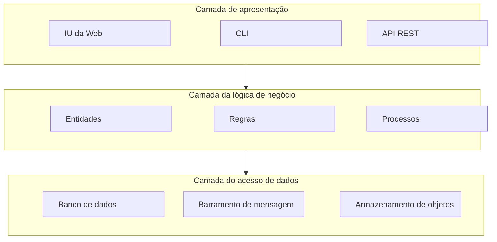
```mermaid
graph TD
    %% Definição de estilo para largura fixa
    classDef fixWidth width:240px,height:50px;

    subgraph P [Camada de apresentação]
        direction LR
        A1[IU da Web] --- A2[CLI] --- A3[API REST]
    end

    subgraph L [Camada da lógica de negócio]
        direction LR
        B1[Entidades] --- B2[Regras] --- B3[Processos]
    end

    subgraph D [Camada do acesso de dados]
        direction LR
        C1[Banco de dados] --- C2[Barramento de mensagem] --- C3[Armazenamento de objetos]
    end

    %% Conexões verticais
    P --> L
    L --> D

    %% Aplicação do estilo a todos os nós
    class A1,A2,A3,B1,B2,B3,C1,C2,C3 fixWidth
    
    %% Esconder links de suporte horizontal
    linkStyle 0,1,2,3,4,5 stroke:none, stroke-width:0px
```


**VARIAÇÂO - Camada de Serviços**
<details>
<summary>Exemplo de camada de serviço utilizando o MVC para criar um novo usuário. A criação de usuário utilizado o padrão REGISTRO ATIVO (active record) para armazenar no banco de dados</summary>

```c#
namespace MvcApplication.Controllers
{
    public class UserController: Controller
    {
        // ...

        [AcceptVerbs(HttpVerbs.Post)]
        public ActionResult Create(ContactDetails contactDetails)
        {
            OperationResult result = null;

            try
            {
                _db.StartTransaction();
                
                var user = new User();
                user.SetContactDetails(contactDetails)
                user.Save();
                
                _db.Commit();
                result = OperationResult.Success;
            } catch (Exception ex) {
                _db.Rollback();
                result = OperationResult.Exception(ex);
            }

            return View(result);
        }
    }
}
```
</details>


Para desacoplar a camada de apresentação da camada de negócio é possível utilizar uma camada de serviço. Ex:
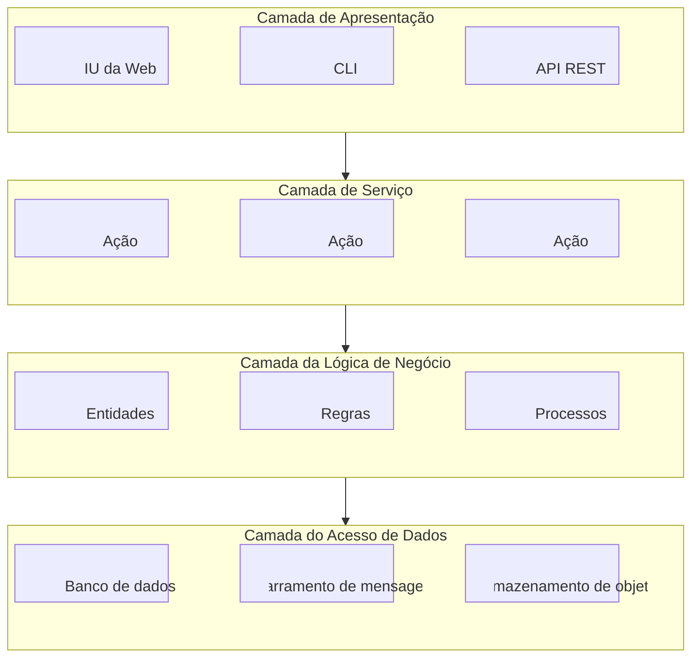
```mermaid
graph TD
    %% Definição de Estilo para Simetria
    classDef fixWidth width:160px,height:60px,display:flex,justify-content:center,align-items:center;

    %% Camada de Apresentação
    subgraph S1 [Camada de Apresentação]
        direction LR
        N1_1[IU da Web] --- N1_2[CLI] --- N1_3[API REST]
    end

    %% Camada de Serviço
    subgraph S2 [Camada de Serviço]
        direction LR
        N2_1[Ação] --- N2_2[Ação] --- N2_3[Ação]
    end

    %% Camada da Lógica de Negócio
    subgraph S3 [Camada da Lógica de Negócio]
        direction LR
        N3_1[Entidades] --- N3_2[Regras] --- N3_3[Processos]
    end

    %% Camada do Acesso de Dados
    subgraph S4 [Camada do Acesso de Dados]
        direction LR
        N4_1[Banco de dados] --- N4_2[Barramento de mensagem] --- N4_3[Armazenamento de objetos]
    end

    %% Conexões entre Camadas (Usando IDs)
    S1 --> S2
    S2 --> S3
    S3 --> S4

    %% Aplicação da Classe de Largura Fixa
    class N1_1,N1_2,N1_3,N2_1,N2_2,N2_3,N3_1,N3_2,N3_3,N4_1,N4_2,N4_3 fixWidth;

    %% Escondendo links horizontais para manter o layout lado a lado
    linkStyle 0,1,2,3,4,5,6,7 stroke:none,stroke-width:0px;
```

<details>
<summary>Exemplo de separação da acamada de apresentação utilizando uma camada de serviço</summary>

```c#
interface CampaignManagementService
{
      OperationResult CreateCampaign(CampaignDetails details);
      OperationResult Publish(CampaignId id, PublishingSchedule schedule);
      OperationResult Deactivate(CampaignId id);
      OperationResult AddDisplayLocation(CampaignId id, DisplayLocation newLocation);
      // ...
}
```

```c#
namespace ServiceLayer
{
    public class UserService
    {
        // ...
        
        public OperationResult Create(ContactDetails contactDetails)
        {
            OperationResult result = null;

            try
            {
                _db.StartTransaction();
                
                var user = new User();
                user.SetContactDetails(contactDetails)
                user.Save();

                _db.Commit();
                result = OperationResult.Success;
            } catch (Exception ex) {
                _db.Rollback();
                result = OperationResult.Exception(ex);
            }

            return result;
        }

        // ...
    }
}
```

```c#
namespace MvcApplication.Controllers
{
    public class UserController: Controller
    {
        // ...

        [AcceptVerbs(HttpVerbs.Post)]
        public ActionResult Create(ContactDetails contactDetails)
        {
            var result = _userService.Create(contactDetails);
            return View(result);
        }
    }
}
```
</details>

**Quando utilizar?**    
Quando a lógica de negócio utiliza o padrão **script de transação** ou **registro ativo**.


#### Portas e adaptadores
Utilizada para implementar a lógica de negócio mais complexa.

Princípio da inmversão de dependência é um conceito forte no portas e adaptadores.
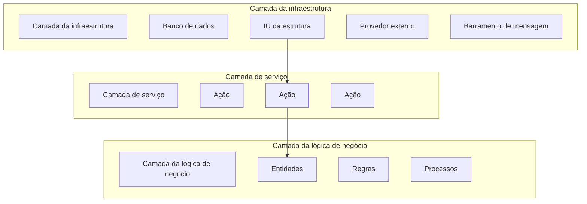
```mermaid
flowchart TB

%% =========================
%% CAMADA LÓGICA DE NEGÓCIO
%% =========================
subgraph BL["Camada da lógica de negócio"]
direction LR
BL0["Camada da lógica de negócio"]
E["Entidades"]
R["Regras"]
P["Processos"]
D1[" "]
end

%% =========================
%% CAMADA DE SERVIÇO
%% =========================
subgraph SV["Camada de serviço"]
direction LR
SV0["Camada de serviço"]
A1["Ação"]
A2["Ação"]
A3["Ação"]
D2[" "]
end

%% =========================
%% CAMADA INFRAESTRUTURA
%% =========================
subgraph INF["Camada da infraestrutura"]
direction LR
INF0["Camada da infraestrutura"]
DB["Banco de dados"]
UI["IU da estrutura"]
EXT["Provedor externo"]
MSG["Barramento de mensagem"]
end

%% Fluxo vertical
A2 --> E
UI --> A2

%% Invisível para equalizar largura
style D1 fill:transparent,stroke:transparent,color:transparent
style D2 fill:transparent,stroke:transparent,color:transparent
```


Arquitetura porta de adaptadores:
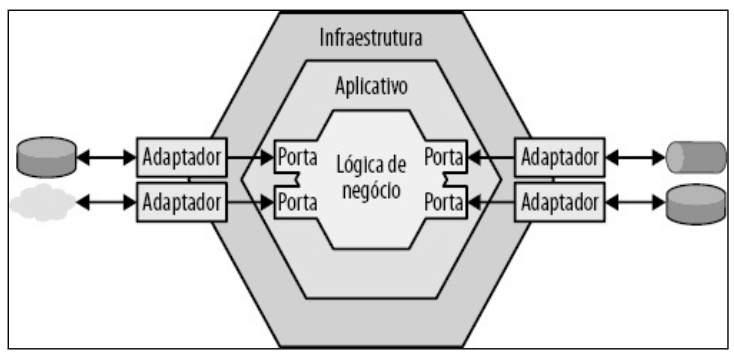

Exemplo de implementação de adaptador concreto na camada de infraestrutura para um barramento de mensagem:
```c#
namespace App.BusinessLogicLayer
{
    public interface IMessaging
    {
        void Publish(Message payload);
        void Subscribe(Message type, Action callback);
    }
}

namespace App.Infrastructure.Adapters
{
    public class SQSBus: IMessaging { 
    /*  
      implementação dos métodos Publish e Subscribe
     */ 
    }
}
```

A arquitetura de portas e adaptadores também é conhecida como arquitetura hexagonal, arquitetura cebola e arquitetura limpa, mas a terminologia pode ser diferente.


```
Camada do aplicativo = camada de serviço = camada do caso de uso 
Camada da lógica de negócio = camada de domínio = camada principal
```

**Quando utilizar?**
Perfeita para aplicar a lógica de negócio utilizando o padrão de modelo de domínio.


#### CQRS (Command Query Responsability Segregation)
Segregação de Responsabilidade de Comando e Consulta

1- Sistemas que utilizam o processamento de transação online (OLTP) e processamento analítico online(OLAP)
2- Um único sistema utilizar um banco de dados para armazenamento de documentos, um armazenamento para colunas/relatório e um mecanismo de buscas robustas


**MAPEAMENTO ARQUITETURAL: Ferramentas de Mercado 🏛️**    
No **CQRS**, cada armazenamento resolve um problema específico de acesso a dados:

* **Armazenamento de Documentos (Escrita/Comando):** Foca em consistência e atomicidade do Agregado.
    * *Exemplos:* **DynamoDB**,**MongoDB** 🍃 ou **PostgreSQL** (usando tipos JSONB).
* **Armazenamento de Colunas (Analítico):** Otimizado para ler grandes volumes e agregar valores (Soma, Média).
    * *Exemplos:* **Redshift**, **ClickHouse** 🏠 ou **Google BigQuery**.
* **Mecanismo de Busca (Consulta Complexa):** Foca em pesquisa textual e filtros dinâmicos.
    * *Exemplos:* **Elasticsearch** 🔍 ou **Apache Solr**.

> Está relacionado ao **event source** (modelo de domínio orientado a eventos) falado no capítulo 7.


O padrão separa em dois tipos:
- modelo de execução de comando
- modelo de leitura


**Modelo de execução de comando**    
- Utiliza somente um modelo para executar operações que alteram o estado do sistema
- Aplica a lógica de negócio, valida regras e aplica invariantes
- É modelo que representa dados fortemente consistentes, ou seja, após um comando ser executado, o estado resultante é imediatamente consistente, não existe “eventualmente correto”
- Tem suporte a concorrência otimista


**Modelo de leitura**    
- Utiliza quantos modelos forem necessários
- É uma projeção pré-cache, pode residir em banco de dados durável, um arquivo simples ou cachê de memória
- Nenhuma operação do sistema pode modificar diretamente os dados do modelo de leitura


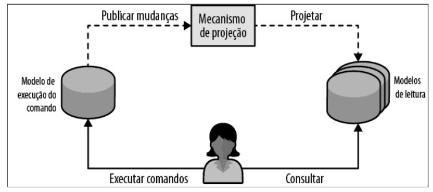

**Projeção síncrona**    
A assinatura catch-up (ou busca ativa) é o mecanismo que permite ao sistema de leitura "alcançar" o estado do sistema de escrita de forma incremental e resiliente. No contexto do CQRS, ela funciona como um processo de sincronização contínua.

- mecanismo de projeção busca informação no banco de dados OLTP
- mecanismo de projeção atualiza o modelo de leitura do sistema
- mecanismo de projeção armazena o último registro atualizado (checkpoint)


*   **Ponto 1: Consulta de Incrementos (Onde paramos?):** O mecanismo de projeção utiliza o checkpoint para identificar a posição exata do último registro processado no banco de dados OLTP. Ele solicita apenas os dados que possuem um valor de versão ou ID superior a esse marcador, garantindo que apenas as novidades sejam capturadas.
*   **Ponto 2: Atualização do Modelo (Transformação):** Os dados obtidos a partir do checkpoint são usados para regenerar ou atualizar os modelos de leitura. Esse processo transforma a informação bruta do modelo de comando em uma estrutura otimizada para consultas rápidas no destino.
*   **Ponto 3: Persistência do Progresso (Garantia de Continuidade):** Após o processamento bem-sucedido, o novo valor do último registro é gravado como o checkpoint atualizado. Esse registro de progresso é o que permite ao sistema retomar o trabalho corretamente em uma próxima iteração ou reconstruir toda a projeção do zero caso o valor seja resetado para 0.


**Projeção assíncrona**    
Nas projeções assíncronas, o modelo de execução de comando publica as mudanças para um barramento de mensagem.

O mecanismo de projeção utiliza as mensagens para atualizar o modelo de leitura.

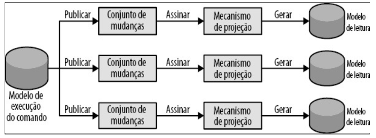


**Segregação do modelo**    
A segregação do modelo no CQRS não é apenas uma separação de tabelas ou classes; é uma separação de intenções e garantias de consistência.

- Comandos (Escrita): Focam na execução da lógica de negócio e operam no modelo fortemente consistente. Khononov é enfático: o comando deve informar se teve sucesso ou falhou e, se necessário, retornar dados resultantes da operação para evitar idas e vindas (roundtrips) desnecessárias.
- Consultas (Leitura): Operam em modelos que frequentemente são eventualmente consistentes. Elas não podem modificar o estado do sistema.


**Quando utilizar?**    
o CQRS serve naturalmente para modelos de domínio orientado a eventos


**Conclusão**    
A escolha da arquitetura não é uma questão de preferência estética, mas sim de **complexidade do domínio** e **estratégia de consistência**. 

- **Arquitetura em Camadas (Layered):** Decompõe o sistema por preocupações tecnológicas (Apresentação -> Negócio -> Dados). É adequada para padrões de **Registro Ativo (Active Record)** onde a lógica de negócio e o acesso a dados estão acoplados.
- **Portas e Adaptadores (Hexagonal):** Inverte as relações, colocando a **Lógica de Negócio no centro** e isolando-a de dependências externas (bancos de dados, APIs). É o padrão ideal para o **Modelo de Domínio (Domain Model)** purista.
- **CQRS:** Segrega os modelos de leitura e escrita. É obrigatório para sistemas baseados em **Event Sourcing** ou quando múltiplos modelos persistentes são necessários para atender diferentes requisitos de performance e busca.


### Capítulo 9 - Padrões de Comunicação
Veremos os padrões para organizar o fluxo de comunicação entre os elementos do sistema. 

Este padrão facilita a comunicação entre os contextos delimitados. 

Contextos delimitados (**Bounded Contexts**) se comunicam sem corromper seus modelos de domínio. Quando os modelos de linguagem ubíqua entre dois contextos são diferentes, precisamos de uma camada de tradução. A escolha entre uma abordagem **com estado** ou **sem estado** depende da complexidade da transformação e da necessidade de persistência.

Vamos explorar esses conceitos sob a ótica da integridade de domínio.

A tradução ocorre na **Anticorruption Layer (ACL)** ou no **Open-Host Service (OHS)**. A diferença fundamental reside em onde a lógica de "memória" da tradução reside.


**Tradução Sem Estado (Stateless):**
*   A transformação é 1:1 ou funcional.
*   Não há necessidade de armazenar dados de traduções anteriores.
*   Ocorre em tempo de execução, geralmente no próprio processo do consumidor (ACL).

**Tradução Com Estado (Stateful):**
*   Exige um banco de dados próprio para mapear identidades ou agregar dados de múltiplas chamadas.
*   Utilizada quando o modelo de origem é muito fragmentado ou quando as IDs não coincidem de forma óbvia.
*   Geralmente implementada como um serviço intermediário ou um **BFF (Backend for Frontend)** complexo.


EXPLICAÇÃO ARQUITETURAL 🏗️

Ambos os padrões tratam de integrações, mas com "centros de poder" opostos. No DDD, a relação de poder (quem se adapta a quem) é o que dita qual padrão usar.

**ACL (Anti-Corruption Layer - Camada Anticorrupção)**    
É uma camada defensiva onde o **Consumidor** se recusa a ser poluído pelo modelo do **Provedor**.
*   **Fluxo**: [Modelo Legado/Externo] → (ACL: Tradutor/Adaptador) → [Seu Modelo Limpo]
*   **Poder**: O controle está no Consumidor.

**OHS (Open-Host Service - Serviço de Host Aberto)**    
O **Provedor** define um protocolo público e estável para que múltiplos consumidores o utilizem sem que ele precise criar uma integração customizada para cada um.
*   **Fluxo**: [Provedor] → (OHS: API/Contrato Público) → [Múltiplos Consumidores]
*   **Poder**: O controle está no Provedor.
```
ACL (O Consumidor se protege):
[ Contexto A (Upstream) ] ----> [ ACL | Contexto B (Downstream) ]
                                  ^--- Traduz o "dialeto" de A para B

OHS (O Provedor se estabiliza):
[ Contexto A (Upstream + OHS) ] <---- [ Contexto B (Consumidor) ]
       |                               <---- [ Contexto C (Consumidor) ]
       +--> Publica uma Interface Publicada (Published Language)
```


**Tradução de modelo sem estado**    
- sincrona: uso de gateway de apis abertas como Kong ou privadas como AWS API Gateway
- assincronza: proxy de mensagens


**Tradução de modelo com estado**    
São transformações mais significativas. Quando precisar agregar dados ou unificar de várias fontes em um único modelo.


**Integrando agragados**
Uma das forma de um agregado se comuniar num sistema é através dos eventos, mas como são publicados num barramento de mensagens?

Primeiro vamos vamos ao erros:
```c#
public class Campaign
{
    // ...
    List<DomainEvent> _events;
    IMessageBus _messageBus;
    // ...
  
    public void Deactivate(string reason)
    {
        for (l in _locations.Values())
        {
            l.Deactivate();
        }
   
        IsActive = false;
  
        var newEvent = new CampaignDeactivated(_id, reason);
        _events.Append(newEvent);
        _messageBus.Publish(newEvent);
    }
}
```

> Erro 1: publicar eventos dentro do agregado é ruim: 1- evento enviado antes armazenar a alteração de estado no banco de dados. 2- algum erro no armazenamento de dados após o envio do evento e o banco desfazer a alteração no banco, o evento não poderá ser desfeito.

```c#
public class ManagementAPI
{
    // ...
    private readonly IMessageBus _messageBus;
    private readonly ICampaignRepository _repository;
    // ...
    public ExecutionResult DeactivateCampaign(CampaignId id, string reason)
    {
        try
        {
            var campaign = repository.Load(id);
            campaign.Deactivate(reason);
            _repository.CommitChanges(campaign);
 
            var events = campaign.GetUnpublishedEvents();
            for (IDomainEvent e in events)
            {
                _messageBus.publish(e);
            }
            campaign.ClearUnpublishedEvents();
        }
        catch(Exception ex)
        {
            // ...
        }
    }
}
```

> Erro 2: eventos de domínio enviados pela camada de aplicativo. Aqui o envio de evento somente é realizado após a confirmação no banco de dados. Aqui também podemos ter algum erro no armazenamento de dados ou barramento de mensagens e deixar o sistema num estado inconsistente.

> Esses casos podem ser solucionados com o padrão de caixa de saída.


#### **Caixa de saída (OUTBOX)**    
Garante a publicação confiável dos eventos de domínio utilizando o seguinte algoritmo:
- estado do agregado atualizado e evento de domínio numa transação atômica
- busca de eventos de domínio enviados recentemente no banco de dados
- publicação de evento no barramento de evento
- após publicado, o evento é marcado como publicado ou excluído

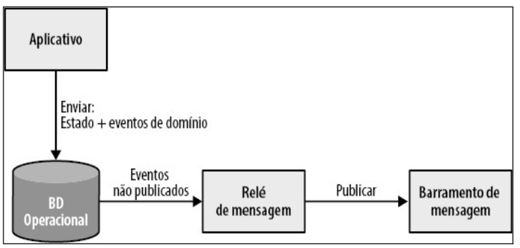


No envio atômico dos dados do estado do agregado e evento, é essencial utilizar um banco de dados transacional e no caso de um banco de dados sem suporte ao envio de duas tabelas de forma tranasacional, é possível enviar o evento do domínio incorporado no registro do agregado. Estado do agregado e lista de evento de domínio conforme o exemplo:
```json
{
    "campaign-id": "364b33c3-2171-446d-b652-8e5a7b2be1af",
    "state": {
        "name": "Autumn 2017",
        "publishing-state": "DEACTIVATED",
        "ad-locations": [
            "..."
        ],
        "...": "..."
    },
    "outbox": [
        {
            "campaign-id": "364b33c3-2171-446d-b652-8e5a7b2be1af",
            "type": "campaign-deactivated",
            "reason": "Goals met",
            "published": false
        }
    ]
}
```


**Buscando eventos não publicados**    
No Domain-Driven Design, a integridade é sagrada. O padrão Outbox resolve o problema de atomicidade entre a mudança de estado do Agregado e a notificação dessa mudança para o mundo externo. No entanto, ter os eventos na tabela `Outbox` é apenas metade do caminho; precisamos movê-los para o message broker. Para isso temos 2 opções: **Pull** e **Push**.

**Diagrama de Fluxo (Outbox Relay):**

```text
[ Agregado ] --(1. Transação Atômica)--> [ DB: Tabela de Negócio ]
      |                                  [ DB: Tabela Outbox  ]
      |
      +------(2. Notificação/Busca)-----> [ Relé de Publicação ]
      |
      +------(3. Publica) 
      | 
      +------(4. Marca como enviado)
      |
      v          
[ Message Broker / Bus ]
```


- **PULL (Polling Publisher):** O Relé interroga o banco de dados em intervalos fixos (ex: a cada 100ms). É uma busca ativa ("Você tem algo novo?").
- **PUSH (Transaction Log Tailer):** O Relé reage a um gatilho do banco de dados (Change Data Capture - CDC). O banco "empurra" a mudança para o Relé assim que o log de transação é gravado.


**Por que o rigor do Outbox com Relé é necessário?**
Muitos desenvolvedores tentam publicar eventos diretamente de dentro da Entidade ou do Service (o famoso "Ghost Publishing"). Se o banco de dados falhar no *commit* após a mensagem ter sido enviada ao RabbitMQ, seu sistema estará em um estado inconsistente: o mundo exterior acha que algo aconteceu, mas seu banco diz que não.

- **PULL (Polling):**
    *   *Prós:* Simples de implementar; funciona em qualquer DB relacional.
    *   *Contras:* Gera carga constante no DB (requer índices precisos); introduz latência (o tempo do intervalo do poll).
- **PUSH (Log Tailoring/CDC):**
    *   *Prós:* Baixíssima latência; quase zero impacto de performance no DB, pois lê o log de transações (como o `binlog` do MySQL ou `WAL` do Postgres).
    *   *Contras:* Complexidade operacional alta (ex: configurar Debezium ou DynamoDB Streams).


> o padrão caixa de saída garante o envio da mensagem em pelo menos um vez. Se uma mensagem for publica e falhar antes de atualizar o banco de dados informando que o evento foi enviado, o mesma mensagem pode ser enviada novamente.


**Saga**    
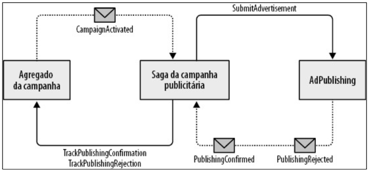

Exemplo de campnha com utilizando uma `saga`:
```c#
public class CampaignPublishingSaga
{
    private readonly ICampaignRepository _repository;
    private readonly IPublishingServiceClient _publishingService;
    // ...

    public void Process(CampaignActivated @event)
    {
        var campaign = _repository.Load(@event.CampaignId);
        var advertisingMaterials = campaign.GenerateAdvertisingMaterials);
        _publishingService.SubmitAdvertisement(@event.CampaignId,
                                              advertisingMaterials);
    }

    public void Process(PublishingConfirmed @event)
    {
        var campaign = _repository.Load(@event.CampaignId);
        campaign.TrackPublishingConfirmation(@event.ConfirmationId);
        _repository.CommitChanges(campaign);
    }

    public void Process(PublishingRejected @event)
    {
        var campaign = _repository.Load(@event.CampaignId);
        campaign.TrackPublishingRejection(@event.RejectionReason);
        _repository.CommitChanges(campaign);
    }
}
```


```c#
public class CampaignPublishingSaga
{
    private readonly ICampaignRepository _repository;
    private readonly IList<IDomainEvent> _events;
    // ...

    public void Process(CampaignActivated activated)
    {
        var campaign = _repository.Load(activated.CampaignId);
        var advertisingMaterials = campaign.GenerateAdvertisingMaterials);
        var commandIssuedEvent = new CommandIssuedEvent(
            target: Target.PublishingService,
            command: new SubmitAdvertisementCommand(activated.CampaignId,
            advertisingMaterials));
        
        _events.Append(activated);
        _events.Append(commandIssuedEvent);
    }

    public void Process(PublishingConfirmed confirmed)
    {
        var commandIssuedEvent = new CommandIssuedEvent(
            target: Target.CampaignAggregate,
            command: new TrackConfirmation(confirmed.CampaignId,
                                           confirmed.ConfirmationId));

        _events.Append(confirmed);
        _events.Append(commandIssuedEvent);
    }

    public void Process(PublishingRejected rejected)
    {
        var commandIssuedEvent = new CommandIssuedEvent(
            target: Target.CampaignAggregate,
            command: new TrackRejection(rejected.CampaignId,
                                        rejected.RejectionReason));

        _events.Append(rejected);
        _events.Append(commandIssuedEvent);
    }
}
```


**Consistência**    
> Apenas os dados dentro dos limites de um agregado podem ser considerados fortemente consistentes. Tudo do lado de fora acaba sendo consistente.


#### Gerenciador de processos
Se uma sega tem declaração de if e else, então ela é um **gerenciado de processos**
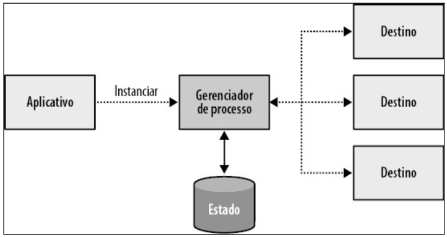


Outro exemplo: A reserva de uma viagem de negócios começa com o algoritmo de roteamento escolhendo a rota de voo mais barata e pedindo ao funcionário que a aprove. Caso ele prefira uma rota diferente, seu gerente direto precisa aprová-la. Após a reserva do voo, um dos hotéis pré-aprovados deve ser reservado para as datas certas. Se não há hotéis disponíveis, as passagens aéreas devem ser canceladas.

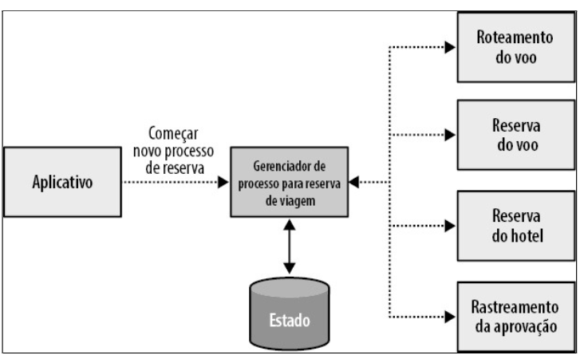


<details>
<summary>Clique aqui para ver um exemplo de código</summary>

```c#
public class BookingProcessManager
{
    private readonly IList<IDomainEvent> _events;
    private BookingId _id;
    private Destination _destination;
    private TripDefinition _parameters;
    private EmployeeId _traveler;
    private Route _route;
    private IList<Route> _rejectedRoutes;
    private IRoutingService _routing;
    // ...

    public void Initialize(Destination destination,
                           TripDefinition parameters,
                           EmployeeId traveler)
    {
        _destination = destination;
        _parameters = parameters;
        _traveler = traveler;
        _route = _routing.Calculate(destination, parameters);

        var routeGenerated = new RouteGeneratedEvent(
            BookingId: _id,
            Route: _route);

        var commandIssuedEvent = new CommandIssuedEvent(
            command: new RequestEmployeeApproval(_traveler, _route)
        );

        _events.Append(routeGenerated);
        _events.Append(commandIssuedEvent);
    }

    public void Process(RouteConfirmed confirmed)
    {
        var commandIssuedEvent = new CommandIssuedEvent(
            command: new BookFlights(_route, _parameters)
        );

        _events.Append(confirmed);
        _events.Append(commandIssuedEvent);
    }

    public void Process(RouteRejected rejected)
    {
        var commandIssuedEvent = new CommandIssuedEvent(
            command: new RequestRerouting(_traveler, _route)
        );

        _events.Append(rejected);
        _events.Append(commandIssuedEvent);
    }

    public void Process(ReroutingConfirmed confirmed)
    {
        _rejectedRoutes.Append(route);
        _route = _routing.CalculateAltRoute(destination,
                                            parameters, rejectedRoutes);
        var routeGenerated = new RouteGeneratedEvent(
            BookingId: _id,
            Route: _route);
        
        var commandIssuedEvent = new CommandIssuedEvent(
            command: new RequestEmployeeApproval(_traveler, _route)
        );

        _events.Append(confirmed);
        _events.Append(routeGenerated);
        _events.Append(commandIssuedEvent);
    }

    public void Process(FlightBooked booked)
    {
        var commandIssuedEvent = new CommandIssuedEvent(
            command: new BookHotel(_destination, _parameters)
        );
    
        _events.Append(booked);
        _events.Append(commandIssuedEvent);
    }

    // ...
}
```
</details>


**Tabela Comparativa Técnica**

| Característica | Saga (Coreografada) | Gerenciador de Processo (Orquestrador) |
| :--- | :--- | :--- |
| **Ativação** | Reativa (Pub/Sub) | Explícita (Criação de instância de estado) |
| **Lógica** | Distribuída entre os participantes | Centralizada no objeto do Processo |
| **Conhecimento** | Cada serviço conhece apenas o próximo passo | O Gerenciador conhece o fluxo inteiro |
| **Implementação** | Handlers de eventos simples | Máquina de estados (State Pattern) |

Por que isso importa na prática?    
Se você tem um fluxo simples (Pedido -> Pagamento -> Envio), uma **Saga** é mais desacoplada. Se você tem um fluxo onde o sistema precisa decidir caminhos alternativos baseados em tempo (timeouts), múltiplas respostas de diferentes serviços ou condições complexas de negócio, você **instancia um Gerenciador de Processo**.

Dessa forma, o Gerenciador de Processo atua como um "coordenador" que possui sua própria identidade e ciclo de vida, enquanto a Saga é uma sequência de reações em cadeia.


## Parte III

Neste capítulo saímos da teoria e embarcamos na prática, aplicando em projetos reais.

No capítulo 10 iremos identificar padrẽos que correspondem à complexidade e as necessidades do negócio.

No capítulo 11 iremos aplicar o DDD para manter e evoluir as decisões do design de software ao longo do tempo.

No capitulo 12 vamos aprendaer uma atividade prática que ajuda na descoberta do conhecimento de domínio e construção da linguagem obiqua. Essa atividade é conhecida como **EventStorming**.

No capítulo 13  termos dicas e truques para aplicar DDD em projetos browfield, projetos que já existem num sistema que já existe e está em operação, também chamado de sistemas legados.

> Projeto **Greenfield** é aquele onde começamos do zero, em um "campo verde" sem restrições. Já nasce modernizado.


### Capítulo 10 - Heurística de Design
Neste capítulo vamos falar sobre o "design" (software) do Domain Driven Design.


#### Heurística
Heurísticas no desenvolvimento de software são atalhos mentais, princípios ou técnicas baseadas na experiência (regras de bolso) utilizadas para guiar a tomada de decisão rápida, otimizar testes exploratórios e melhorar a usabilidade. Elas não garantem a solução perfeita, mas facilitam encontrar boas soluções diante de incertezas.

Por exemplo, no desenvolvimento de software podemos utilizar a heurística para realizar um code review focado na orientação a objetos de acordo com algumas características no código. Isso não garante que seja um bom código com orientação a objetos, mas através da heurística podemos considerar que um código segue algumas características que são identificadas num bom código.


#### Contextos delimitados
> Existem muitas heurísticas úteis e reveladoras para definir os limites de um serviço. O tamanho é uma das menos úteis. Nick Tune


#### Padrões de Implementação da Lógica de Negócio
- O subdomínio rastreia dinheiro ou outras transações monetárias, tem que fornecer um log de auditoria consistente ou é necessária uma análise profunda de seu comportamento por parte da empresa? Em caso afirmativo, utilize o modelo de domínio orientado a eventos. Se não… 
- A lógica de negócio do subdomínio é complexa? Em caso afirmativo, implemente um modelo de domínio. Se não… 
- O subdomínio inclui estruturas de dados complexas? Em caso afirmativo, use o padrão do registro ativo. Se não… 
- Implemente um script de transação.

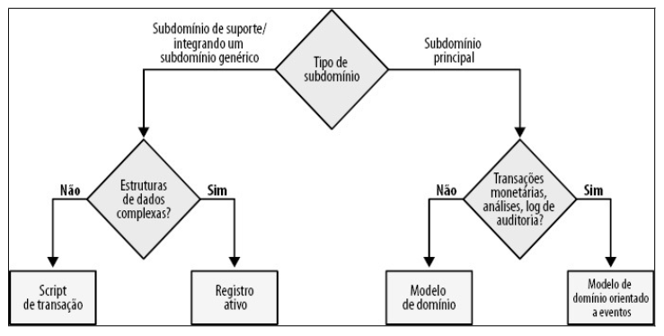


#### Padrões de Arquitetura
- Modelo de domínio orientado a eventos requer CQRS
- Modelo de domínio requer a arquitetura porta e adaptadores
- O registro ativo requer arquitetura em comadas com uma camada de aplicativo (serviço)
- O script de transação requer uma arquitetura em camada mínima (três camadas)

O CQRS é bom para qualquer outra padrão que o subdomínio exige a representação de seus dados em multiplos modelos de persistentes.
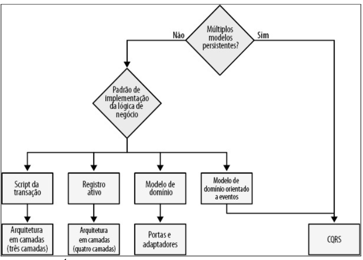


#### Estratégia de Teste
Baseado na heurística no padrão de implementação de lógica de negócio e no padrão de arquitetura usado.
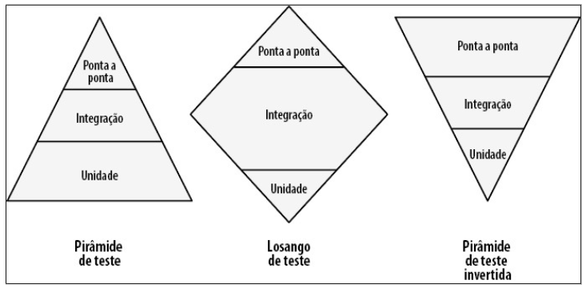

- pirâmide de teste: ambos modelos de domínio
- losango de teste: registro ativo
- pirâmide de teste invertida: script de transação
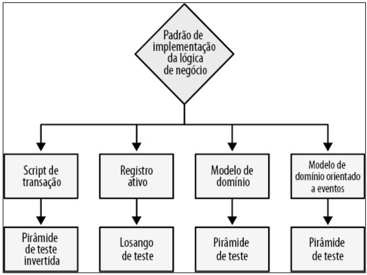


#### Árvore de Decisão do Design Tático
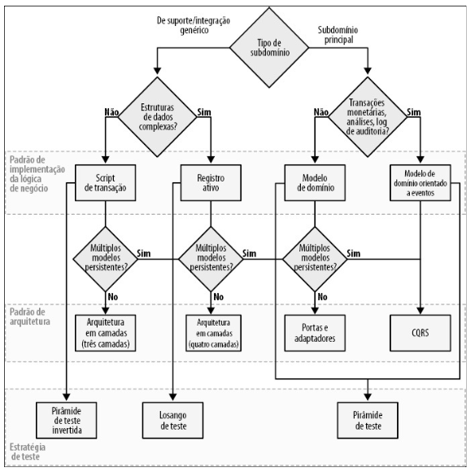
> Lembrando que isso é uma heurística e não deve ser tratado com uma regra obrigatória


#### Conclusão
Capítulo integrou as partes I e II.


### Capítulo 11 - Desenvolvendo as Decisões de Design
#### Mudanças nos dominios
Tipos de subdomínios:
- principal
- generico
- suporte

Os subdomínos afetam nas decisões de design estratégico e tático
- contexto delimitado
- padrão de design relacionado a complexidade da lógica de negócio

> Subdomínios mudam durante o passar do tempo


**Principal para genérico**    
Uma empresa que tem seu subdomínio principal hoje, pode perder espaço no mercado por uma empresa que entrega o mesmo serviço por uma fração da empresa principal. A empresa deixa de ser um subdomínio principal e passa a ser um subdomínio genérico. Agora os concorrêntes tem acesso ao mesmo serviço que era exclusivo inicialmente.


**Genérico para principal**    
Um exemplo real de uma empresa que transforma um subdomínio genérico em um subdomínio central é a Amazon. Como todos os prestadores de serviços, a Amazon precisava de uma infraestrutura na qual pudesse executar seus serviços. A empresa foi capaz de “reinventar” a forma como gerenciou sua infraestrutura física e, mais tarde, até mesmo transformá-la em um negócio lucrativo: Amazon Web Services.


**De Suporte para Genérico**    
Antes (Suporte): O sistema era um "ajudante" específico para o marketing. Baixa complexidade, focado em CRUD. A lógica era simples o suficiente para ser desenvolvida internamente sem grande esforço criativo.
Depois (Genérico): Ao adotar uma solução de mercado (Open Source), a BuyIT reconhece que a gestão de contratos é um problema já resolvido por outros. O foco muda de "como construir" para "como integrar".


**De suporte a principal**    
Subdomínio de suporte normalmente tem a lógica mais simples e tem uma relação com o CRUD e o ETL, mas pode ocorrer de aumentar a complexidade e se tornar um diferencial econômico. Passando de suporte para subdomínio pricipal.


**Principal para de suporte**    
Subdomínio pricipal pode ter uma lógica complexa, mas não justifica o seu valor para empresa (lucratividade).


**De genérico para suporte**    
Um subdomínio genérico pode tornar-se um subdomínio de suporte se uma empresa (como a BuyIT) decidir abandonar uma solução externa/código aberto e optar por utilizar um sistema interno, devido à complexidade de integração.

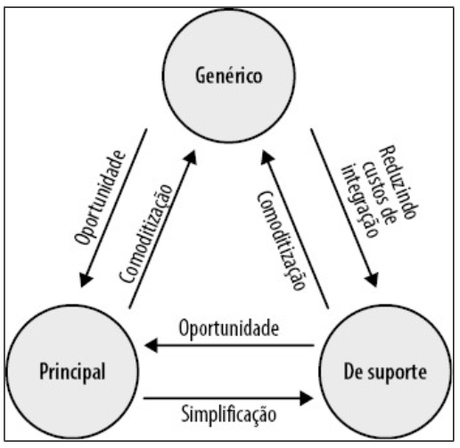


#### Preocupações do design estratégico
É possível ocorrer a evolução de um subdomínio de suporte para um subdomínio principal. Existe uma diferença clara entre a lógica de um e outro. No subdomínio de suporte temos uma lógica mais simples e usamos um padrão relativo como o registro ativo ou script de transação, mas no subdomínio principal utilizamos o modelo de domínio que é utilizados para uma lógica complexa com invariantes e regras complexas. Essa mudança não deve ser temida e não devemos utilizar um padrão de lógica complexa de forma geral e nem a lógica simples. Não deve ser trabalhoso troca de uma decisão de design e outra, desde conheça as diferenças entre cada um.


**Script de Transação para Registro Ativo**    
Tanto o script de transação como o registro ativo implementam a lógica de negócio de forma procedural. A diferença é que no registro ativo os dados estão estruturados e o acesso ao armazenamento de dados (banco de dados) não ocorre de forma direta como no script de transação. O processo de evolução será estruturar os dados complexos e acessar o banco de dados através do registro ativo.


**Registro ativo para modelo de domínio**    
A evolução do registro ativo é modelo de modelo de domínio. Neste caso, identifique as estruturas de dados que são objetos de valor (imutáveis).

Identifique os limites transacinais nas estruturas de dados

Altere todos os setters do registro ativo como privados para garantir que toda a lógica que modifique um estado seja explícita. A ideia é que o código quebre, mas agora ficará fácil identificar e corrigir seguindo a ideia do modelo de domínio. Ex:

Aqui é a forma que o registro aivo resolve o problema:
```c#
public class Player
{
    public Guid Id { get; set; }
    public int Points { get; set; }
}

public class ApplyBonus
{
    // ...

    public void Execute(Guid playerId, byte percentage)
    {
        var player = _repository.Load(playerId);
        player.Points *= 1 + percentage/100.0;
        _repository.Save(player);
    }
}
```

Aqui é a alteração que quebra o código:
```c#
public class Player
{
    public Guid Id { get; private set; }
    public int Points { get; private set; }
}

public class ApplyBonus
{
    // ...

    public void Execute(Guid playerId, byte percentage)
    {
        var player = _repository.Load(playerId);
        player.Points *= 1 + percentage/100.0;
        _repository.Save(player);
    }
}
```

Aqui segue a ideia do modelo de dominio:
```c#
public class Player
{
    public Guid Id { get; private set; }
    public int Points { get; private set; }

    public void ApplyBonus(int percentage)
    {
        this.Points *= 1 + percentage/100.0;
    }
}

public class ApplyBonus
{
    // ...

    public void Execute(Guid playerId, int percentage)
    {
        var player = _repository.Load(playerId);
        player.ApplyBonus(percentage);
        _repository.Save(player);
    }
}
```


**Modelo de Domínio para Modelo de Domínio Orientado a Eventos**    
A transição para um modelo de domínio orientado a eventos consiste em substituir a modificação direta de dados pela modelagem do ciclo de vida dos agregados por meio de eventos, enfrentando como principal desafio a migração do estado atual estático para um histórico de eventos retroativos baseado em estimativas ou eventos de migração.


**Geração de Transições Passadas**    
```js
[
    {
        "lead-id": 12,
        "event-id": 0,
        "event-type": "lead-initialized",
        "first-name": "Shauna",
        "last-name": "Mercia",
        "phone-number": "555-4753"
    },
    {
        "lead-id": 12,
        "event-id": 1,
        "event-type": "contacted",
        "timestamp": "2020-05-27T12:02:12.51Z"
    },
    {
        "lead-id": 12,
        "event-id": 2,
        "event-type": "order-submitted",
        "payment-deadline": "2020-05-30T12:02:12.51Z",
        "timestamp": "2020-05-27T12:02:12.51Z"
    },
    {
        "lead-id": 12,
        "event-id": 3,
        "event-type": "payment-confirmed",
        "status": "converted",
        "timestamp": "2020-05-27T12:38:44.12Z"
    }
]
```
Quando essa abordagem é utilizada, é impossível recuperar o histórico completo das transições do estado. No exemplo anterior, não sabemos quantas vezes o agente de vendas entrou em contato com a pessoa e, portanto, quantos eventos “contatados” não vimos.


**Modelando Eventos de Migração**    
```json
{
    "lead-id": 12,
    "event-id": 0,
    "event-type": "migrated-from-legacy",
    "first-name": "Shauna",
    "last-name": "Mercia",
    "phone-number": "555-4753",
    "status": "converted",
    "last-contacted-on": "2020-05-27T12:02:12.51Z",
    "order-placed-on": "2020-05-27T12:02:12.51Z",
    "converted-on": "2020-05-27T12:38:44.12Z",
    "followup-on": null
}
```

#### Mudanças organizacionais
Padrões de integração de contextos delimitados: 
- parceria
- núcleo compartilhado
- camada conformista
- camada anticorrupção
- serviço de host aberto
- caminhos separados

**Parceria entre Cliente-Fornecedor**    

**Cliente-Fornecedor para Caminhos Separados**    

**Conhecimento de Domínio**    

**Crescimento**    

**Subdomínios**    

**Contextos delimitados**    

**Agregados**    


#### Conclusão


### Capítulo 12 - EventStorming

#### O que é EventStorming?
É uma ferramenta tática para compartilhar o conhecimento do domínio de negócio.


#### Quem Deve Participar do EventStorming?
> Lembre-se de que o objetivo do workshop é aprender o máximo possível com o mínimo de tempo. Convidamos pessoas-chave para o workshop e não queremos desperdiçar o precioso tempo delas. — Alberto Brandolini, criador do workshop de EventStorming

Ideal com grupos diversos como: engenheiros, especialistas de domínio, proprietários do produtos, testadores, designer de UI/UX, pessoal de suporte etc.


#### O que É necessário para o EventStorming?
Utiliza papel e caneta, mas precisará também de:
- espaço de modelagem: parede, quadro branco com bastante espaço
- notas adesivas: com diversas cores definidas (próxima seção)
- marcadores de texto: canetas para escrever nas notas adesivas
- Petiscos: comida saudável
- Sala: lugar com espaço para movimentação. Se possível, tire as cadeiras para evitar distração

Exemplo de uma sala com mesa:    
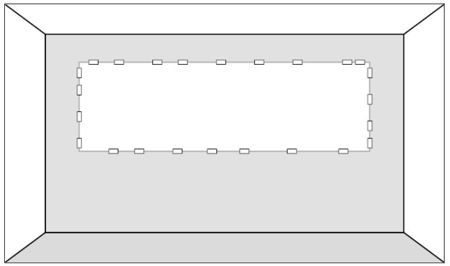


#### Processo do eventstorming
Composto de 10 etapas

**Etapa 1: Exploração desestruturada**    
Deve-se anotar nos papéis eventos no passado, exemplo, Fatura emitida, Pedido Criado, Item adicionado, Pedido finalizado, contrato registrado etc.

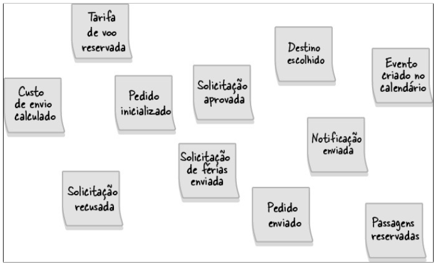
> utilize notas adesivas na cor laranja


**Etapa 2: Linhas do tempo**    
- organizar as notas adesivas se baseando na linha do tempo
- remover as notas adesivas repetidas
- iniciar pelo fluxo feliz e depois pensar nos cenários de erro

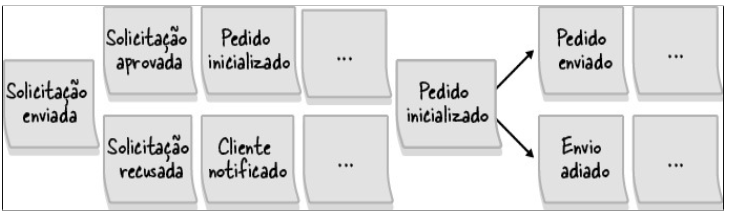


**Etapa 3: Pontos problemáticos**    
- problemas como gargalos, etapas manuais que precisam de automação, documentação ausente ou conhecimento de domínio em falta
- notas adesivas cor de rosa (losango)

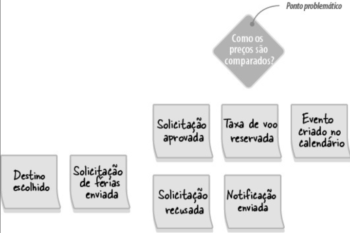


**Etapa 4: Eventos cruciais**    
- eventos comerciais significativos que indiquem uma mudança no contexto ou na fase. São os chamados eventos cruciais e são marcados com uma barra vertical que divide os eventos antes e depois do evento crucial. Ex: “carrinho de compras inicializado”, “pedido inicializado”, “pedido enviado”, “pedido entregue” e “pedido devolvido”.

> São indicadores de possíveis limites do contexto

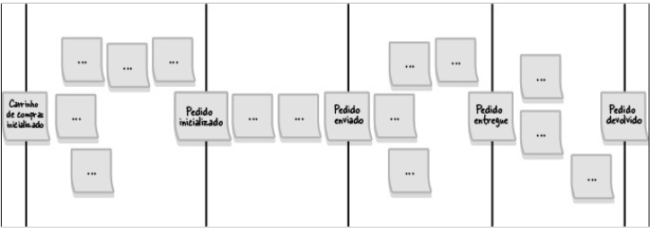


**Etapa 5: Comandos**    
> Notas adesivas na cor **azul-claras** para o comandos. Nota adesiva amarela para se executado por um ator com papel específico como clientem administrador ou editor.

**Evento de domínio** é algo do passado, já um **comando** descreve operações do sistema e ficam no imperativo:
- publique campanha
- reverta uma transação
- envie pedido
- registrar contrato

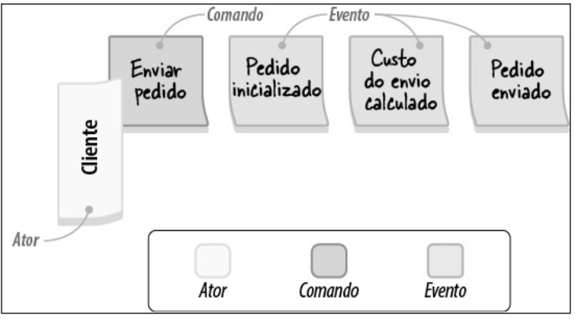


**Etapa 6: Políticas**    
> Notas adesivas lilás para políticas que conectam eventos aos comandos. Caso ocorre em algum cenário, pode-se adicionar essas informações, exemplo, somente quando o cliente é VIP.
- Comandos que não tem ator específico associado a eles. 
- Uma política de automação é um cenário no qual um evento executa um comando.

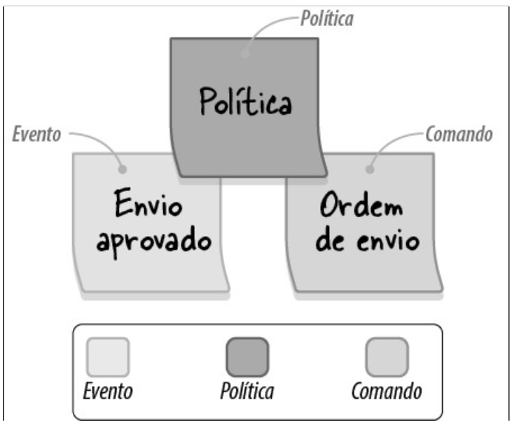


**Etapa 7: Modelos de Leitura**    
> Notas adesivas verdes para modelo de leitura
- Modelo de leitura pode ser uma tela de sistema, um relatório, uma notificação etc. 
- São posicionados antes dos comandos

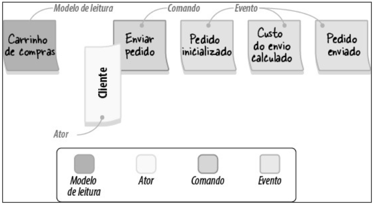


**Etapa 8: Sistemas Externos**    
> Notas adesivas cor-de-rosa para sistemas externos
- São sistemas externos ao domínio
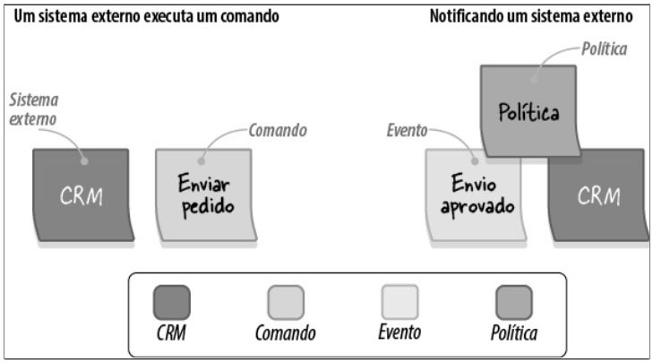


**Etapa 9: Agregados**    
> Notas adesivas amarelas de grandes para agregados
- Um agregado recebe comandos e produz eventos.

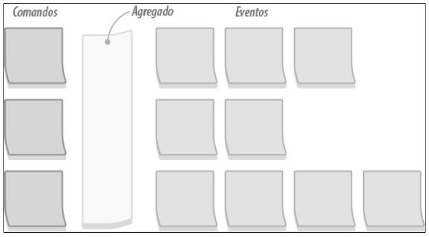


**Etapa 10: Contexto Delimitados**    
A última etapa é deixar os agragados que estejam relacionado entre si. 
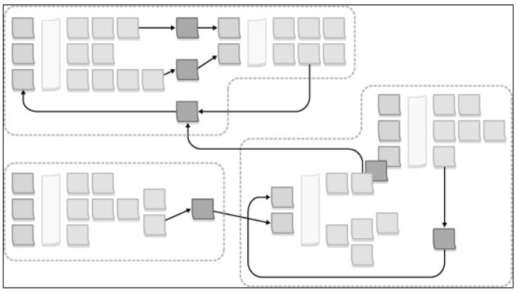


**Variantes**    
Alberto Brandolini, criador do workshop de EventStorming, define esse processo como “orientação, não regras rígidas”.

O real valor de uma sessão de EventStorming é o próprio processo:
- o compartilhamento de conhecimento
- o alinhamento de seus modelos mentais do negócio
- a descoberta de modelos conflitantes
- formulação da linguagem ubíqua


#### Quando utilizar o eventstorming
Razões:
- construir uma linguagem obíqua
- modelar o processo de negócio
- explorar novos requisitos de negócio
- Recuperar o conhecimento de domínio
- Explorar formas de melhorar um processo de negócio existente
- Integrar novos membros da equipe

Ele terá menos sucesso quando o processo de negócio que você está explorando é simples ou óbvio, como seguir uma série de etapas sequenciais sem nenhuma lógica ou complexidade de negócio interessante.


#### Dicas de realização
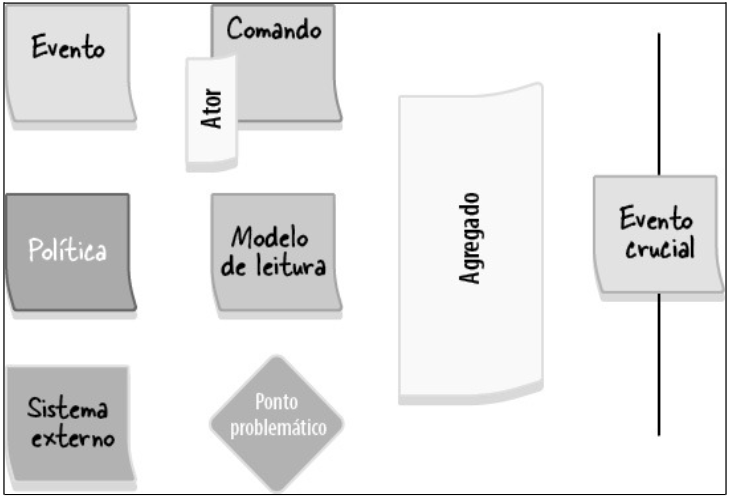

- Evento
- Comando
- Ator
- Políticas
- Modelo de leitura
- Sistema externo
- Ponto problemático
- Agregado
- Evento crucial


**Cuidado com a Dinâmica**    


**EventStorming Remoto**    


**Conclusão**    


### Capítulo 13 - Domain-Driven Design na Prática
A maior parte do tempo vamos trabalhar em projetos browfield (legados) e mesmo assim podemos aplicar o DDD. Por mais que o projeto não utilize de todas as ferramentas do DDD, ele pode se beneficiar do Domain Driven Design.


#### Análise Estratégica
Investir tempo na compreesão da estratégia de negócio e do estado atual da arquitetura de seus sistemas.


**Entenda o domínio de negócio**    


**Subdomínios principais**    
- Vantagem competitiva


**Subdomínios genéricos**    
- Soluções prontas


**Subdomínios de suporte**    
- Componentes do sistema que não podem ser substituídos por soluções prontas


#### Explore o design atual

**Avalie o design tático**    

**Avalie o design estratégico**    


#### Estratégia de modernização
Limites lógicos alinhados com os limites dos subdomínios    
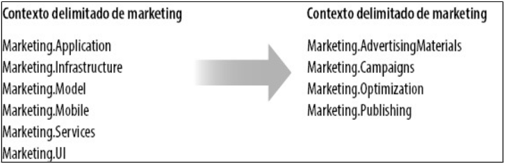


#### MOdernização estratégica
Problemas resolvidos pelos padrões de integrações:
- relação do cliente-servidor
- camada anticorrupção
- Serviço de host aberto
- caminhos separados


#### Modernização Tática


#### Cultive uma linguagem ubíqua

**Padrão estrangulador**    
A ideia é estrangular o sistema legado enquanto moderniza o sistema e congela as alterações no sistema legado.    
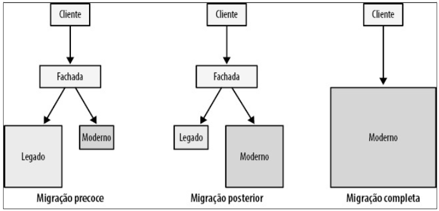


Para evitar a integração complexa, o contexto modernizado e antigo podem usar o mesmo banco de dados para evitar complexidades como transações distribuídas.    
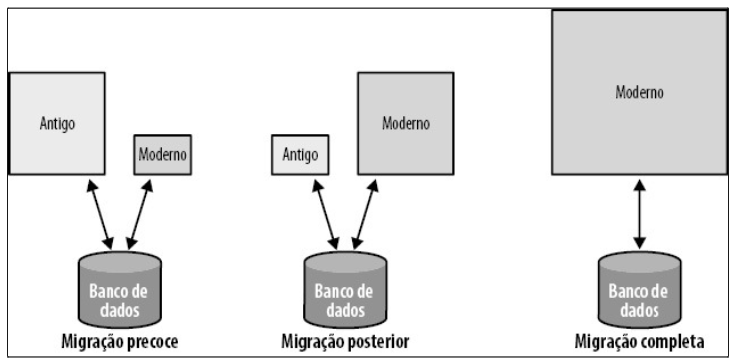


**Refatorando as decisões de design tático**    


#### Domain-driven design pragmático


#### Vendendo o domain driven designer 

**Domain driven designer infiltrado**
- Linguagem ubíqua
- Contextos delimitados
- Decisões de design tático
- Modelo de domínio orientado a eventos


#### Conclusão


## Parte IV
**Relações com Outras Metodologias e PadrõesRelações com Outras Metodologias e Padrões**    
- No capítulo 14 fala sobre a interação entre os microserviços e o DDD 
- No capítulo 15 fala sobre a arquitetura orientada a eventos e o DDD 
- No capítulo 16 fala sobre a arquitetura do gerenciamento de dados, repositórios, data lakes e suas deficiências são abordadas pela arquitetura de malhas se baseiam nos princípios de design.


### Capítulo 14 - Microsserviços
- Os termos contexto delimitado e Microsserviços são usados alternadamente, mas são a mesma coisa?


#### O que é serviço?
> Segundo a OASIS, serviço é um mecanismo que permite o acesso a uma ou mais capacidades, em que o acesso é fornecido usando uma interface prescrita. Interface prescrita é qualquer mecanismo usado para obter dados dentro ou fora de um serviço. Ela pode ser síncrona, como um modelo de solicitação/resposta, ou assíncrona, como um modelo que produz e consome eventos.

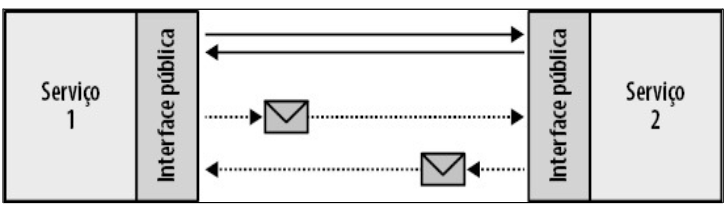


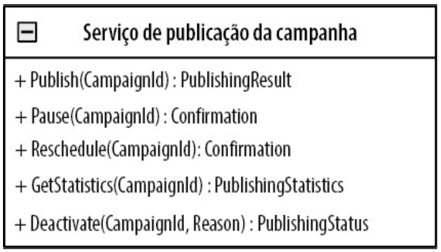


#### O que é Microsserviço?
O serviço é definido por sua interface pública, um Microsserviço é um serviço com uma interface micropública.

Serviço menores limitam os motivos de mudança

Microsserviço não compartilha banco de dados, somente disponibiliza informações por sua interface pública


#### Método como Serviço: Microsserviços Perfeitos?
Prolema do Microsserviço limitado com uma única interface de serviço com um método público:
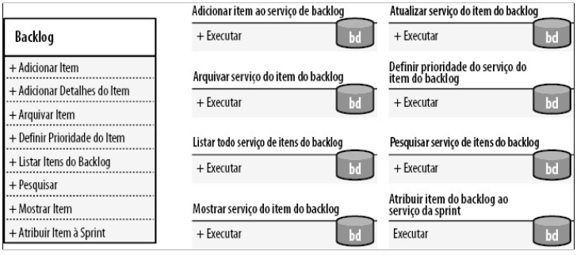


Fluxo de dados entre os serviços:    
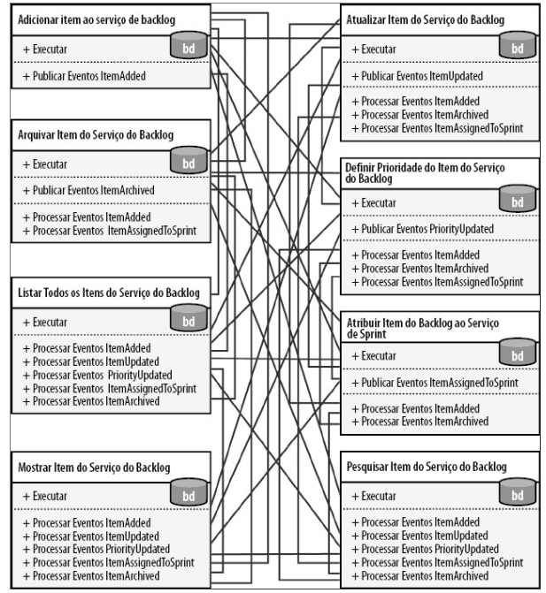


#### Objetivo do Design
O exemplo de cada serviço expondo um único método na sua interface pública mostrou-se péssimo. Cada serviço ficou bem simples, mas o sistema resultante se tornou altamente complexo ao analisar a grande bola de lama na imagem acima.

Não devemos esquecer sobre os conceitos de sistema em relação na integração entre os microserviços:
- Um conjunto de coisas ou dispositivos conectados que operam juntos 
- Um conjunto de equipamentos e programas de computador utilizados em conjunto para determinado fim


#### Complexidade do Sistema
- complexidade local: é a complexidade de cada Microsserviço
- complexidade global: é a a complexidade de todo o sitema

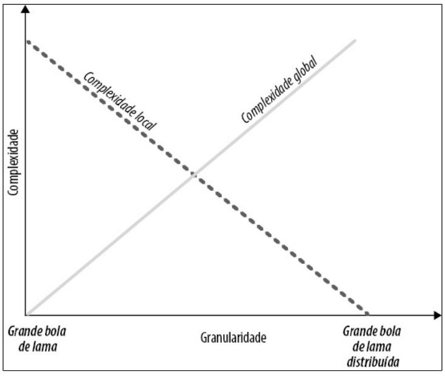


#### Microsserviços como serviços profundos
- função:funcionalidade de negócio (complexidade)
- lógica: lógica de negócios do módulo (largura)
- profundidade
- largura

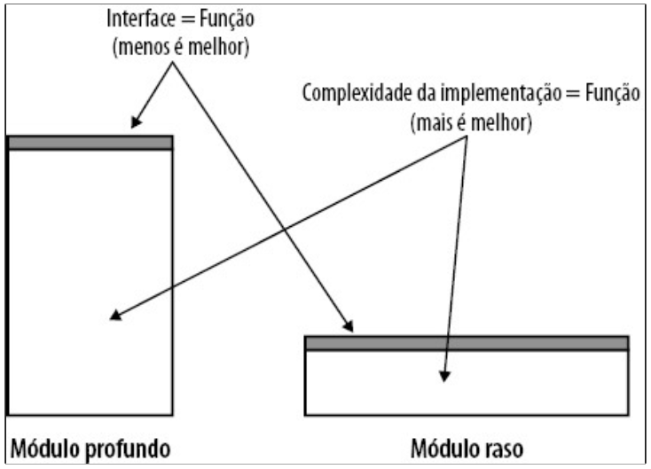


**O Coração do Conceito: Complexidade vs. Interface**    
Para entender microsserviços do jeito certo, esqueça o tamanho em linhas de código. O design correto se baseia na relação entre a complexidade interna daquilo que o serviço faz e a simplicidade da sua API (interface pública).

##### ┌─ Serviço Raso (Shallow Service)
* **O que é:** Um serviço que possui uma **interface pública complexa**, mas **quase nenhuma lógica interna**.
* **O problema:** Ele expõe seus detalhes de implementação (como tabelas do banco de dados). Quem consome o serviço precisa saber *como* ele funciona para conseguir usá-lo.
* **Resultado:** Alto acoplamento. Se você alterar uma regra de negócio, precisará alterar e fazer o deploy de vários serviços ao mesmo tempo (o temido monólito distribuído).

##### └─ Serviço Profundo (Deep Service)

* **O que é:** Um serviço que possui uma **interface pública extremamente simples**, mas que esconde uma **enorme complexidade de negócio** por trás dela.
* **O benefício:** Alto encapsulamento. Ele resolve um problema complexo de forma autônoma e entrega um valor gigante através de comandos simples para o mundo externo.
* **Resultado:** Verdadeira independência de deploy e baixa carga cognitiva para o restante do sistema.


#### Microsserviços como Módulos Profundos
- um módulo profundo reduz a complexidade global do sistema
- um módulo raso aumenta a complexidade global do sistema
- serviços rasos são a ração que pprojetos orientados a microsserviços falham
- para distribuir um serviço em microsserviços, devmos usar como parâmetro os casos de uso do sistema

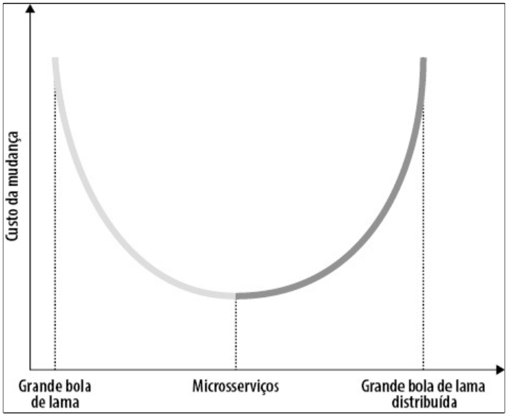


#### Domain-driven design e limites dos microsserviços
- contexto delimitadeo é o limite do modelo
- subdomínio limita capacidade do negócio
- agregados e objetos de valor são limites transacionais


**Contextos delimitados**    
Exemplo da entidade Lead em modelos conflitantes:
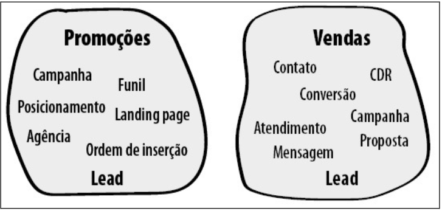


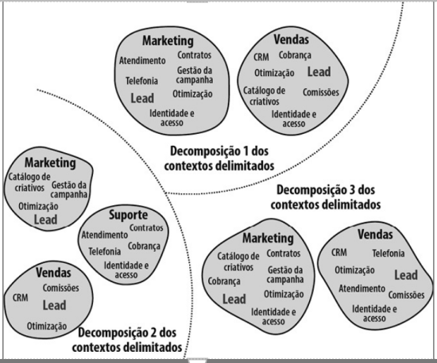


Embora o microsservicos seja um contexto delimitado, nem todo contexto delimitado é um Microsserviço.

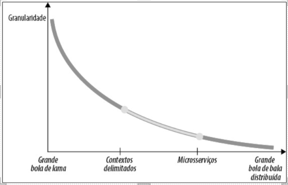


**Agregados**    
O limite do agregado é o mais estreito possível

A decomposição de um agregado em multiplos serviços físicos leva a consequências indesejáveis

Um agregado é uma unidade de funcionalidade de negócio indivisível que encapsula as complexidades de suas regras de negócio internas, invariantes e lógicas.

Quanto mais forte for a relação do agregado com outras entidades do negócio do seu subdomínio, mais raso será como um serviço individual.


**Subdomínios**    

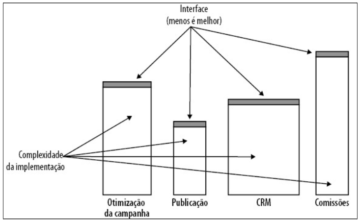

Microsserviços com subdomínios é uma heurística segura que produz soluções ótimas para a maioria dos microsserviços. Há casos que outros limites serão mais eficientes e devido a requisitos não funcionais, recorrer a um agregado como microsserviços.


#### Compactando interfaces públicas dos microsserviços
Padrão de host aberto e da camada de anticorrupção podem simplificar as interfaces públicas dos microsservicos.


#### Serviço de host aberto
O serviço de host aberto desacopla o modelo do contexto delimitado do domínio de negócio e o modelo utilizado para a integração com outros componentes do sistema

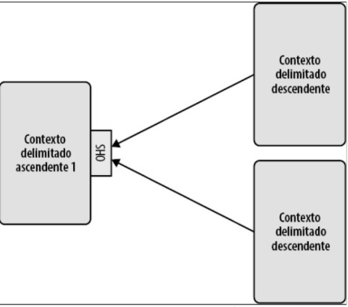


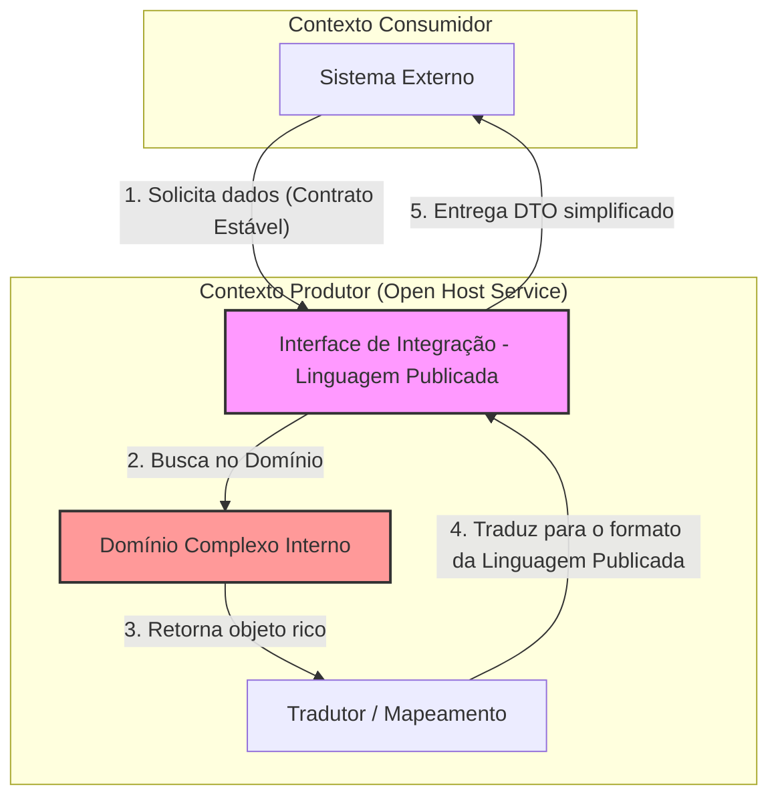
```mermaid
graph TD
    subgraph "Contexto Consumidor"
        Consumidor[Sistema Externo]
    end

    subgraph "Contexto Produtor (Open Host Service)"
        OHS[Interface de Integração - Linguagem Publicada]
        Tradutor[Tradutor / Mapeamento]
        Dominio[Domínio Complexo Interno]
    end

    Consumidor -- "1. Solicita dados (Contrato Estável)" --> OHS
    OHS -- "2. Busca no Domínio" --> Dominio
    Dominio -- "3. Retorna objeto rico" --> Tradutor
    Tradutor -- "4. Traduz para o formato da Linguagem Publicada" --> OHS
    OHS -- "5. Entrega DTO simplificado" --> Consumidor

    style OHS fill:#f9f,stroke:#333,stroke-width:2px
    style Dominio fill:#ff9999,stroke:#333,stroke-width:2px
```

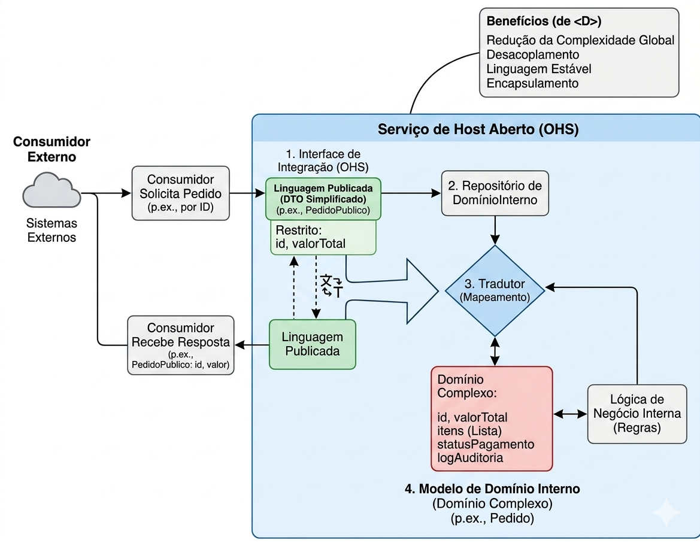


> Apenas uma correção conceitual: O produtor se responsabiliza por fornecer uma Linguagem Publicada (uma interface/DTO pública e estável), e não o domínio correto para cada contexto. Por que essa diferença importa? Se o produtor tentasse criar um modelo customizado para cada contexto que o consome, ele viraria um "parceiro de conformidade" (Customer-Supplier extremo ou Conformist invertido) e ficaria louco tentando agradar a todos.


Aqui está um fluxograma que representa visualmente a lógica do Open Host Service (OHS), desde o consumidor externo até o domínio interno, seguindo o exemplo de código Java apresentado.


O diagrama destaca a separação entre a Linguagem Publicada (o contrato simplificado para o mundo externo) e o Domínio Complexo (a lógica interna protegida), mostrando o Tradutor (Mapeamento) como o componente central que une os dois mundos.


Fluxo Lógico (Origem ao Destino):

1. Um Consumidor Externo inicia uma solicitação (p.ex., buscar um pedido por ID).
2. A solicitação atinge a Interface de Integração (OHS), que expõe o contrato simplificado (o DTO PedidoPublico na Linguagem Publicada).
3. O serviço interage com o Repositório para obter o objeto de Domínio Complexo (Pedido) completo.
4. O objeto de domínio complexo é processado e, em seguida, passado para o Tradutor (Mapeamento).
5. O Tradutor converte os dados relevantes do domínio complexo no formato simplificado exigido pela Linguagem Publicada.
6. A Linguagem Publicada (DTO Simplificado) é retornada ao consumidor, que recebe exatamente o que precisa, sem exposição à complexidade interna.

Observe como o Modelo de Domínio Interno está "protegido" dentro do bloco azul do OHS, garantindo que o consumidor permaneça isolado das mudanças internas e da complexidade.

----


Para representar o padrão **Open Host Service (OHS)** por completo em Java, precisamos simular a interação entre **dois Contextos Delimitados distintos**:

1. **Contexto Produtor (Provedor do OHS):** O dono do Domínio Rico/Complexo que decide abrir uma "Linguagem Publicada" (Interface/DTO Simplificado) para o mundo.
2. **Contexto Consumidor:** O sistema externo que precisa de dados do produtor, mas consome apenas a interface pública estável.

Aqui está a estrutura completa dividida por pacotes (contextos):

---

##### 📦 1. Contexto Delimitado: Gestão de Pedidos (O Produtor / OHS)

Este contexto possui regras complexas de negócio que não devem vazar. Ele cria uma **Linguagem Publicada** (o contrato) para os outros usarem.

**A) O Domínio Complexo (Protegido)**    
```java
package br.com.sistema.pedidos.dominio;

import java.util.List;

// Modelo interno rico, complexo e instável (muda frequentemente devido ao negócio)
public class PedidoInterno {
    private String id;
    private String clienteId;
    private List<ItemPedido> itens;
    private String statusFaturamento;
    private String historicoModificacoes; // Dado sensível / interno
    private double margemLucroCalculada;  // Dado sensível / interno

    // Construtores, getters, setters e lógica de negócio interna...
    public PedidoInterno(String id, double margemLucroCalculada) {
        this.id = id;
        this.margemLucroCalculada = margemLucroCalculada;
    }
    
    public String getId() { return id; }
    public double calcularValorTotal() {
        // Lógica complexa simulada
        return 1500.00;
    }
}

```

**B) A Linguagem Publicada (O Contrato estável do OHS)**    

```java
package br.com.sistema.pedidos.publico;

// DTO simplificado e imutável. Este é o contrato oficial do Open Host Service.
// Mesmo que o PedidoInterno mude, este record DEVE permanecer estável.
public record PedidoPublicoDTO(String pedidoId, double valorTotal) {}

```

**C) O Serviço OHS (A API/Fachada Aberta)**    

```java
package br.com.sistema.pedidos.api;

import br.com.sistema.pedidos.dominio.PedidoInterno;
import br.com.sistema.pedidos.publico.PedidoPublicoDTO;

// Esta classe É o Open Host Service. Ela serve como a porta de entrada pública.
public class PedidoOpenHostService {

    // Simula a busca no banco de dados interno
    private PedidoInterno buscarNoBancoInterno(String id) {
        return new PedidoInterno(id, 35.5); 
    }

    // Método público exposto para outros contextos
    public PedidoPublicoDTO obterPedidoParaIntegracao(String id) {
        PedidoInterno pedido = buscarNoBancoInterno(id);
        
        // O OHS traduz o seu domínio interno para a Linguagem Publicada
        double total = pedido.calcularValorTotal();
        
        return new PedidoPublicoDTO(pedido.getId(), total);
    }
}

```


##### **📦 2. Contexto Delimitado: Sistema de Logística (O Consumidor)**

Este é outro microsserviço ou módulo isolado. Ele não conhece nenhuma classe do pacote `br.com.sistema.pedidos.dominio`. Ele depende **apenas** do contrato público.

```java
package br.com.sistema.logistica.integracao;

import br.com.sistema.pedidos.api.PedidoOpenHostService;
import br.com.sistema.pedidos.publico.PedidoPublicoDTO;

public class AgendamentoEntregaService {
    
    private final PedidoOpenHostService pedidoOshClient;

    public AgendamentoEntregaService(PedidoOpenHostService pedidoOshClient) {
        this.pedidoOshClient = pedidoOshClient;
    }

    public void planejarRotaDeEntrega(String idPedido) {
        // O consumidor chama o OHS e recebe estritamente a Linguagem Publicada
        PedidoPublicoDTO dadosPedido = pedidoOshClient.obterPedidoParaIntegracao(idPedido);
        
        System.out.println("[Logística] Planejando entrega para o pedido: " + dadosPedido.pedidoId());
        System.out.println("[Logística] Valor segurado da carga: R$ " + dadosPedido.valorTotal());
        
        // O contexto de logística não faz ideia de que existem campos como "margemLucroCalculada"
    }
}

```


#### Camada Anticorrupção (ACL)

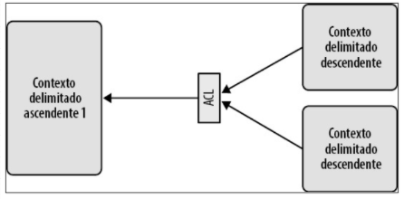

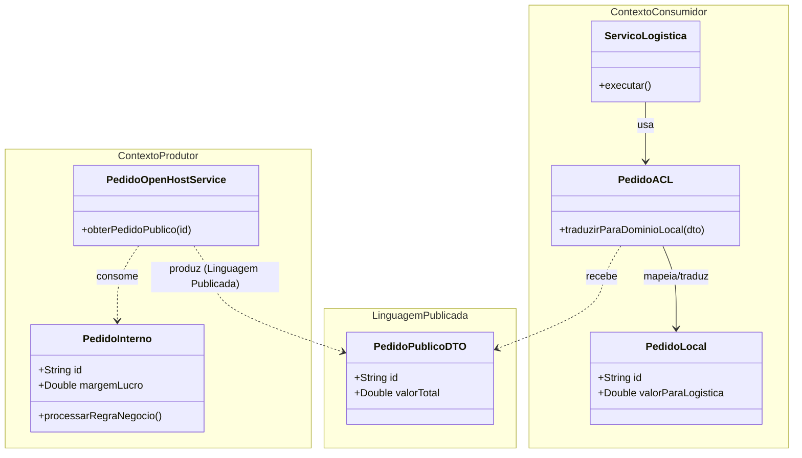
```mermaid
classDiagram
    %% --- CONTEXTO PRODUTOR (OHS) ---
    namespace ContextoProdutor {
        class PedidoInterno {
            +String id
            +Double margemLucro
            +processarRegraNegocio()
        }
        class PedidoOpenHostService {
            +obterPedidoPublico(id)
        }
    }

    %% --- CONTRATO PÚBLICO (Linguagem Publicada) ---
    namespace LinguagemPublicada {
        class PedidoPublicoDTO {
            +String id
            +Double valorTotal
        }
    }

    %% --- CONTEXTO CONSUMIDOR (ACL) ---
    namespace ContextoConsumidor {
        class ServicoLogistica {
            +executar()
        }
        class PedidoACL {
            +traduzirParaDominioLocal(dto)
        }
        class PedidoLocal {
            +String id
            +Double valorParaLogistica
        }
    }

    %% Relacionamentos OHS (Produtor fornece a interface)
    PedidoOpenHostService ..> PedidoInterno : consome
    PedidoOpenHostService ..> PedidoPublicoDTO : produz (Linguagem Publicada)

    %% Relacionamentos ACL (Consumidor se protege)
    ServicoLogistica --> PedidoACL : usa
    PedidoACL ..> PedidoPublicoDTO : recebe
    PedidoACL --> PedidoLocal : mapeia/traduz
```

A **Camada Anticorrupção (ACL)** é um padrão essencial para manter a saúde do seu domínio quando você precisa integrar seu sistema com outros, especialmente sistemas legados ou de terceiros.


##### O Conceito
Imagine que seu sistema fala "Português" (seu modelo de domínio limpo) e você precisa se comunicar com um sistema que fala "Grego Antigo" (um sistema legado confuso). Se você começar a usar palavras em grego no seu código, seu domínio ficará poluído e difícil de manter. A **ACL funciona como um intérprete**: ela traduz o que vem de fora para a sua linguagem, garantindo que o seu domínio permaneça "puro".


##### Pontos Chave segundo Khononov:
* **Proteção do Modelo:** Ela evita que a complexidade e os modelos de outros contextos "vazem" e corrompam o seu modelo de domínio.
* **Redução de Complexidade:** A ACL descarrega a responsabilidade da integração, separando a lógica de negócio da lógica de tradução de dados.
* **Evolução como Serviço:** Khononov propõe que a ACL não seja apenas um código interno, mas pode ser implementada como um **serviço autônomo**, o que reduz drasticamente a complexidade global do sistema.
* **Interface Compacta:** Ao usar uma ACL, o seu contexto consumidor trabalha com um modelo mais conveniente, sem precisar lidar com a complexidade exposta pelo serviço produtor.

> "O padrão ACL reduz a complexidade de integrar o serviço com outros contextos delimitados."


Para implementar uma **Camada Anticorrupção (ACL)** em Java, o segredo é criar um componente que atue como uma "barreira de tradução". Ele deve receber dados do sistema externo (no formato dele) e convertê-los para o formato que o seu Domínio espera, antes mesmo que esses dados cheguem à sua lógica de negócio.

Aqui está um exemplo prático:

##### 1. O Modelo do Sistema Externo (O que não queremos no nosso domínio)

Imagine um sistema externo legado que retorna dados em um formato estranho.

```java
// Formato do sistema legado (não queremos isso espalhado no nosso código)
public class PedidoLegado {
    public String ID_EXTERNO;
    public String VALOR_STR; // Armazenado como String
    public String DATA_ISO;
}

```

##### 2. Nosso Modelo de Domínio (O que queremos proteger)

Este é o modelo limpo que sua aplicação usa.

```java
public record Pedido(String id, double valor, LocalDate data) {}

```

##### 3. A Camada Anticorrupção (ACL)

Esta classe é a "tradutora". Ela fica entre o mundo externo e o seu domínio.

```java
public class PedidoACL {
    private final ClienteServicoExterno servicoExterno;

    public PedidoACL(ClienteServicoExterno servico) {
        this.servicoExterno = servico;
    }

    public Pedido buscarPedido(String id) {
        // 1. Chama o sistema legado
        PedidoLegado legado = servicoExterno.getPedido(id);
        
        // 2. Traduz (aqui reside a "proteção" contra a corrupção)
        double valor = Double.parseDouble(legado.VALOR_STR);
        LocalDate data = LocalDate.parse(legado.DATA_ISO);
        
        // 3. Retorna o objeto limpo para o seu domínio
        return new Pedido(legado.ID_EXTERNO, valor, data);
    }
}

```

##### 4. O Uso no Domínio

Seu código de negócio nunca "vê" o `PedidoLegado`.

```java
public class PedidoService {
    private final PedidoACL acl;

    public void processar(String id) {
        // O serviço de negócio trabalha apenas com o objeto "Pedido" limpo
        Pedido pedido = acl.buscarPedido(id);
        
        // Lógica de negócio protegida...
    }
}

```

##### Por que isso é uma ACL?

1. **Isolamento:** Se o sistema externo mudar o campo `VALOR_STR` para um objeto complexo, você só altera o código dentro da classe `PedidoACL`. O resto do seu sistema permanece intacto.
2. **Conversão:** A ACL encapsula toda a sujeira da integração (parsing, tratamento de erros de formato, mapeamento).
3. **Independência:** Seu domínio define como ele quer trabalhar, e a ACL faz o "ajuste de conta" para que o mundo externo se adapte ao seu modelo, e não o contrário.


-----

Para fixar de vez a diferença entre os dois padrões nas suas revisões:

* **No código da ACL (anterior):** O seu contexto se protege criando um tradutor para limpar a "sujeira" que vem de uma API externa (o controle de tradução é **seu**, o consumidor se defende).
* **No código do OHS (este atual):** O seu contexto é o **provedor** do serviço. Você voluntariamente cria um DTO (`PedidoPublicoDTO`) e um serviço (`PedidoOpenHostService`) amigável para que os outros contextos não sofram para se integrar com você (o controle da tradução é do **produtor**, que ajuda a comunidade de serviços ao redor).


Resumo Comparativo (Para fixar na mente):

| Padrão | Quem tem a iniciativa? | Onde fica a lógica de tradução? | Objetivo |
| --- | --- | --- | --- |
| **ACL** | O **Consumidor** | Dentro do contexto do **Consumidor** | Se proteger do modelo ruim ou instável do produtor. |
| **OHS** | O **Produtor** | Dentro do contexto do **Produtor** | Ser um bom cidadão na arquitetura, oferecendo uma interface estável e simplificada para quem precisar. |


#### Conclusão
Todos os microsserviços são contextos delimitados, mas nem todos os contextos delimitados são necessariamente microsserviços.

Limites mais amplos do que seus contextos delimitados resultará em uma grande bola de lama

Limites menores do que os microsserviços levarão a uma grande bola de lama distribuída

#### Exercício
1. a
2. d
3. b (errado) c
4. b (errado) D


##### 3. Quais são os limites dos componentes seguros?     
a. Limites mais amplos que os contextos delimitados.     
b. Limites mais estreitos que os microsserviços.     
c. Limites entre os contextos delimitados (mais amplos) e os microsserviços (mais estreitos).     
d. Todos os limites são seguros.    


Ao analisarmos a questão apresentada, estamos tocando em um ponto crucial: **onde exatamente devemos traçar a fronteira de um componente ou serviço para garantir que ele seja saudável e sustentável?**

**A Resposta Correta**    

A alternativa correta é a **c**: *Limites entre os contextos delimitados (mais amplos) e os microsserviços (mais estreitos).*

**Por que essa é a resposta de Khononov?**    

Para entender melhor, imagine uma analogia com uma empresa:

* **O Contexto Delimitado** é como um departamento (ex: Departamento de Vendas). Ele tem uma responsabilidade clara e uma linguagem específica (Linguagem Ubíqua).
* **O Microsserviço** é como um pequeno grupo de trabalho ou até um indivíduo dentro desse departamento.

Se você fizer o limite muito amplo (como a alternativa **a**), o componente se torna um monolito difícil de manter. Se você fizer o limite muito estreito (como a alternativa **b**), você acaba caindo na "falácia dos microsserviços", onde o sistema se torna excessivamente fragmentado, gerando uma complexidade operacional imensa, o que Khononov alerta que deve ser evitado.

A "zona segura" reside exatamente no meio: os limites devem ser definidos para que o componente seja pequeno o suficiente para ser gerenciável e independente, mas grande o suficiente para encapsular uma capacidade de negócio completa, sem quebrar as fronteiras do contexto delimitado.


##### 4. É uma boa decisão de design alinhar os microsserviços com os limites de agregado?    
a. Sim, os agregados sempre são microsserviços adequados.     
b. Não, os agregados nunca devem ser expostos como microsserviços individuais.     
c. É impossível transformar um único agregado em microsserviço.     
d. A decisão depende do domínio de negócio.    


**Pergunta**  

> "É uma boa decisão de design alinhar os microsserviços com os limites de agregado?"

**Resposta (Baseada em Vlad Khononov)**  

A resposta correta é a **alternativa d: A decisão depende do domínio de negócio.**

**Pontos de Consulta e Reflexão**  

* **Agregado vs. Microsserviço:** O Agregado é um padrão tático focado na consistência transacional e no encapsulamento de lógica de negócio. Já o microsserviço é uma unidade estratégica de implantação, escalabilidade e autonomia de equipe.
* **A "Armadilha" da Granularidade:**
  * **Muito Granular:** Alinhar cada agregado a um microsserviço pode levar a um sistema excessivamente fragmentado, aumentando a complexidade de rede, latência e gestão distribuída desnecessariamente.
  * **Coesão é a chave:** Se um conjunto de agregados compartilha alta coesão e faz parte do mesmo contexto delimitado, geralmente é mais eficiente mantê-los juntos dentro de um único microsserviço.


* **Critérios de Decisão:** A escolha deve ser guiada por fatores como a necessidade de escalabilidade independente, autonomia da equipe e limites de confiança, e não por uma regra fixa de mapeamento.


### Capítulo 15 - Arquitetura Orientada a Eventos
EDA - Event-Driven Architecture 

A arquitetura orientada a eventos está ligada ao DDD, afinal, é baseado em eventos. Pode ser tentador utilizar os eventos do DDD como base para o uso da arquitetura orientada a eventos, mas é uma ideia?

O evento não é uma formula mágica que pode ser adicionadada em um sistema antigo para transformar num sistema distribuído, podendo gerar uma `grande bola de lama distribuída`.


#### Arquitetura orientada a eventos
A arquitetura orientada a eventos é um estilo arquitetônico no qual os componentes de um sistema se comunicam de forma assíncrona através da troca de mensagens de eventos.

O padrão saga (capítulo 9) é um exemplo de fluxo de execução orientada a eventos.

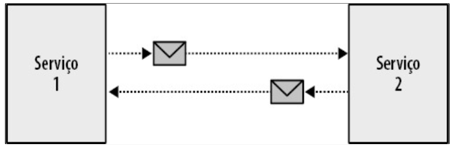

> Event Source capítulo 7 é diferente de arquitetura orientada a eventos. Event Sourcing é um método para capturar mudanças de estado como uma série de eventos. O event Sourcing ocorre dentro do serviço, já o EDA (Event-Driven Architecture) ocorre na comunicação dos serviços.

Existem 3 tipos de eventos que serão abordados no capítulo.


#### Eventos
No EDA (Event-Driven Architecture) a troca de eventos permite a comunicação entre componentes para se tornar um sistema.


##### Eventos, Comandos e Mensagens
Evento e Mensagens são semelhantes quanto a definição, mas são diferentes. Um evento é uma mensagem, mas uma mensagem não é um evento. Existem 2 tipos de mensagens:

**Evento**    
- Uma mensagem que descreve uma mudança que aconteceu
- Um evento não pode ser cancelado, somente pode ser feito uma reversão (ação compensatória), através de um comando, por exemplo, no padrão saga.

**Comando**    
- Uma mensagem que descreve uma operação que precisa ser realizada
- Comando pode ser rejeitado (inválido devido uma regra de negócio)

##### Estrutura
Um evento é um registro de dados que pode ser serializado e transmitido usando a plataforma ce mensagens de sua escolha.

Exemplo de um esquema de evento com metadados:
```json
{
    "type": "delivery-confirmed",
    "event-id": "14101928-4d79-4da6-9486-dbc4837bc612",
    "correlation-id": "08011958-6066-4815-8dbe-dee6d9e5ebac",
    "delivery-id": "05011927-a328-4860-a106-737b2929db4e",
    "timestamp": 1615718833,
    "payload": {
        "confirmed-by": "17bc9223-bdd6-4382-954d-f1410fd286bd",
        "delivery-time": 1615701406
    }
}
```


##### Tipos de eventos
Os eventos são categorizados em: notificação de eventos, transferência de estado por eventos ou eventos de domínio.


###### Notificação de eventos
Relativo a uma mudança no domínio de negócio como: `PaycheckGenerated` e `CampaignPublished`
```json
{
    "type": "paycheck-generated",
    "event-id": "537ec7c2-d1a1-2005-8654-96aee1116b72",
    "delivery-id": "05011927-a328-4860-a106-737b2929db4e",
    "timestamp": 1615726445,
    "payload": {
        "employee-id": "456123",
        "link": "/paychecks/456123/2021/01"
    }
}
```


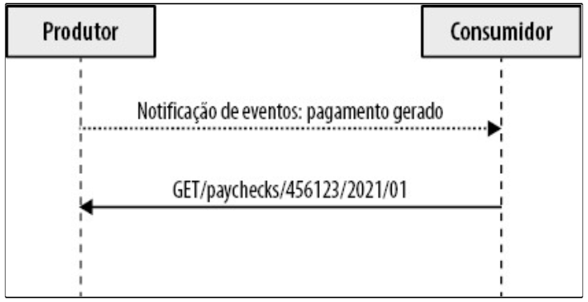


> Além disso, no caso de consumidores simultâneos, em que apenas um assinante deve processar um evento, o processo de consulta pode ser integrado com o bloqueio pessimista. Isso garante ao lado do produtor que nenhum outro consumidor será capaz de processar a mensagem.


###### Transferência de estado por eventos (ECST)
ECST: Event-Carried State Transfer

Diferente das **mensagens de notificação de evento**, a transferência de estado por eventos envia todos os dados que refletem a mudançã de estado. POdendo ser de duas formas: um retrato completo do estado ou somente os dados alterados.

Retrato completo:
```json
{
    "type": "customer-updated",
    "event-id": "6b7ce6c6-8587-4e4f-924a-cec028000ce6",
    "customer-id": "01b18d56-b79a-4873-ac99-3d9f767dbe61",
    "timestamp": 1615728520,
    "payload": {
        "first-name": "Carolyn",
        "last-name": "Hayes",
        "phone": "555-1022",
        "status": "follow-up-set",
        "follow-up-date": "2021/05/08",
        "birthday": "1982/04/05",
        "version": 7
    }
}
```

Retrato parcial:
```json
{
    "type": "customer-updated",
    "event-id": "6b7ce6c6-8587-4e4f-924a-cec028000ce6",
    "customer-id": "01b18d56-b79a-4873-ac99-3d9f767dbe61",
    "timestamp": 1615728520,
    "payload": {
        "status": "follow-up-set",
        "follow-up-date": "2021/05/10",
        "version": 8
    }
}
```


Os consumidores podem manter um fluxo local em cache com o estados das mensagens. Essa abordagem torna o sistema tolerante a falhas. Em vez de consultar as fontes de dados sempre que os dados são necessários, os dados podem ser armazenados em cache localmente, como na Figura abaix:

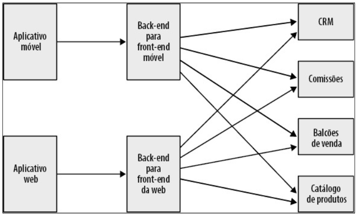


###### Eventos de domínio
O terceiro tipo de mensagem de evento é o evento de domínio que descrevemos no Capítulo 6. De certa forma, os eventos de domínio estão em algum lugar entre a notificação de eventos e as mensagens ECST (Event-Carried State Transfer): ambos descrevem um evento significativo no domínio de negócio e contêm todos os dados que descrevem o evento. Apesar das semelhanças, as mensagens são conceitualmente diferentes.


##### Eventos de domínio versus notificação de evento
As notificações de eventos são projetadas com a intenção de aliviar a integração com outros componentes. Os eventos de domínio, por outro lado, têm a intenção de modelar e descrever o domínio de negócio.


##### Eventos de domínio versus transferência de estado por eventos
Uma mensagem **transferência de estado por eventos** fornece informações suficientes para manter um cache local dos dados do produtor.

Os dados incluídos nos eventos de domínio não pretendem descrever o estado do agregado. Em vez disso, eles descrevem um evento de negócio que aconteceu durante seu ciclo de vida.


##### Tipos de evento: Exemplo

```json
eventNotification = {
    "type": "marriage-recorded",
    "person-id": "01b9a761",
    "payload": {
        "person-id": "126a7b61",
        "details": "/01b9a761/marriage-data"
    }
};

ecst = {
    "type": "personal-details-changed",
    "person-id": "01b9a761",
    "payload": {
        "new-last-name": "Williams"
    }
};

domainEvent = {
    "type": "married",
    "person-id": "01b9a761",
    "payload": {
        "person-id": "126a7b61",
        "assumed-partner-last-name": true
    }
};
```

- Notificação de Evento (eventNotification com type "marriage-recorded"): contém informação mínima e um link para obter mais detalhes
- Transferência de estado por eventos (ecst com type "personal-details-changed"): fornece as informações necessárias, no caso, informação de autalização do último nome.
- Eventdo de domínio (domainEvent com o type "married"): é modelado o mais próximo possível da natureza do evento no domíno de negócio, contendo o ID da pessoa e um indicador que simboliza uma pessoa que adotou o nome de seu parceiro ou não


#### Projetando a integração orientada a eventos

##### Grande bola de lama distribuída
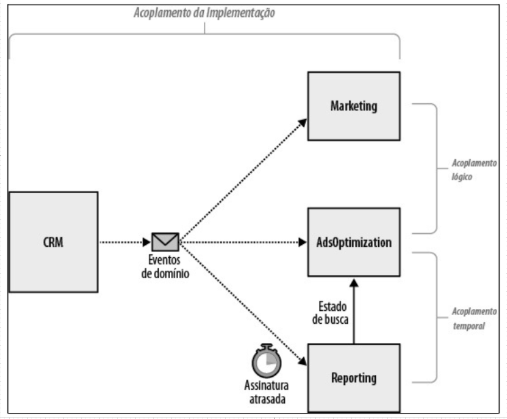


##### Acoplamento temporal
O componente AdsOptimization tem que terminar seu processamento antes que o módulo Reporting seja disparado, para isso existe um delay no sitema Reporting.


##### Acoplamento lógico
Quando uma alteração em uma funcionalidade de negócio exige uma mudança sincronizada em múltiplos componentes ou contextos.

O **acoplamento lógico** ocorre quando múltiplos componentes ou contextos delimitados implementam a mesma funcionalidade de negócio.
* **O problema:** Como a lógica está duplicada, qualquer alteração na regra de negócio exige uma atualização sincronizada em todos os lugares onde ela foi implementada.
* **Impacto:** Gera fragilidade (risco de inconsistência), perda de autonomia das equipas e desperdício de esforço com código duplicado.
* **Conclusão:** É um sinal de que os contextos não são verdadeiramente autónomos, comprometendo a agilidade e a independência do sistema.


##### Acoplamento de implementação
Ocorre quando o modelo de dados ou o contrato de eventos de um contexto (ex: CRM) é alterado, forçando uma atualização imediata em todos os contextos que o consomem (ex: Marketing, AdsOptimization).
- **O Problema:** Existe uma dependência direta na estrutura técnica (esquema) das mensagens.
- **Impacto:** O emissor dos eventos perde a liberdade de evoluir seu modelo. Se os assinantes não forem atualizados simultaneamente, as projeções falham ou os dados tornam-se inconsistentes.
- **Conclusão:** É uma forma de rigidez arquitetural que compromete a autonomia dos Bounded Contexts, pois o "consumidor" acaba acoplado aos detalhes de implementação do "provedor".

> buscamos isolar o impacto das mudanças. Quando um contexto depende excessivamente da estrutura interna de outro (como o esquema exato de um evento), perdemos a autonomia que a estratégia de Bounded Contexts deveria nos proporcionar.


##### Refatorando a Integração Orientada a Eventos

ECST: Event-Carried State Transfer


Compreendo perfeitamente a sua dúvida. É comum confundir "Eventos de Domínio" (Domain Events) com "Eventos de Integração" (Integration Events) ou padrões de mensageria, como o **ECST**.

Vamos desmistificar esse texto do livro, que é um ponto crucial do DDD moderno.

##### O Problema: O "Acoplamento por Eventos"

O texto está alertando sobre um erro muito comum: **expor todos os eventos internos do seu sistema para fora.**

Imagine que no seu `CRM` você tem um evento chamado `ClienteCadastrado`, `ClienteAtualizouEndereco`, `ClienteMudouTelefone`. Se você expõe tudo isso para o `Marketing` e `AdsOptimization`, o que acontece?

1. **Acoplamento de Implementação:** Se o seu `CRM` mudar a estrutura interna dele (o modelo de banco de dados, por exemplo), todos os serviços que consomem esses eventos quebrarão. Você virou refém do seu próprio modelo interno.
2. **Acoplamento Lógico:** Os consumidores precisam saber *como* o `CRM` funciona para montar o estado deles. Eles fazem o trabalho pesado que o produtor deveria ter feito.


##### A Solução: O Padrão ECST (Event-Carried State Transfer)
O texto sugere que, em vez de disparar qualquer evento interno, você deve criar um **modelo específico de integração**.

* **O que é o "Estado Projetado":** É um documento (geralmente um JSON) que contém exatamente o que o consumidor precisa, no formato que o consumidor precisa.
* **Encapsulamento:** É o `CRM` quem prepara esse "Estado Projetado". O `CRM` traduz o modelo interno dele para esse modelo de integração.
* **Contrato Orientado ao Consumidor:** Você não envia o que "acha" que eles precisam. Você conversa com os times de `Marketing` e `AdsOptimization`, entende o que eles precisam para funcionar e cria um **contrato** (uma interface de dados) que o `CRM` promete entregar.

##### Visualizando a Mudança
| Abordagem Ruim (Acoplada) | Abordagem Boa (ECST / Integrada) |
| --- | --- |
| Enviar todo evento interno do CRM. | Enviar apenas o "Estado Projetado" consolidado. |
| Consumidor precisa montar a lógica do dado. | Produtor encapsula a lógica e entrega o dado pronto. |
| Se o CRM muda o interno, o sistema quebra. | Se o CRM muda o interno, ele apenas atualiza o "tradutor" para o contrato de integração. |

##### Resumo para o seu dia a dia

O **ECST** serve para colocar uma camada de proteção entre sistemas. O **CRM** (produtor) diz: *"Eu não me importo com como vocês funcionam, mas eu garanto que entregarei este pacote de informações (Estado Projetado) sempre que algo importante acontecer"*.

Os consumidores, por sua vez, param de tentar "adivinhar" o que aconteceu no produtor e passam a apenas consumir o estado final que lhes interessa. Isso é **desacoplamento** real.


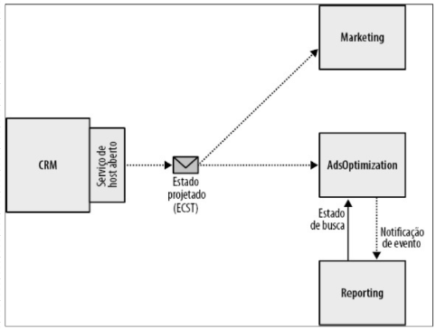

Para lidar com o acoplamento temporal entre os contextos delimitados AdsOptimization e Reporting, o componente AdsOptimization pode publicar uma mensagem de notificação de eventos, disparando o componente Reporting para buscar os dados de que necessita. Esse sistema refatorado é mostrado na Figura


#### Heurística do design orientado a eventos

##### Presuma o pior
Andrew Groven disse:
- a rede é lenta
- Os servidores falharão no momento mais inconveniente possível. 
- Os eventos chegarão fora de ordem.
- Os eventos serão duplicados.

A palavra “orientada” em arquitetura orientada a eventos significa que todo o seu sistema depende do sucesso da entrega das mensagens. Portanto, evite a mentalidade “as coisas ficarão bem”. Verifique se os eventos são sempre entregues de forma consistente, não importa o que aconteça: 
- Use o padrão da caixa de saída para publicar mensagens de forma confiável. 
- Ao publicar mensagens, verifique se os assinantes serão capazes de reduplicar as mensagens, identificar e reorganizar as mensagens fora de ordem. 
- Utilize os padrões saga e gerenciador de processo ao orquestrar processos de contextos delimitados cruzados que exigem a realização de ações compensatórias.


##### Utilize eventos públicos e privados
Em sistemas complexos, um erro comum é "vazar" detalhes internos de implementação para outros contextos. Khononov enfatiza que eventos de domínio não devem ser tratados apenas como simples mensagens técnicas, mas como **parte integrante da interface pública** do seu Contexto Delimitado.

Aqui está o resumo dos conceitos apresentados na imagem:
- **Interface Pública vs. Interna:** Assim como em uma empresa, onde os departamentos têm processos internos (privados) e comunicados oficiais (públicos), o seu Bounded Context deve proteger sua lógica interna. Ao publicar eventos, você está definindo um contrato público.
- **Linguagem Publicada:** Os eventos precisam estar alinhados à "linguagem publicada" do seu contexto. Se o nome ou o conteúdo do evento for confuso ou puramente técnico, você criará um acoplamento indesejado com os sistemas consumidores.
- **Mensagens de Transferência de Estado (State Transfer):** São modelos compactos e focados. Em vez de enviar o objeto inteiro do seu modelo de domínio (que pode conter regras de negócio e dados sensíveis), você envia apenas o "essencial" que o consumidor precisa para realizar o trabalho dele.
- **Mensagens de Notificação:** Uma forma ainda mais minimalista de comunicação, onde o evento serve apenas como um gatilho ("algo aconteceu"), forçando o consumidor a consultar a fonte (o seu contexto) caso precise de mais detalhes. Isso minimiza drasticamente a superfície de exposição da sua interface.

###### Analogia do Mundo Real
Imagine o setor de **Recursos Humanos** de uma empresa.
- **Eventos Privados:** As discussões sobre o desempenho interno de um funcionário ou as notas de uma avaliação são privadas (o "modelo de implementação").
- **Evento Público:** Quando o RH emite um comunicado oficial dizendo: *"Fulano foi promovido"*. Este é o evento público. Ele não precisa explicar *por que* (os detalhes internos), apenas informa o fato necessário para que o departamento financeiro atualize o salário e o TI atualize o acesso.

> **Nota importante:** Khononov reforça que o cuidado com esses eventos é essencial, especialmente em sistemas que utilizam *Event Sourcing* ou Agregados orientados a eventos, onde o risco de expor o modelo interno é maior.


#### Avalie os requisitos de consistência

Avalie os requisitos de consistência Ao projetar a comunicação orientada a eventos, avalie os requisitos de consistência dos contextos delimitados como uma heurística adicional para a escolha do tipo de evento:
- Se os componentes puderem aceitar finalmente dados consistentes, use a mensagem de transferência de estado por eventos. 
- Se o consumidor precisar ler a última gravação no estado do produtor, envie uma mensagem de notificação de evento, com uma consulta posterior para buscar o estado atualizado do produtor.

---
A escolha do tipo de evento não é apenas sobre o que esconder ou mostrar, mas sobre **como o sistema consumidor precisa lidar com os dados**. Vlad Khononov nos dá uma heurística prática baseada na necessidade de "frescor" da informação:
- **Consistência Eventual (Mensagem de Transferência de Estado):** Se o seu sistema consumidor aceita trabalhar com um dado que pode estar ligeiramente "atrasado" ou desatualizado por alguns instantes, envie os dados dentro do próprio evento. É rápido e desacoplado.
- **Consistência Imediata/Leitura Atualizada (Mensagem de Notificação + Consulta):** Se o consumidor precisa garantir que está lendo o dado mais recente (o "estado atual" do produtor), não envie o dado no evento. Envie apenas uma **notificação** (um "sinal" de que algo mudou) e obrigue o consumidor a consultar a fonte oficial para buscar o valor exato no momento da leitura.

##### Em resumo:
- Precisa de **velocidade e tolerância** ao atraso? **Transfira o estado** no evento.
- Precisa de **precisão absoluta** no valor? **Notifique** e deixe o consumidor buscar o dado atualizado na fonte.


#### Conclusão
EDA (Event-Driven Architecture)

No capítulo falou sobre os 3 tipos de eventos:
- notificação de evento
- transferência de estado por eventos
- evento de domínio

O uso inadequado do tipo de evento transforma o sistema bseado em EDA (Event-Driven Architecture), uma grande bola de lama. 
- Avalie os requisitos de consistência 
- Tenha cuidado ao expor os detalhes
- Garanta que o sistema entregue as mensagens, mesmo em caso de problemas técnicos e interrupções.


#### Exercícios
1. D
2. B
3. A
4. ~~D~~ B    
R: S2 deve publicar notificações de evento, sinalizando para que S1 emita uma solicitação síncrona para obter a informação mais atualizada.

> Precisa de **velocidade e tolerância** ao atraso? **Transfira o estado** no evento. Precisa de **precisão absoluta** no valor? **Notifique** e deixe o consumidor buscar o dado atualizado na fonte.


