# fundamentos-arquitetura-software
Escrito por Mark Richards e Neal Ford

- Material complementar: https://fundamentalsofsoftwarearchitecture.com/

https://www.youtube.com/@markrichards5014


# Capítulo 1 : Introdução
Citação de Martin Fowler sobre a definição da profissão de arquiteto de software:
> Arquitetura é sobre algo importante… seja lá o que for. — Ralph Johnson

Por que não existe uma trajetória para os arquitetos de software?
- Primeiro: não existe uma boa definição
- Segundo: de acordo com o mapa mental demostrado no livro, o profissional incorpora uma enorme quantidade de dominos e responsabilidades e continua a expandir
- Terceiro: devido a evolução rápida do ecossistema de desenvolvimento de software, ficará desatualiza futuramente
- Quarto: grande parte do material tem apenas relevância histórica


## Definindo a arquitetura de software
Ao pergunta para um arquiteto para descrever uma arquitetura, ele responde:
> "É uma arquitetura de microserviços"
- arquitetura do sistema e estrutura do sistema são diferentes: a frase está dizendo somente da estrtura

### Estruturas
Tipos de estruturas:
- microsserviços
- arquitetura em camadas
- microkernel


### Características
São os atributos que o sistema deve suportar como:
- Disponibilidade
- Confiabilidade
- Testabilidade
- Escalabilidade
- Segurança
- Agilidade
- Tolerância a falhas
- Elasticidade
- Recuperabilidade
- Desempenho
- Implementabilidade
- Capacidade de aprendizagem

<details>
    <summary>Gerado por IA</summary>

    ### Diferença entre Arquitetura e Estrutura
    De acordo com o texto explicativo dos autores:

    * **Estrutura (O "Como se organiza"):** É apenas o **estilo de arquitetura** no qual o sistema está sendo implementado. Ela dita a disposição física e lógica dos componentes. Exemplos de estruturas comuns citados são: *microsserviços, arquitetura em camadas (layered)* ou *microkernel (plug-ins)*. O texto enfatiza que se você perguntar a um arquiteto sobre a arquitetura e ele responder apenas "é uma arquitetura de microsserviços", ele está descrevendo **apenas a estrutura**, e não a arquitetura em sua totalidade.
    * **Arquitetura (A "Visão Holística"):** É o conjunto completo. A arquitetura engloba a **estrutura**, mas a ela soma-se obrigatoriamente o conhecimento das **características da arquitetura** (as necessidades de negócio e atributos de qualidade do sistema), as **decisões arquiteturais** (as restrições técnicas impostas) e os **princípios de design** (as diretrizes de desenvolvimento).

    **Em resumo:** A estrutura é uma parte contida dentro da arquitetura. Descrever um sistema unicamente por sua estrutura (ex: "é orientado a microsserviços") é um erro comum, pois falha em exibir a arquitetura em sua totalidade e o contexto real de funcionamento e decisões do sistema.
</details>


### Decisões de arquitetura
- restrições de como um sistema deve ser construído, por exemplo, somente camadas de serviço devem acessar o banco de dados

> uma restrição (regra) pode ser quebrada por uma **variância**


### Princípios de design
- Princípio: utilizado para orientar
- diretriz: é obrigatória, uma regra


<details>
  <summary>Gerado por IA</summary>

  ### O Conceito em Linhas Gerais
  Pense nas decisões de arquitetura como as **leis** de um país (regras rígidas que precisam ser seguidas) e nos princípios de design como os **manuais de boas maneiras** ou **diretrizes** (orientações que mostram o caminho preferencial, mas dão margem para adaptação).

  Um princípio de design não dita exatamente *como* fazer algo com uma regra de ferro, mas define uma *intenção clara* para guiar os desenvolvedores no dia a dia, permitindo que eles escolham a melhor ferramenta para o contexto específico.

  ---

  ### A Visão dos Autores (Richards & Ford)
  Como mostramos na **Figura 1-6**, a arquitetura de software é sustentada por quatro pilares fundamentais: a estrutura, as características de arquitetura (os "ilities"), as decisões de arquitetura e, finalmente, os **princípios de design**.

  Para nós, a diferença crucial está na flexibilidade:

  * **Decisão de Arquitetura (Regra):** É mandatória. Se a regra diz "cada microsserviço deve ter seu próprio banco de dados", o desenvolvedor não pode criar um banco compartilhado.
  * **Princípio de Design (Diretriz):** É orientador. Como no exemplo da imagem: *"Sempre que possível, utilize a mensageria assíncrona entre os serviços para aumentar o desempenho"*.
</details>


## Expectativas de um arquiteto
- No lugar de focar na função de um arquiteto de software, é recomendado focar nas expectativas de um arquiteto:
- Tomar decisões de arquitetura 
- Analisar continuamente a arquitetura 
- Manter-se atualizado com as últimas tendências 
- Assegurar a conformidade com as decisões 
- Exposição e experiência diversificadas 
- Ter conhecimento sobre o domínio do negócio 
- Ter habilidades interpessoais 
- Entender e lidar bem com questões políticas


### Tomar decisões de arquitetura
> Um arquiteto deve estabelecer as decisões (regras) da arquitetura e os princípios (orientações) do design usados para orientar as decisões de tecnologia dentro da equipe, do departamento ou em toda a empresa.


<details>
  <summary>Gerado por IA</summary>

  ### O Conceito em Linhas Gerais
  Em termos simples, o papel do arquiteto de software não é ditar rigidamente cada ferramenta que os desenvolvedores devem usar, mas sim criar as **regras do jogo** e dar uma **direção clara**.

  Pense no arquiteto como um planejador urbano: ele define as zonas residenciais e as vias expressas (a estrutura e os princípios), mas deixa os construtores escolherem os tijolos e acabamentos específicos (as escolhas técnicas do dia a dia).

  ---

  ### A Visão dos Autores (Richards & Ford)

  Mark Richards e Neal Ford defendem que a principal missão do arquiteto nesta primeira expectativa é **orientar, não especificar**.

  * **Decisão Técnica vs. Decisão Arquitetural:** Escolher uma biblioteca específica (como o *React.js*) de forma isolada é apenas uma decisão técnica. A decisão arquitetural ideal é definir uma diretriz genérica — por exemplo, exigir o uso de um *framework reativo para o front-end* — dando autonomia para a equipe escolher a melhor ferramenta (React, Angular, Vue, etc.) dentro desse limite.
  * **O Segredo da Decisão Eficiente:** Os autores propõem uma pergunta-chave para testar suas decisões: *Esta regra está ajudando a guiar o time a fazer a escolha certa ou está simplesmente tirando o poder de escolha deles?*
  * **A Exceção Justificável:** Há momentos em que o arquiteto precisa, sim, cravar uma tecnologia específica. No entanto, isso só deve acontecer se essa ferramenta for estritamente necessária para garantir uma **característica de arquitetura** vital (os chamados "-ilidades"), como garantir alta escalabilidade, desempenho crítico ou disponibilidade do sistema. Nesse cenário, vira uma decisão de arquitetura legítima.
</details>


### Analisar continuamente a arquitetura
> Um arquiteto deve analisar continuamente a arquitetura e o ambiente de tecnologia atual, para então recomendar soluções de melhorias.


<details>
  <summary>Gerado por IA</summary>

  ### O Conceito em Linhas Gerais
  Sistemas de software envelhecem. Analisar continuamente a arquitetura significa que o trabalho do arquiteto não termina quando o sistema vai para o ar. Trata-se do esforço constante de olhar para o ecossistema atual e garantir que a estrutura criada no passado ainda faça sentido hoje, evitando que o sistema se degrade e se torne obsoleto diante de novas tecnologias ou mudanças no negócio.

  ---

  ### A Visão dos Autores (Richards & Ford)

  * **Vitalidade da Arquitetura:** Uma arquitetura definida há alguns anos pode perder a validade devido a novas demandas de mercado ou evoluções tecnológicas. Avaliar essa vitalidade garante que o software continue viável e funcional.
  * **Prevenção da Decadência Estrutural:** Alterações diárias feitas no código ou no design pelos desenvolvedores podem, sem querer, destruir características cruciais do sistema (como desempenho, disponibilidade e escalabilidade). O arquiteto precisa monitorar isso de perto para evitar que a estrutura colapse.
  * **Olhar Além do Código:** A análise contínua também exige atenção aos ambientes de teste e de implantação (*deployment*). Não adianta o código ser flexível se o time leva semanas para testar ou meses para lançar uma nova versão; a agilidade deve ser integrada e de ponta a ponta.
  * **Manutenção da Relevância:** O arquiteto deve estudar de forma integral as mudanças técnicas e o domínio do problema para manter as aplicações robustas e competitivas no mercado.
</details>


### Manter-se Atualizado com as Últimas Tendências
- desenvolvedores devem ficar atualizados para se manterem relevantes
- arquitetos devem se atualizar com tendência técnica e do setor


### Assegurar a conformidade com as decisões
- conformidade é verificar/fiscalizar se o que foi decidido continua sendo obedecido/respeitado

<details>
  <summary>Gerado por IA</summary>

  ### O Conceito em Linhas Gerais

  Assegurar a conformidade significa garantir que o código construído no dia a dia esteja alinhado com as regras estruturais que foram combinadas para o projeto. Em um paralelo simples, o arquiteto cria a planta e as regras de segurança de um prédio; assegurar a conformidade é fiscalizar a obra para garantir que ninguém derrube uma parede mestre ou use materiais que coloquem a estrutura em risco.

  ---

  ### A Visão dos Autores (Richards & Ford)

  * **Verificação Contínua:** O arquiteto precisa acompanhar constantemente se os times de desenvolvimento estão seguindo as decisões de arquitetura e os princípios de design previamente documentados e comunicados.
  * **Visão de Curto Prazo vs. Longo Prazo:** É comum que desenvolvedores queiram quebrar regras arquiteturais por motivos imediatos (como acessar o banco de dados direto da tela para poupar tempo ou ganhar desempenho pontual). Porém, o arquiteto foca no longo prazo, isolando camadas para garantir que mudanças futuras no banco não quebrem a interface.
  * **Consequência das Violações:** Permitir o descumprimento dessas regras faz com que o sistema perca os atributos fundamentais planejados (como manutenibilidade ou segurança), resultando em uma aplicação que não funciona como esperado.

</details>


### Exposição e experiência diversificadas
- estar familiarizado com diversas tecnologias
- concentrar na amplitude, não na profundidade técnica
- amplitude é o que você sabe, mas não quer dizer que domina profundamente
- para um arquiteto, a especialidade numa tecnologia é algo negativo


### Ter conhecimento sobre o domínio do negócio
- ajuda na comunicação com os usuários do negócio e os stakeholders
- arquiteto bem sucedido tem conhecimento técnico, prático e um bom conhecimento no domínio
- consegue se comunicar com executivos da diretoria e usuários comerciais


### Ter habilidades interpessoais
- habilidade de liderança é metade do que é necessário para se tornar um arquiteto eficiente
- essa característica ajuda a se diferenciar dentro de um conjunto de profissionais
- ajuda a liderar, treinar e aconselhar desenvolvedores e de comunicar com eficiência ideias, decisões e princípios.


### Entender e lidar com questões políticas
<details>
  <summary>Gerado por IA</summary>

  ## O Conceito em Linhas Gerais

  No dia a dia do desenvolvimento de software, quem programa costuma ter autonomia para tomar decisões técnicas locais (como escolher um padrão de projeto ou organizar as classes) sem precisar de aprovação superior. No entanto, quando passamos para o papel de **arquitetura de software**, o cenário muda drasticamente.

  Neste nível, quase todas as decisões técnicas impactam custos, prazos, outras equipes e o próprio negócio. Por isso, gerenciar expectativas significa entender que as suas decisões serão constantemente questionadas e que você precisará navegar pela **política corporativa** e dominar a **negociação** para conseguir implementar o que o sistema precisa.

  ---

  ### A Visão dos Autores (Richards & Ford)

  De acordo com a nossa abordagem na obra, a capacidade de lidar com as expectativas e com a política da empresa baseia-se nos seguintes pilares fundamentais:

  * **Toda Decisão Será Questionada:** Diferente do desenvolvedor, cujas escolhas de código passam quase invisíveis pela diretoria, as decisões do arquiteto afetam o ecossistema da empresa. Stakeholders, gerentes de projeto e desenvolvedores vão questionar suas propostas devido ao aumento de custos, tempo ou mudanças no fluxo de trabalho.
  * **O Clima Político da Empresa:** O arquiteto precisa entender o cenário político em que está inserido. Mudar a estrutura de um banco de dados ou isolar uma aplicação (criando silos para maior segurança, por exemplo) gera atritos com outros times que dependem daquele recurso. Saber lidar com essas tensões é parte essencial do papel.
  * **Negociação como Habilidade Vital:** Como você terá que justificar e lutar por praticamente cada decisão arquitetural importante, as habilidades de negociação e liderança tornam-se tão essenciais quanto o conhecimento técnico de código. É preciso argumentar e buscar aprovação de forma estratégica para mitigar as frustrações do cargo.


  ### O Exemplo dos Silos de Aplicação

  Imagine que um arquiteto cuida de um grande sistema de CRM e percebe que o acesso direto ao banco de dados por outros sistemas externos está a comprometer a segurança, o controlo e a flexibilidade para futuras mudanças no esquema.

  Para resolver este problema de engenharia, o arquiteto decide adotar uma estratégia de **silos de aplicação**, onde:

  * **Isolamento dos Dados:** Cada base de dados passa a ser acessível *única e exclusivamente* através da aplicação que a possui.
  * **Barreira de Acesso:** Qualquer outro sistema que precise de dados do CRM já não pode fazer consultas diretas à base de dados; agora é obrigado a solicitar as informações através de chamadas de acesso remoto (como APIs REST ou SOAP).

  ### O Impacto Político da Decisão

  Embora a criação de silos de aplicação traga benefícios claros de segurança e governança para o arquiteto, ela gera um impacto negativo imediato nas outras equipas da empresa.

  Essa decisão será fortemente questionada por quase todos porque:

  1. **Aumento de Esforço e Tempo:** As outras equipas de desenvolvimento terão de reescrever os seus códigos para substituir as consultas diretas por chamadas de API complexas.
  2. **Conflito de Interesses:** O que resolve o problema do arquiteto (segurança e controlo) cria novos problemas para os gestores e donos do produto (atrasos nas entregas e aumento de custos).

  Este cenário ilustra exatamente por que razão o arquiteto não pode ser apenas um técnico: ele precisa de usar a **política** e a **negociação** para justificar a necessidade do isolamento dos dados (os silos) e convencer os *stakeholders* de que o benefício a longo prazo supera o desconforto e o custo imediato.
</details>


## Inserçao da arquitetura e ...
<details>
  <summary>Gerado por IA</summary>

  Olá! Que excelente trecho para analisarmos. O que você acabou de trazer toca em uma das mudanças mais profundas que a nossa área sofreu nos últimos anos: a união definitiva entre o desenho do sistema (**Arquitetura**) e como ele roda de verdade (**Operações/DevOps**).

  Vamos desmistificar esse ponto crucial do livro.

  ---

  ### O Conceito em Linhas Gerais

  Antigamente, o arquiteto de software desenhava o sistema em um papel e "jogava o código por cima do muro" para a equipe de infraestrutura se virar para manter o sistema online. Era uma relação puramente burocrática e baseada em contratos.

  Hoje, com o avanço da nuvem e de modelos como os microserviços, as barreiras caíram. O arquiteto precisa projetar o software já pensando em como ele vai escalar, falhar e se recuperar automaticamente em produção. **Arquitetura e DevOps agora andam de mãos dadas.**

  ---

  ### A Visão dos Autores (Richards & Ford)

  Nós defendemos que o escopo do arquiteto moderno expandiu drasticamente. Não dá mais para ignorar o ambiente de execução.

  * **A Era Contratual (O Passado):** As empresas terceirizavam a infraestrutura para evitar dor de cabeça. A arquitetura se limitava a exigir metas em contratos (como *"o sistema precisa aguentar 99% de tempo de atividade"*), sem se preocupar em *como* o código ajudaria nisso.
  * **A Era DevOps e Microserviços (O Presente):** Características arquiteturais complexas (como **escala elástica** — a capacidade do sistema de aumentar ou diminuir de tamanho sozinho conforme o número de acessos) agora são resolvidas diretamente no código e nas configurações de deploy, de forma automatizada.
  * **Responsabilidade Compartilhada:** Para que uma arquitetura moderna funcione, arquitetos e engenheiros de DevOps precisam trabalhar juntos desde o primeiro dia. Preocupações operacionais tornaram-se decisões de design de software.
</details>


## Práticas da engenharia
- processo: fluxo de trabalho de uma organização, como empresas são formadas, como reuniões são feitas
- práticas: integração contínua (CI), práticas idependentes do processo
- práticas da XP (Extreme programming)
  a. teste
  b. integração contínua (CI)
  c. automação
  d. continuos delivery (CD)

> "... como sabemos, existem conhecimentos conhecidos; existem coisas que sabemos que sabemos. Também sabemos que existem incógnitas conhecidas, ou seja, sabemos que existem coisas que não sabemos. Mas também existem as incógnitas desconhecidas, aquelas que não sabemos que não sabemos."
> — Ex-secretário de Defesa dos EUA, Donald Rumsfeld

- adotar práticas de engenharia ágil, como a integração contínua, o provisionamento de máquina automatizado e práticas semelhantes, facilita criar arquiteturas resilientes, além de mostrar o quanto a arquitetura se torna interligada com as práticas de engenharia.


## Operações/DevOps
> Um axioma é uma verdade evidente por si mesma que não precisa de prova, servindo como base ou ponto de partida indiscutível para a construção de qualquer raciocínio, teoria ou sistema.

Exemplos:
- "o software deve ser manutenível"
- "a segurança não é opcional"

- Há alguns anos, questões arquiteturais que envolviam questões operacionais lidavam com a escala elástica. A complexidade de adição ou remoção de processamento era cuidar internamente gerando **uma arquitetura muito mais complexa**.
- Os criadores do estilo de microsserviços perceberam que questões operacionais eram melhores para tratar esses problemas. Arquitetor e profissionais de operações se juntaram para criar os microsserviços.


## Processo
- alguns anos atrás, o processo de criação de software tem pouco impacto na arquitetura de software (estrutura)
- no desenvolvimento moderno, provou o contrário: a forma como você trabalha impacta diretamente a flexibilidade e a evolução da sua arquitetura.


<details>
  <summary>Gerado por IA</summary>

  ### O Conceito em Linhas Gerais

  Historicamente, as pessoas acreditavam que o método usado para gerenciar um projeto (seja ele uma metodologia tradicional/Cascata ou Ágil) não mudava a estrutura final do código. Dizia-se que o processo era **ortogonal** (independente) à arquitetura.

  No entanto, o desenvolvimento moderno provou o contrário: a forma como você trabalha impacta diretamente a flexibilidade e a evolução da sua arquitetura.

  ---

  ### A Visão dos Autores (Richards & Ford)

  Como autores do livro, defendemos que essa separação total é uma ilusão. O processo molda a arquitetura de duas formas principais:

  * **Ciclos de Feedback Rápidos:** Em metodologias ágeis, o desenvolvimento iterativo permite que os arquitetos testem decisões arquiteturais mais cedo. Se uma escolha der errado, o feedback rápido permite corrigir a rota sem um custo catastrófico.
  * **Suporte a Mudanças e Reestruturação:** Mudar de uma arquitetura para outra (como migrar de um Monolítico para Microsserviços) é muito mais viável com processos ágeis. Eles incentivam práticas de engenharia modernas, como:
  * **Padrão de Estrangulamento (Strangler Fig Pattern):** Substituir partes do sistema antigo gradativamente, em vez de refazer tudo do zero.
  * **Alternância de Recursos (Feature Toggles):** Ativar ou desativar funcionalidades em tempo de execução para testar o comportamento do sistema de forma segura.


  > **Resumo da ópera:** Toda arquitetura se torna iterativa com o tempo. Processos que abraçam o feedback contínuo ajudam a criar arquiteturas mais resilientes e adaptáveis a mudanças.
</details>


## Dados
- código fonte e dados tem uma relação simbiótica: um não é útil sem o outro
- quantum arquitetural: (Architectural Quantum): Este é um conceito central do nosso livro. O quantum é a menor unidade de uma arquitetura que pode funcionar de forma independente. Como os bancos de dados costumam ligar várias partes do sistema, eles determinam fortemente o acoplamento e o tamanho desse quantum


## Leis da arquitetura de software
> Tudo na arquitetura de software é uma concessão. — Primeira Lei da Arquitetura de Software

- concessão é, essencialmente, o ato de ceder, permitir ou dar algo a alguém, mas o seu significado exato muda dependendo do contexto em que é usada. Na engenharia de software, uma concessão (frequentemente chamada pelo termo em inglês, trade-off) é a decisão consciente de abrir mão de uma qualidade ou benefício do sistema para obter outro que é mais crítico para o projeto no momento.

> Se um arquiteto pensa que descobriu algo que não é uma concessão, muito provavelmente ele ainda não a identificou. — Corolário 1


> O porquê é mais importante do que o como. — Segunda Lei da Arquitetura de Software


## Resumo
### Pilares fundamentais
> Quatro pilares fundamentais: a estrutura, as características de arquitetura (os "ilities"), as decisões de arquitetura e, finalmente, os **princípios de design**.
- estrutura: microsserviços, arquitetura em camadas etc
- características: escalabilidade, desempenho, resiliência e disponibilidade. Também conhecido como "ilities" plural no inglês que vêm de "ility" (scalability, availability, maintainability)
- decisões: é restrita. Ex: "Toda a nossa infraestrutura deve rodar exclusivamente na nuvem AWS"
- princípios: é flexível. Ex: "Prefira bancos de dados NoSQL orientados a documentos quando o esquema dos dados for altamente dinâmico.". O engenheiro tem a flexibilidade de escolher entre MongoDB, Couchbase, DynamoDB ou outro.

### Expectativas
É tudo o que se espera de um arquiteto de software
- Tomar decisões de arquitetura 
- Analisar continuamente a arquitetura 
- Manter-se atualizado com as últimas tendências 
- Assegurar a conformidade com as decisões 
- Exposição e experiência diversificadas 
- Ter conhecimento sobre o domínio do negócio 
- Ter habilidades interpessoais 
- Entender e lidar bem com questões políticas

### Leis da arquitetura de software:
1. Tudo na arquitetura de software é uma concessão. — Primeira Lei da Arquitetura de Software
2. O porquê é mais importante do que o como. — Segunda Lei da Arquitetura de Software


# PARTE I: Fundamentos
Para entender trade-offs, os desenvolvedores dever compreender conceits e componentes relacionados:
- terminomologia
- modularidade
- acomplamento
- conascência

> conascência: relacionado a acoplamento. A conascência (connascence) é uma métrica e conceito de arquitetura de software que mede o grau de dependência entre diferentes partes ou componentes de um sistema. Ela indica que, se uma mudança em um componente exige a modificação de outro para que o sistema continue funcionando, esses componentes são conascentes

> A conascência é um conceito que ajuda a entender e gerenciar o grau de dependência entre diferentes partes de um sistema de software. Se você já lidou com sistemas complexos, provavelmente já experimentou os desafios de manter componentes sincronizados em mudanças ou de evitar falhas causadas por pequenas alterações em módulos interdependentes. Conascência é sobre como partes do sistema estão “cientes” umas das outras — e quanto mais entendemos isso, mais controlamos a complexidade e melhoramos a manutenção do sistema

Fontes: 
- https://www.youtube.com/watch?v=dRlaLUkt7Wc&t=668s
- https://medium.com/@gustavoeyros/conasc%C3%AAncia-em-arquitetura-de-software-o-que-%C3%A9-e-por-que-importa-af84750e17fa


# Capítulo 2: Pensamento arquitetônico
- pensamento arquitetônico: o que pensa um dev e um arquiteto é diferente
Os quatro aspectos:
1. diferença de arquitetura e design
2. grande variedade de conhecimento técnico
3. entender, analisar e reconciliar  os trade-offs
4. entender motivação comercial e como se traduz em preocupação arquitetônica


## Arquitetura Versus Design
Arquitetura:
- identificar as características
- selecionar os padrões
- criar componentes

Design:
- criar diagrama de classes para cada componente
- criar telas de interface
- desenvolver
- testar

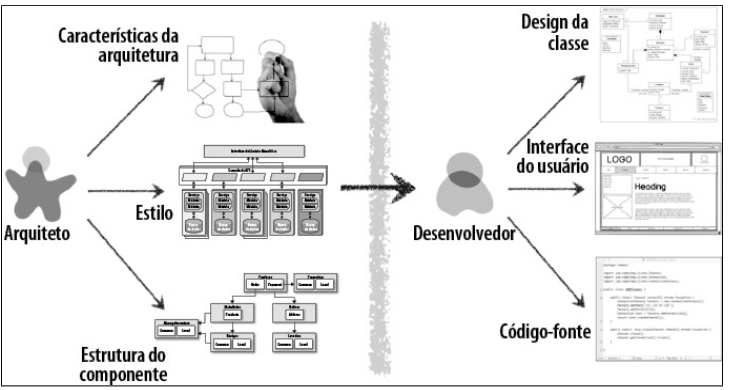

- o modelo acima tem vários problemas como a separação de arquitetura do desenvolvedor que causam problemas na arquitetura
- decisões que algumas vezes os arquitetos tomam, não funcionam. Decisões que os desenvolvedores tomam, dificilmente voltam para o arquiteto.
- a solução é quebrar as barreiras entre eles e formar uma relação bidirecional 
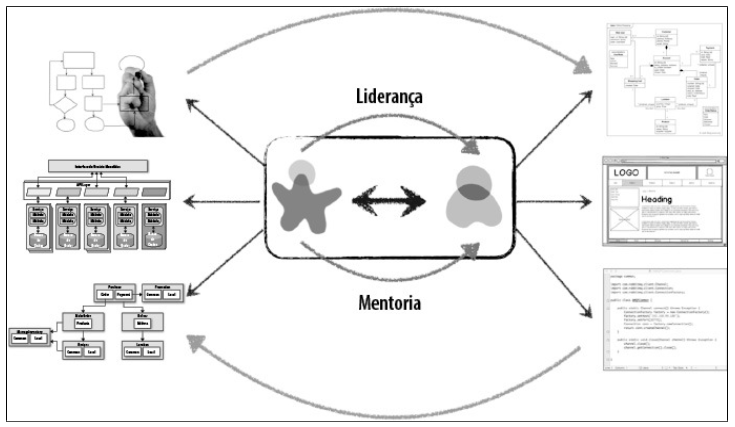

> não existe onde começa a arquitetura ou termina o design. Num projeto de software, sempre devem estar em sincronia.


## Amplitude técnica
- desenvolvedores devem ter _profundidade técnica_
- arquitetos devem uma grande _amplitude técnica_
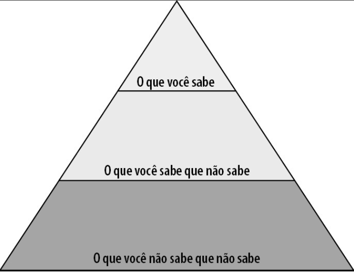

- o que você sabe, o que você não sabe e o que você não sabe que não sabe
  a. o que você sabe: tecnologias, frameworks, liguagens de programação etc
  b. o que você não sabe: o que tem pouco conhecimento, ou conhecimento superficial
  c. o que você não sabe que não sabe: o conjunto das tecnologias e conhecimento que ele não sabe que existe e poderia resolver um problema
  - **profundidade**: é o que você domina, é o que você se especializa e tem um grande conhecimento. É o topo da pirâmide abaixo:
  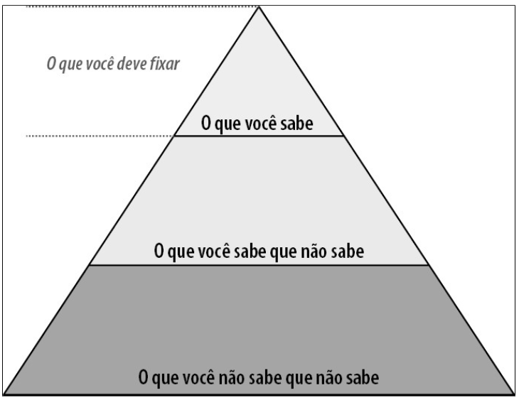

- Para um arquiteto é vantajoso saber que existem 3 soluções do que ser especialista em uma solução.
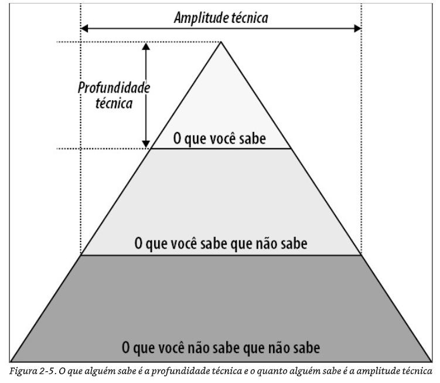


- arquitetos devem ter mais amplitude e menos aprofundamento
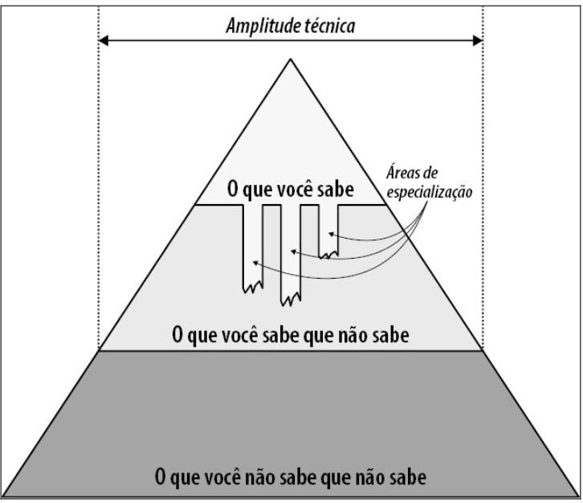


## Analisando os trade-offs
- Pensar como arquiteto é identificar os trade-offs para determinar a melhor solução
- Tudo na arquitetura é um trade-off que gera aquela famosa resposta: "DEPENDE"
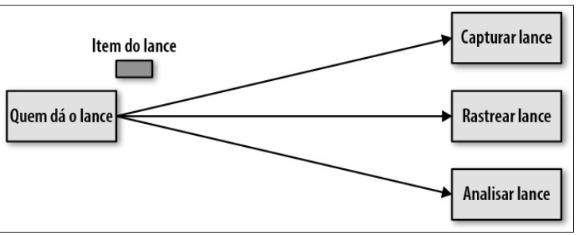

Tópico:

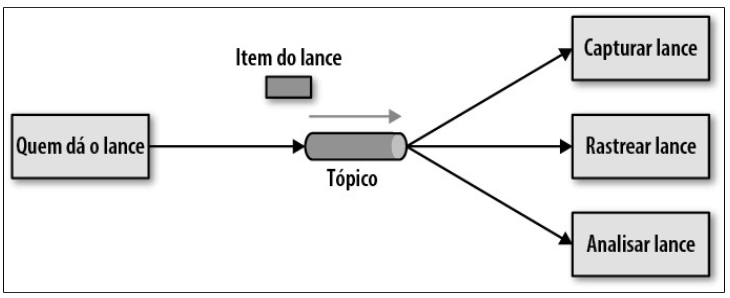


Fila:

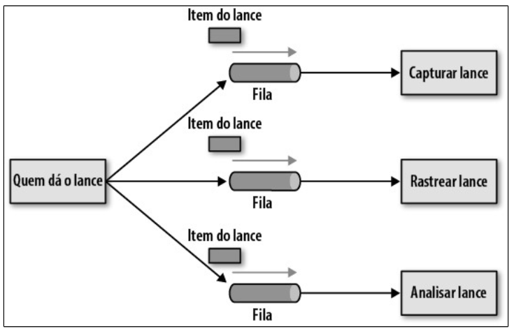

No tópico, a solução se conecta com uma conexão. Na fila se conecta com 3 conexões.

trade-offs identificados entre as soluções:
- segurança: no tópico "qualquer pessos pode acessar". Na fila, só pode ser acessado pelos consumidores
- contrato homogêneos: no tópico, uma alteração afeta todos os consumidores. Na fila, somente o consumidor daquela fila sofre o impacto
- monitoramenteo e escalabilidade: no tópico, é complexo o controle de monitoramento e escalonamento devido ao uso genérico para diversos consumidores. Na fila, através do AMQP, permite o moniotoramento e escalagem de forma independente

> AMQP (Advanced Message Queuing Protocol)

<details>
  <summary>Gerado por IA</summary>

  Com base nas análises fundamentais que discutimos sobre as decisões de design, vamos estruturar o entendimento desse cenário clássico de mensageria: **Tópicos (Publish-Subscribe) vs. Filas (Point-to-Point)**.

  ---

  ## O Conceito em Linhas Gerais

  Imagine que você quer dar um aviso para várias pessoas.

  * **Abordagem de Tópico (Pub/Sub):** É como usar um alto-falante. Você fala uma vez só (publica) e qualquer um que estiver interessado pode sintonizar e ouvir (assinar). Se uma nova pessoa chegar, ela só precisa começar a escutar, sem que você precise falar diretamente com ela.
  * **Abordagem de Fila (Ponto a Ponto):** É como enviar cartas individuais. Se você precisa avisar três serviços, você escreve e envia três cartas diferentes, postando uma em cada caixa postal (fila) específica.

  ---

  ## A Visão dos Autores (Richards & Ford)

  Como arquitetos, não existe "solução perfeita", existem **trade-offs** (compensações). Vamos analisar o peso de cada escolha segundo os princípios do livro:

  ### 1. Vantagens do Modelo de Tópicos

  * **Extensibilidade Arquitetural:** Adicionar um novo serviço (como um histórico) é extremamente simples. O serviço produtor não precisa sofrer nenhuma modificação ou saber da existência do novo componente; o novo serviço apenas "assina" o tópico existente.
  * **Desacoplamento:** O emissor da mensagem é completamente agnóstico em relação a quem consome as informações ou como elas são usadas.

  ### 2. Desvantagens e Riscos do Modelo de Tópicos

  * **Segurança e Controle de Acesso:** Como o canal é aberto para assinantes, torna-se mais fácil para um serviço não autorizado "grampear" o tópico e ler os dados. Nas filas, o canal é restrito e exclusivo entre o produtor e aquele consumidor específico.
  * **Contratos Homogêneos:** Todos os consumidores do tópico precisam aceitar exatamente o mesmo formato de dados (o mesmo contrato). Se um novo serviço exigir um dado extra, o contrato de todos os outros serviços terá de mudar. Com filas individuais, cada canal pode ter seu próprio contrato customizado.
  * **Monitoramento e Escalabilidade Dinâmica:** Protocolos como o AMQP permitem monitorar o volume de mensagens de cada fila de forma independente e escalar os consumidores sob demanda. Em tópicos genéricos, esse controle granular e o auto-dimensionamento (auto-scaling) se tornam bem mais complexos.

  > **Frase de Impacto do Livro:** *"Os programadores conhecem os benefícios de tudo e os trade-offs de nada. Os arquitetos precisam entender ambos."* — Rich Hickey. A decisão final sempre dependerá de qual fator (extensibilidade ou segurança/contratos flexíveis) é a maior prioridade para o seu sistema atual.
</details>


## Entendendo as motivações comerciais
- traduzir requisitos das motivações comerciais em características como escalabilidade, disponibilidade, desempenho etc.

<details>
  <summary>Explicação sobre o termo motivação comercial</summary>

  No contexto da arquitetura de software, **motivação comercial** (ou *business driver*) refere-se aos objetivos estratégicos, metas financeiras e necessidades de negócio que uma empresa possui e que justificam a existência de um sistema.

  Em termos simples: o software não existe para ser tecnologicamente elegante; ele existe para resolver um problema de negócio ou gerar valor para a empresa.

  Abaixo, detalho como esse conceito funciona na prática:

  ### 1. O que são essas Motivações Comerciais?

  Elas partem do nível estratégico da empresa (os acionistas e diretores) e costumam responder a perguntas como:

  * **"Qual é a meta da empresa?"** (Ex: "Queremos expandir nossa operação para mais três países este ano").
  * **"Qual é o problema atual?"** (Ex: "Estamos perdendo vendas porque o sistema cai durante a Black Friday").
  * **"Como a empresa monetiza?"** (Ex: "Nosso lucro vem de transações rápidas em alta escala").

  ### 2. A Tradução: Negócio $\rightarrow$ Arquitetura

  O papel do arquiteto é pegar essa meta comercial (que está em linguagem de negócios) e traduzi-la em requisitos técnicos (as características da arquitetura). Por exemplo:

  | Motivação Comercial (Negócio) | Característica da Arquitetura (Técnico) |
  | --- | --- |
  | "Precisamos lançar novas funcionalidades toda semana para vencer a concorrência." | **Agilidade e Modulabilidade** (ex: arquitetura de microsserviços para deploys independentes). |
  | "A empresa vai investir muito em marketing e esperamos o triplo de acessos no próximo mês." | **Escalabilidade** (o sistema precisa aguentar o aumento de carga sem travar). |
  | "Somos um aplicativo de banco; se ficarmos fora do ar por 5 minutos, seremos multados pelo Banco Central." | **Disponibilidade e Tolerância a Falhas** (infraestrutura redundante para nunca cair). |
  | "O usuário desiste da compra se a página demorar mais de 2 segundos para carregar." | **Desempenho/Performance** (uso de cache, otimização de consultas). |

  ### Por que isso é desafiador?

  Porque os recursos são limitados (tempo e dinheiro). Se o arquiteto tenta criar um sistema que é perfeitamente escalável, ultra seguro, disponível 100% do tempo e extremamente rápido, o projeto se torna financeiramente inviável ou demora anos para ser entregue.

  Por isso, o arquiteto precisa colaborar de perto com os acionistas para entender quais motivações comerciais são as **reais prioridades** no momento, equilibrando os custos técnicos com o retorno financeiro que o sistema trará.
</details>


## Equilibrando arquitetura e codificação
- armadilha do gargalo: ocorre quando um arquiteto assume a codificação no caminho crítico de um projeto
- delegar o caminho crítico para a equipe de desenvolvimento e codificar funcionalidade de negócio que estão longe da parte crítica
- nos casos que o arquiteto não consiga escrever código fonte, é possível criar provas de conceito (POC). Neste caso é importante gerar código de produção com qualidade e não deixar que esse código seja utilizado como referência e ser levado para produção. Essa prática ajuda a manter a prática contínua e com boas práticas de programação.
- Outra oportunidade de códificação é resolver alguma história de deficits técnicos ou de arquitetura
- Automação de processos e ferramentas é outra forma de manter o contato com o desenvolvimentos de software. Desenvolvendo CLI para alguma validação ou tarefa repetitiva.
- Revisão é outra opção, além de não ser uma prática, ajuda a manter o contatos com as boas práticas e ajudar a identificar ponto de melhorias e indicar treinamentos para as equipes


## Resumo
- Arquitetura vs design: 
  a. Arquitetura: identificar as características, selecionar os padrões e criar componentes
  b. Design: criar diagrama de classes para cada componente, criar telas de interface, desenvolver e testar
- Amplitude técnica: para um arquiteto ter um conhecimento amplo é preferencial em relação a um conhecimento profundo (ser especialista numa tecnologia). Conhecer uma quantidade maior de tecnologias para resolver um mesmo problemas ajuda a tomar as melhores decisões ao se basear nas característica de arquitetura de acordo com as decisões de negócio.
- Analisando trade-offs:
  a. exemplo de solução para consumer de informação usando tópico ou fila
- Entendendo as motivações comerciais: Exemplo: uma empresa está perdendo vendas num marketplace porque o sistema está muito lento. Isso é uma necessidade de negócio que deve ser refletida a arquitetura para reduzir o tempo de resposta de reuiqsição da API
- Equilibrando arquitetura e codificação: estar próximo do código, mesmo não desenvolvendo com a equipe de desenvolvedores, ajuda a manter a qualidade técnica e apoiar/identificar gargalos técnicos nas equipes


# Capítulo 3: modularidade
> Noventa e cinco por cento das palavras [sobre arquitetura de software] são usadas enaltecendo os benefícios da “modularidade” e poucas, se algumas, tratam de como alcançá-la. — Glenford J. Myers (1978)
- modularidade é um princípio organizacional


## Definição
- No dicionário a definição é: "cada conjunto de partes padronizadas ou unidades independentes que podem ser usadas para construir uma estrutura mais complexa"
- Na linguagem de programação são usados:
  a. classes
  b. métodos/funções
  c. pacotes/namespace
  d. visibilidade e regras de escopos diferentes


## Medindo a modularidade
Pesquisadores criaram 3 conceitos principais:
- coesão
- acoplamento
- conascência


### Coesão
- se diz coeso quando as parte de um módulo devem estar contidas num mesmo módulo
> Tentar dividir um módulo coeso apenas resultaria em maior acoplamento e menor legibilidade. — Larry Constantine

Medidas de coesão:
- **coesão funcional**: uma parte está relacionada a outra parte, assim como o módulo tem tudo necessário para funcionar
- **coesão sequêncial**: quando temos dois módulos e a saída de um, é a entrada de outro
- **coesão comunicacional**: Exemplo prático: Um módulo que recebe os dados de uma compra, adiciona esse registro ao banco de dados e usa esses mesmos dados para gerar um e-mail de confirmação.
- **coesão procedural**: dois módulo devem executar o código numa determinada ordem
- **coesão temporal**: relacionado ao tempo, por exemplo, sistemas que precisam de algo na inicialização do sistema (configurar banco, carregar cache, carregar propriedades).
- ** coesão lógica**: uma agrupamento de métodos numa classes que realizam funcionalidades diferentes e que não tem relação. No java são conhecidas como módulo/pacote chamado utils. Lembre-se daquela frase: "não sei onde coloco isso" e resposta é "coloque no pacote utils".
- **coesão coincidental**: Os elementos estão no mesmo módulo por pura conveniência ou coincidência, sem qualquer relação lógica, temporal ou de dados. É o nível mais prejudicial para a manutenção do software.


<details>
    <summary>Sobre o trade-off sobre a separação de classes ou manter juntas</summary>

    ### O Conceito em Linhas Gerais

    Decidir o tamanho e a responsabilidade de um módulo não é uma ciência exata matemática. Na teoria, a alta coesão diz que devemos separar tudo o que faz coisas diferentes. Na prática, se separarmos *demais* (criando micromódulos para absolutamente tudo), corremos o risco de criar um problema oposto e igualmente grave: o **alto acoplamento**, onde os módulos ficam tão dependentes uns dos outros que não conseguem funcionar sozinhos.

    ---

    ### A Visão dos Autores (Richards & Ford)

    No livro, enfatizamos que a coesão é uma métrica subjetiva, "menos precisa do que o acoplamento", e que a estrutura correta **"sempre depende"** de trade-offs (compensações).

    Analisando o exemplo que você trouxe sobre a manutenção de clientes (`Customer Maintenance`) e pedidos (`Order Maintenance`), propomos três perguntas fundamentais que você, como arquiteto, deve se fazer para decidir se separa ou une esses comportamentos:

    * **1. O escopo do módulo de pedidos é muito pequeno?**
    Se as operações de obter e cancelar pedidos forem as únicas que existirão para sempre sobre "Pedidos", separá-las em um módulo `Order Maintenance` pode ser preciosismo. Talvez faça mais sentido mantê-las simplificadas dentro de `Customer Maintenance`.
    * **2. Há potencial de crescimento desordenado?**
    Se a tendência é que o módulo de clientes (`Customer Maintenance`) cresça muito no futuro com dezenas de novas funções, misturar regras de pedidos ali vai gerar uma bagunça difícil de manter. Nesse caso, a extração preventiva para um módulo próprio (`Order Maintenance`) é encorajada para preservar a coesão.
    * **3. Qual é o nível de dependência de dados (Acoplamento)?**
    Esta é a chave de ouro baseada na famosa citação de Larry Constantine (que diz que o acoplamento ideal é aquele que minimiza as conexões entre os módulos). Se para gerenciar pedidos o módulo `Order Maintenance` precisa consultar tantas regras internas e dados íntimos de `Customer` a ponto de os dois precisarem conversar freneticamente a cada segundo, separá-los criará um **acoplamento nocivo**. Se eles são altamente interdependentes, às vezes é melhor mantê-los juntos.
</details>


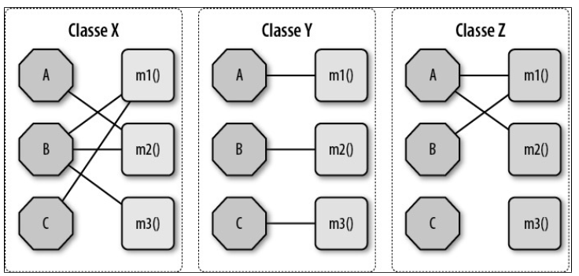

_A imagem acima ilustra a métrica LCOM onde os campos são octagonos e os métodos são quadrados._


A interpretação das classes da imagem é a seguinte:
- classe X: boa coesa
- classe Y: não tem coesão. Cada campo/método poderia ser uma classe separada porque não existe dependências entre um mesmo campo em diversas classes.
- classe Z: coesão mista

Classe utilitárias compartilhadas. 

A LCOM tem deficiências, assim como em muitas métricas. É possível encontrar uma falta de coesão estrutural, mas não tem como determinar quando certas partes se encaixam entre si logicamente.
Isso reflete:
> Segunda Lei da Arquitetura de Software: preferir por que acima de como.


### Acoplamento
- acoplamento **aferente**: mede o número de conexões de entrada para um artefato do código (componente, classe, função etc.).
- acoplamento **eferente**: mede as conexões de saída para outros artefatos do código.

<details>
  <summary>Gerado por IA</summary>

  É super normal achar esses termos confusos de início! Eles foram "emprestados" da biologia e da medicina (onde se fala de vasos sanguíneos e neurônios aferentes e eferentes) e aplicados à arquitetura de software por Robert C. Martin (o famoso "Uncle Bob").

  Para nunca mais esquecer, pense na direção do fluxo. Vamos traduzir isso de forma simples:

  ---

  ## 🧠 A Analogia Biológica (Para fixar na mente)

  * **Aferente (Entrada):** Os neurônios aferentes levam o estímulo sensorial da pele **para dentro** do cérebro.
  * **Eferente (Saída):** Os neurônios eferentes levam a resposta do cérebro **para fora**, em direção aos músculos.

  ---

  ## 💻 No Desenvolvimento de Software

  Quando falamos de acoplamento entre classes, pacotes ou componentes, a lógica é exatamente a mesma.

  ### 1. Acoplamento Aferente ($C_a$ - Afferent Coupling)

  Representa as dependências de **Entrada**. É a métrica que diz: **"Quantos componentes externos dependem de mim?"**

  * **O que significa:** Se o seu módulo `Autenticacao` é usado por outros 10 módulos do sistema, ele tem um acoplamento aferente alto ($C_a = 10$).
  * **Impacto:** Módulos com alto acoplamento aferente são **estáveis e responsáveis**. Como muita gente depende deles, você não pode alterá-los de qualquer jeito, ou vai quebrar o sistema inteiro. Eles devem ser muito bem testados e difíceis de mudar.

  ### 2. Acoplamento Eferente ($C_e$ - Efferent Coupling)

  Representa as dependências de **Saída**. É a métrica que diz: **"De quantos componentes externos eu dependo?"**

  * **O que significa:** Se o seu módulo `GeradorDeRelatorios` precisa importar 8 bibliotecas ou outras classes diferentes para funcionar, ele tem um acoplamento eferente alto ($C_e = 8$).
  * **Impacto:** Módulos com alto acoplamento eferente são **instáveis**. Se qualquer uma das 8 dependências mudar, o seu módulo corre um risco enorme de quebrar. Eles são altamente dependentes do mundo exterior.

  ---

  ## 📊 Tabela Comparativa

  | Característica | Acoplamento Aferente ($C_a$) | Acoplamento Eferente ($C_e$) |
  | --- | --- | --- |
  | **Direção das setas** | Setas apontando **para** o seu módulo ($\rightarrow$ Módulo) | Setas saindo **do** seu módulo (Módulo $\rightarrow$) |
  | **Pergunta-chave** | "Quem me usa?" | "Quem eu uso?" |
  | **Foco** | Responsabilidade | Dependência |
  | **Comportamento** | Tende a ser mais **estável** (difícil de mudar) | Tende a ser mais **instável** (sensível a mudanças externas) |

  ---

  ## 🛠️ Um Exemplo Prático em Código

  Imagine a classe `ProcessadorDePagamentos`:

  ```csharp
  // Exemplo de alto acoplamento EFERENTE (Ce)
  // Esta classe depende de TRÊS outras classes para funcionar.
  public class ProcessadorDePagamentos {
      private BancoDeDados _db;        // Dependência 1
      private GatewayDeCartao _cartao; // Dependência 2
      private ServicoDeEmail _email;   // Dependência 3

      public void Processar() {
          // ... usa as três dependências
      }
  }

  ```

  > O `ProcessadorDePagamentos` tem acoplamento eferente ($C_e$) igual a 3. Se o `ServicoDeEmail` mudar sua assinatura, o processador quebra.

  Agora, imagine a classe `Log`:

  ```csharp
  // Exemplo de alto acoplamento AFERENTE (Ca)
  // Esta classe não depende de ninguém, mas TODOS dependem dela.
  public class Log {
      public void Gravar(string mensagem) {
          Console.WriteLine(mensagem);
      }
  }

  ```

  > Se o `ProcessadorDePagamentos`, o `CarrinhoDeCompras` e o `CadastroUsuario` utilizam a classe `Log`, ela tem um acoplamento aferente ($C_a$) de 3. Ela é altamente responsável; se você alterar o método `Gravar`, precisará ajustar esses três outros lugares.
</details>


### Abstração, Instabilidade e distância da sequência principal
- acomplamento: uma parte do sistema depende de outra
- abstração
- instabilidade 

<details>
  <summary>Gerado por IA</summary>

  Entender as métricas de arquitetura de software pode parecer desafiador no início, mas elas se tornam simples quando usamos analogias do nosso dia a dia. Vamos desmistificar esses três conceitos fundamentais.

  ---

  ## O Conceito em Linhas Gerais

  Imagine que estamos construindo uma cozinha de restaurante. Vamos entender os termos por meio dessa analogia:

  * **Acoplamento (Dependência):** É o quanto uma parte do sistema precisa de outra para funcionar.
  * *Analogia:* Se o cozinheiro só consegue preparar o prato usando exatamente a faca da marca *X*, o trabalho dele está fortemente **acoplado** a essa faca específica. Se a faca sumir, o trabalho para.


  * **Instabilidade (Facilidade de Mudar):** É a probabilidade de um componente sofrer impacto ou precisar ser alterado.
  * *Analogia:* Um garçom é **instável** (no bom sentido arquitetural) porque ele se adapta rapidamente: se o cardápio muda, ele apenas decora os novos pratos. Já a tubulação de gás da cozinha é extremamente **estável** (rígida): se você quiser mudar o fogão de lugar, terá um trabalho enorme para alterar os canos.


  * **Abstração (Ideia vs. Prática):** É a separação entre *o que* deve ser feito e *como* isso é feito detalhadamente.
  * *Analogia:* O cardápio é uma **abstração**. Ele diz "Filé com fritas". Você não precisa saber a marca do óleo ou a temperatura exata da fritadeira (isso é a **implementação concreta**). Você só precisa saber o conceito do prato.


  ---

  ## A Visão dos Autores (Richards & Ford)

  No livro, nós abordamos essas métricas de forma matemática e matemática-visual para ajudar o arquiteto a avaliar a saúde e a flexibilidade do sistema.

  ### 1. Acoplamento: Entradas e Saídas

  Dividimos o acoplamento em duas direções para entender o fluxo de dependência de um componente (ou classe):

  * **Acoplamento Aferente ($C^a$):** São as conexões que **chegam** ao componente. Ou seja, quantos outros componentes dependem dele.
  * **Acoplamento Eferente ($C^e$):** São as conexões que **saem** do componente. Ou seja, de quantos outros componentes ele depende para funcionar.

  ### 2. Instabilidade ($I$)

  A instabilidade mede o quão fácil é alterar um componente sem causar um efeito dominó de erros. Ela é calculada pela fórmula:

  $$I = \frac{C^e}{C^e + C^a}$$

  * **Instabilidade Próxima de 1 (Máxima):** O componente depende de muitos outros ($C^e$ alto), mas ninguém depende dele ($C^a$ zero). Ele é muito fácil de mudar, pois qualquer alteração nele não quebra o restante do sistema.
  * **Instabilidade Próxima de 0 (Mínima / Estável):** Muitos dependem dele, mas ele não depende de ninguém. Ele é difícil de mudar, pois qualquer alteração nele pode quebrar vários outros pontos do sistema.

  ### 3. Abstração ($A$)

  Mede a proporção de elementos abstratos (como interfaces e contratos que definem *o que* fazer) em relação aos elementos concretos (código real que executa a tarefa).

  $$A = \frac{\sum m^a}{\sum m^c}$$

  * **Se a abstração é 1:** O componente é puramente abstrato (só contém definições, nenhuma implementação prática).
  * **Se a abstração é 0:** O componente é puramente concreto (código direto, sem interfaces).

  > **A Regra de Ouro dos Autores:** > Componentes que são muito **estáveis** (difíceis de mudar) devem ser altamente **abstratos** (fáceis de estender por meio de contratos). Componentes que são muito **instáveis** (fáceis de mudar) podem ser totalmente **concretos**. O equilíbrio perfeito entre essas forças é o que chamamos de **Sequência Principal** da arquitetura.
</details>


### Distância da sequência principal
- uma métrica derivada com base na instabilidade e na abstração
- instabilidade: mede quando um componente não depende de ninguém para mudar. Mudança no componente não afeta outros componentes do sistema
- abastração: mede a proporção de regras teóricas em relação ao código. Na programação seria a relação de uma classe abstrata e um classe concreta

<details>
  <summary>Gerado por IA</summary>

  ## O Conceito em Linhas Gerais

  * **Instabilidade ($I$):** Mede a facilidade ou a probabilidade de um componente mudar. Se um componente depende de muitas coisas e ninguém depende dele, ele é considerado **instável** (fácil de alterar, pois sua mudança não quebra o resto do sistema). Se todo mundo depende dele, ele é **estável** (difícil de alterar, pois qualquer modificação gera um efeito dominó).
  * **Abstração ($A$):** Mede a proporção de regras teóricas (contratos e interfaces) em relação ao código prático (implementação detalhada). Um componente altamente **abstrato** apenas dita as regras do que deve ser feito, enquanto um componente **concreto** executa o trabalho bruto.

  ---

  ## A Visão dos Autores (Richards & Ford)

  Nesta obra, avaliamos a saúde da arquitetura combinando essas duas métricas, que sempre resultam em valores entre $0$ e $1$:

  * **O Equilíbrio Necessário:** Nós defendemos que a estabilidade e a abstração devem andar de forma inversamente proporcional. Isso é calculado pela fórmula da Distância da Sequência Principal:

  $$D = \vert{}A + I - 1\vert{}$$


  * **Componentes Estáveis devem ser Abstratos ($I = 0$ e $A = 1$):** Se um componente é muito difícil de ser alterado porque todo o sistema depende dele, ele precisa ser composto por interfaces abstratas. Assim, novas funcionalidades podem ser adicionadas estendendo essas interfaces, sem a necessidade de modificar o código original que já está consolidado.
  * **Componentes Instáveis podem ser Concretos ($I = 1$ e $A = 0$):** Se ninguém depende daquele componente, ele é flexível e livre para sofrer modificações diretas na implementação prática a qualquer momento, sem risco de quebrar outras partes do software.
</details>

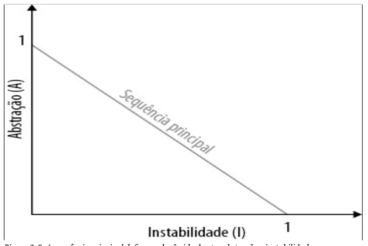

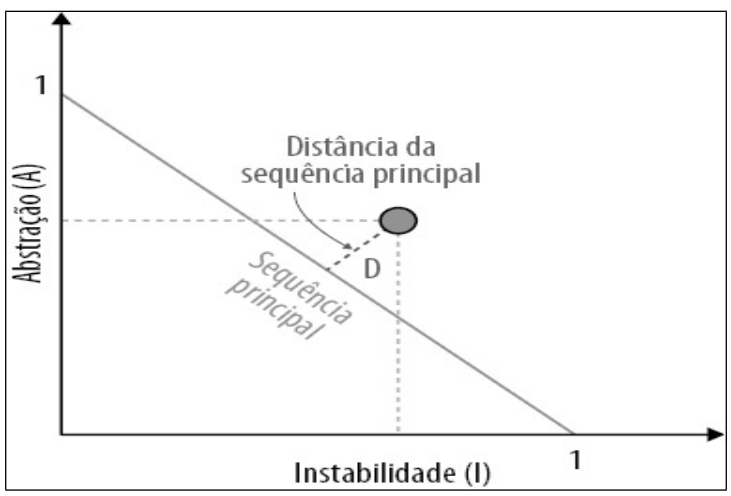

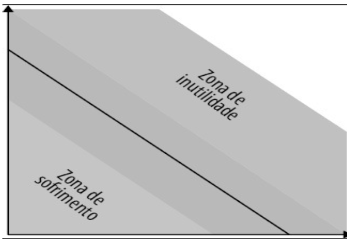


### Conascência
> Dois componentes são conascentes se uma mudança em um requer que o outro seja modificado para manter a correção geral do sistema. — Meilir Page-Jones

Dois tipos de conascência: 
- estática
- dinâmica

#### Conascência estática
- é o acoplamento no nível de código-fonte
  - Conascência de nome
  - Conascência de tipo
  - Conascência de significado ou Conascência de convenção
  - Conascência de posição
  - Conascência de algoritmo


#### Conascência dinâmica
- analisa a chamada durante a execução
  - Conascência de execução
  - Conascência de tempo
  - Conascência de valores
  - Conascência de identidade


#### Propriedades da Conascência
- a Conascência é uma ferramenta para arquitetos e desenvolvedores
- algumas propriedades ajudam os desenvolvedores a usar com sabedoria

**Força**  
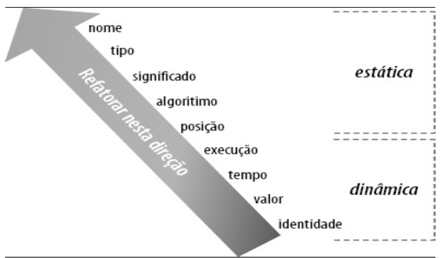

**Localização**  

**Grau**  


### Unificando as métricas de acoplamento e conascência

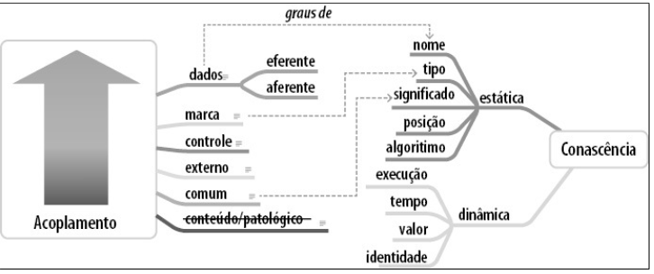


#### Problemas com a conascência dos anos 1990
<details>
  <summary>Gerado por IA</summary>

  ## O Conceito em Linhas Gerais
  A **conascência** é um conceito que serve para medir o grau de dependência entre diferentes partes de um sistema. Se a alteração em um componente exigir que outro componente também seja modificado para manter a integridade do software, dizemos que eles estão em conascência.

  No entanto, as definições tradicionais desse termo criadas na década de 1990 possuem limitações quando aplicadas ao cenário moderno de desenvolvimento. Elas costumam focar demais em detalhes minuciosos e de baixo nível do código (como a qualidade e a limpeza das linhas de programação), deixando de lado as grandes decisões estruturais que definem a arquitetura do sistema.

  ---

  ## A Visão dos Autores (Richards & Ford)

  Em nossa obra, apontamos que as métricas tradicionais dos anos 1990 falham em dois pontos centrais para o arquiteto moderno:

  * **Foco no Grau vs. Modo de Acoplamento:** As métricas antigas olham muito para o *grau* do acoplamento em nível de código. Nós, como arquitetutos, nos importamos mais com o **como** os módulos estão acoplados (a natureza dessa ligação), focando em decisões mais amplas do que na implementação detalhada.
  * **Decisões de Arquitetura Distribuída:** A conascência tradicional não ajuda a resolver dilemas arquiteturais complexos e modernos, como escolher entre **comunicação síncrona ou assíncrona** em um ambiente de microsserviços.
  * **A Regra dos Trade-offs:** Reafirmamos a Primeira Lei da Arquitetura de Software: *tudo é um trade-off* (uma escolha onde há perdas e ganhos). Avaliar o acoplamento hoje exige ponderar essas escolhas estruturais, e não apenas analisar linhas de código isoladas.
</details>


### De módulos a componentes
- módulo: nome genérico para grupo de código
- componente: é a materialização do módulo que você pode instalar, executrar ou conectar no seu sistema.

<details>
  <summary>Gerado por IA</summary>

  ## O Conceito em Linhas Gerais

  * **Módulo:** É uma forma genérica de organizar e agrupar códigos que possuem propósitos parecidos ou que trabalham juntos. Pense nele como as pastas do seu computador onde você guarda arquivos do mesmo assunto para não deixar tudo bagunçado.
  * **Componente:** É a materialização física ou lógica desse grupo de códigos dentro de uma plataforma. Se o módulo é a ideia de organizar as coisas juntas, o componente é o bloco real de construção que você consegue instalar, executar ou conectar no seu sistema.

  ---

  ## A Visão dos Autores (Richards & Ford)

  * **Terminologia Abrangente:** Em nossa obra, usamos o termo "módulo" como um conceito lógico para nos referirmos a um agrupamento de código afim.
  * **Blocos de Construção Práticos:** Já os "componentes" são tratados por nós como os blocos reais e fundamentais que os arquitetos utilizam para desenhar a estrutura do software. A maioria das linguagens e ferramentas modernas oferece suporte para empacotar esses módulos na forma de componentes físicos.
  * **O Desafio da Separação:** Embora o conceito de separar o código em partes menores exista desde o início da computação, nós destacamos que desenvolvedores e arquitetos ainda enfrentam muitas dificuldades práticas para definir bem os limites de cada componente e obter bons resultados de design.
</details>


## Resumo
- Modularidade é como organizamos o nosso código. Na orientação é objetos é representada a partir de classes, métodos e propriedades.
- Na nodularidade temos 3 conceitos:
  - coesão
  - acoplamento
  - conascência
- Coesão: se diz que um código é coeso quando as propriedades de uma classe na orientação a objetos utiliza todos os seus atributos na maioria dos métodos.
- Acoplamento: se diz que um código é acoplado quando ele depende fortemente de outros componentes do sistema
  - acomplamento eferente: o seu sistema não dependende de outros sistema. Os outros sistemas dependem do seu sistema.
  - acomplamento aferente: o seu sistema depende de um ou mais sistemas externos. Qualquer alteração no sistema externo pode quebrar o seu sistema
- Conascência: se diz que existe um componete conascente quando uma alteração em um componete afete um segundo componente. TEmos dois tipos:
  - estática: código fonte
  - dinâmica: o componente em execução. Código-fonte é execução
- Módulo é o agrupamento de código
- Componente é materialização de um módulo


# Capítulo 4: Definição das características da arquitetura
Uma solução do software consiste nos requisitos do domínio e nas características da arquitetura

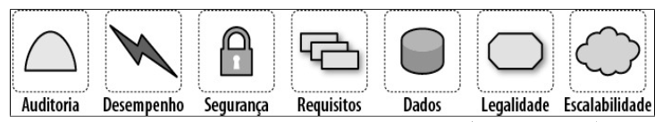

- características da arquitetura
- requisitos não funcionais: nomear algo como não funcional tem um impacto negativo. O termo foi criado pelo arquitetos para diferenciar para diferenciar as `características da arquitetura` dos `requisitos funcionais`
- atributos de qualidade: os autores não gostam porque implica uma avaliação da qualidae posterior no lugar do design.
- os critérios da arquitetura atende 3 critérios:
  - especifica uma consideração de design fora do domínio
  - influencia algum aspecto estrutural de design
  - é essencial ou importante para o sucesso da aplicação

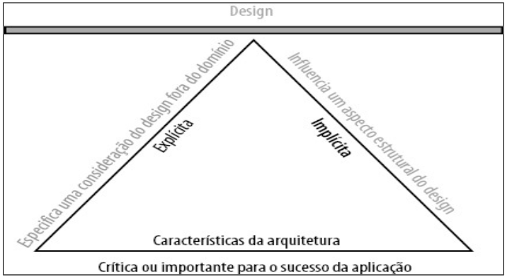


**Especifica uma consideração de design fora do domínio**  

**Influencia algum aspecto estrutural de design**  

**Essencial ou importante para o sucesso da aplicação**  


Características podem ser subdivididas em:
- implícitas: raramente aparcem nos requisitos, mas são ncessárias (disponibilidade, confiabilidade e segurança)
- explícitas: aparcem nos documentos de requisitos ou em outras especificações


## Características da arquitetura listadas (em parte)
As características variam desde código de baixo nível como modularidade e vão até questões sofisticadas como escalabilidade e elaticidade.

Os arquitetos separam essas características em grandes categorias como:


### Características operacionais da arquitetura
Envolvem:
- desempenho
- Escalabilidade
- Elasticidade
- disponibilidade 
- confiabilidade 


### Características estruturais da arquitetura
Se preocupa com a estrutura do código:
- qualidade de código 
- boa modularidade 
- acomplamento controlado entre os componentes
- código legível


### Características transversais da arquitetura
- acessibilidade
- armazenamento
- autenticação
- autorização 


## Trade-offs e arquitetura menos pior
> Nunca mire na melhor arquitetura, mas na arquitetura menos pior.

<details>
  <summary>Gerado por IA</summary>

  ## O Conceito em Linhas Gerais

  Na engenharia de software, **não existe solução perfeita**. Um **trade-off** (ou compensação) significa que para ganhar algo em uma ponta do sistema, você obrigatoriamente precisa sacrificar algo na outra.

  Por isso, o objetivo de um arquiteto não é criar uma arquitetura "perfeita" ou "ideal", mas sim encontrar a **arquitetura menos pior**: aquela que aceita os compromissos necessários para resolver o problema de negócio atual com o menor impacto negativo possível.

  ---

  ## A Visão dos Autores (Richards & Ford)

  * **Interconectividade de Características:** No livro, abordamos que cada característica arquitetural (como segurança, desempenho ou escalabilidade) exige esforço estrutural e afeta diretamente as outras. Aumentar a segurança, por exemplo, exige mais etapas de validação e criptografia, o que reduz o desempenho.
  * **A Analogia do Helicóptero:** Pilotar um helicóptero exige ajustar vários controles simultaneamente: ao mexer em uma alavanca, você altera o equilíbrio de todas as outras. Projetar arquitetura funciona exatamente assim; cada escolha gera reações em todo o sistema.
  * **O Perigo do Excesso de Escopo:** Tentar suportar todas as características possíveis resulta em uma arquitetura genérica e extremamente complexa que não resolve bem problema nenhum.
  * **Arquitetura Iterativa:** Como é impossível acertar de primeira sem cometer erros ou prever o futuro, o segredo é criar uma estrutura flexível e evolutiva. Quanto mais fácil for alterar o design com o tempo, menor será a pressão de tomar a decisão "perfeita" no início.
</details>


# Capítulo 5: Identificando características da arquitetura
- identificar a característica correta, requer que o arquiteto entenda do domínio do problema em colaboração com os stakeholders
- arquiteto descobre as características da arquitetura pelo menos de três modos:
  - extraindo das preocupações
  - requisitos
  - conhecimento implícito do domínio


## Extraindo características da arquitetura das preocupações do domínio
- entender o domínio permite traduzir as preocupações em "atributos" (caracteríticas)
- ao colaborar com o stackholder é manter uma lista mínima de características. Manter um lista grande de características deixa o sistema genérico e aumenta a complexidade antes emso de lidar com os problemas do domínio
- manter o design simples é melhor
- no lugar de priorizar a lista das características, escolha as 3 mais importantes

Tradução das preocupações de domínio nas características da arquitetura

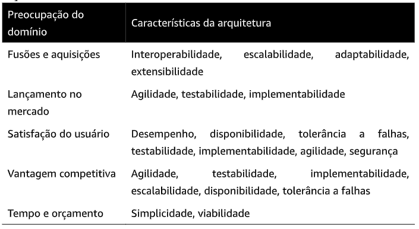

Agilidade é diferente de entregar rápido. Agilidade é:
- agilidade
- testabilidade
- implementabilidade


<details>
  <summary>Gerado por IA</summary>

  ## O Conceito em Linhas Gerais

  Na arquitetura de software, a **agilidade verdadeira** e a **tradução de requisitos de negócio** vão muito além de simplesmente colocar uma funcionalidade no ar o mais rápido possível (*time-to-market*).

  Ser ágil significa ter a capacidade de **responder a mudanças com segurança**. Para que um sistema seja genuinamente ágil e atenda ao negócio, a arquitetura precisa equilibrar múltiplos fatores operacionais e estruturais, e não apenas focar na velocidade primária da entrega ou do processamento.

  ---

  ## A Visão dos Autores (Richards & Ford)

  * **A Equação da Agilidade:** Agilidade não se resume ao tempo de lançamento no mercado. Ela é a soma de **agilidade + testabilidade + implementabilidade**. Se um código é rápido de escrever, mas difícil de testar ou implantar em produção, o sistema não é ágil.
  * **A Armadilha do Requisito Único:** Ao ouvir uma necessidade do negócio (como "precisamos processar estes dados rapidamente até o fim do dia"), um erro comum é focar apenas em **desempenho**.
  * **O Conjunto de Características Interligadas:** Para que uma necessidade de negócio seja realmente atendida, o arquiteto precisa analisar o cenário completo:
  * **Disponibilidade:** O sistema precisa estar no ar quando o processamento for necessário.
  * **Escalabilidade:** Deve suportar o aumento do volume de dados conforme o negócio cresce.
  * **Confiabilidade:** O sistema não pode falhar no meio da execução.
  * **Recuperabilidade:** Se houver uma interrupção, o sistema deve retomar exatamente de onde parou sem perder o progresso.
  * **Auditabilidade e Correção:** O resultado precisa ser verídico e passível de verificação.
</details>


## Extraindo Características da Arquitetura dos Requisitos
- algumas características são explícitas nos documentos de requisitos:
  - quantidade de usuários
  - escala
- outras do conhecimento do domínio:
  - num sistema acadêmico, tem-se conhecimento que os alunos deixam para realizar as operações no sistema em cima da data final. Com isso sabemos que é possível surgir algum pico de acesso nesses períodos e a escalabilidade seria uma das características


## Estudo de caso: Silicon Sandwiches


## Características explícitas
- aparecem em um especificação de requisitos
- requisito: "quantidade de usuários: atualmente milhares, talvez um dia, milhões". Neste caso pensamos em escalabilidade mesmo que não esteja implícito. Também é possível precisar de elasticidade, normalmente estão juntas.

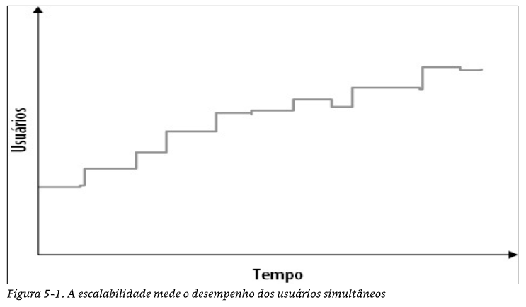

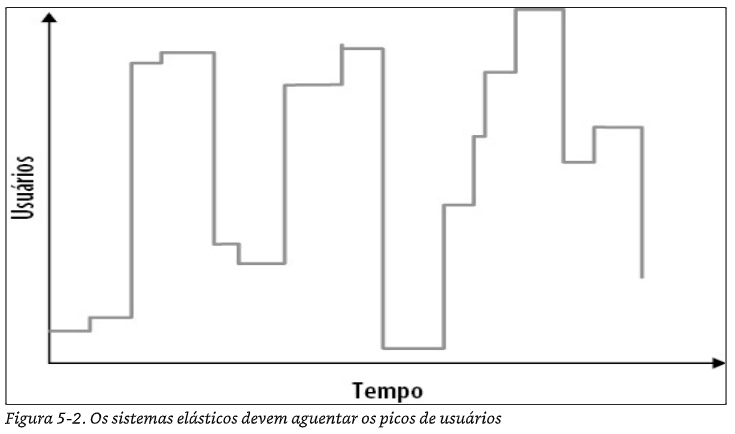

- A terceira característica da arquitetura da qual obtemos os requisitos anteriores é o desempenho: ninguém quer comprar em uma loja de sanduíches com um desempenho ruim, sobretudo nas horas de pico.


## Características implícitas

<details>
  <summary>Gerado por IA</summary>

  ## O Conceito em Linhas Gerais

  As **características implícitas** da arquitetura (também conhecidas como requisitos não funcionais) são aquelas expectativas sobre o funcionamento do sistema que raramente aparecem escritas nos documentos de requisitos entregues pelo cliente ou área de negócio.

  O cliente dificilmente solicitará de forma explícita que *"o sistema não deve cair"* ou *"as senhas devem ser criptografadas"*. No entanto, se o sistema falhar nesses pontos, o negócio será prejudicado. Cabe ao arquiteto identificar e tratar essas necessidades subentendidas.

  ---

  ## A Visão dos Autores (Richards & Ford)

  * **Disponibilidade e Confiabilidade:** Enquanto a disponibilidade garante que o usuário consiga acessar a aplicação, a confiabilidade assegura que o sistema permaneça funcional durante toda a interação do usuário, sem travamentos ou desconexões inesperadas.
  * **Níveis de Segurança:** Toda aplicação exige segurança básica de código. Contudo, ela só se torna uma característica arquitetural (que exige mudanças de infraestrutura ou design estrutural) quando é crítica para o negócio ou envolve regulamentações severas.
  * **O Risco da Especificação Excessiva:** Tentar abraçar todas as características implícitas possíveis complica o design do sistema e gera custos desnecessários. Especificar demais é tão prejudicial quanto especificar de menos.
  * **Arquitetura e Custos:** Escolhas arquiteturais envolvem *trade-offs* contínuos. Como Mark Richards destaca: *"Não existem respostas erradas na arquitetura, apenas as caras"*. Cada decisão tem um preço em complexidade, tempo de desenvolvimento e recursos humanos.
</details>


# Capítulo 6: Medindo e controlando as características da arquitetura
- aspectos operacionais: desempenho, elasticidade e escalabilidade
- preocupações estruturais: modularidade e implementabilidade


## Medindo as características da arquitetura
Problemas na definição da arquitetura nas organizações: 
- elas não são físicas: muitas características tem significado vago como agilidade e implementabilidade
- definições muito variadas: diversos setores podem discordar das definições como desempenho. É necessário que os envolvidos se unam para declarar uma definição em comum.
- complexas demais: características compõe muitas outras. A agilidade pode ser dividida em modularidade, implementabilidade e testabilidade.


## Medidas operacionais
- algumas características da arquitetura têm medidas óbvias como desempenho e escalabilidade
- medir tempo médio de respostas das requisições sem considerar que 1% dessas respostas possam ter um tempo 10 vezes maior que a média pode não ser interessante
- medir os tempos máximos como atípicos é uma outra opção
- medir o tempo ideal de uma página estar visível para um usuário antes que ele desista de permanecer na página, pode ser definir com um tempo mínimo de 500ms para não perder usuários
- calcular uma quantidade de bytes disponível para download num trafego de uma rede em dado momento para evitar problemas com latência
- existem casos que não definem valores fixos, mas sim com base numa analise estátistica com base do passar dos meses e tentar identificar as mudanças que fogem do padrão para criar alarmes e métricas. A falha pode ser: algo incorreto ou alguma falha.

<details>
  <summary>Gerado por IA</summary>

  ## O Conceito em Linhas Gerais

  As **medidas operacionais** servem para quantificar e monitorar como o sistema se comporta na prática em termos de desempenho, escalabilidade e disponibilidade.

  Em vez de adivinhar ou usar metas arbitrárias (como "o sistema precisa ser rápido"), a engenharia moderna utiliza dados e análises estatísticas contínuas para acompanhar o comportamento real da aplicação ao longo do tempo.

  ---

  ## A Visão dos Autores (Richards & Ford)

  * **Uso de Análise Estatística:** Equipes maduras não definem metas exatas ao acaso. Elas constroem **modelos estatísticos** baseados no histórico para entender o comportamento esperado do sistema e disparar alertas quando algo foge desse padrão.
  * **Aprendizado com Desvios:** Quando uma métrica sai do modelo previsto, isso revela um de dois aprendizados valiosos: ou a previsão/modelo estava incorreta, ou há um problema real no sistema que precisa ser corrigido.
  * **Evolução das Métricas:** O que medimos evolui junto com a tecnologia e os dispositivos. Hoje, as equipes utilizam "orçamentos de desempenho" (performance budgets) focando em métricas de experiência do usuário (como tempo para exibição do primeiro conteúdo ou inatividade da CPU).
</details>


## Medidas estruturais
- algumas ferramentas ajudam os arquitetos lidem com a estrutura de código como a complexidade ciclomática.
- Complexidade ciclomática: é uma métrica com base no código-fonte no nível de método da classe/aplicação:
  + Se um método não utiliza **if**, então o seu peso seria 1. `CC=1`
  + Se um método utiliza **if**, então o seu peso seria 2. `CC=2`

Fórmula de calculo:
```
CC = E-N+2
```
Onde:
- `CC`: complexidade ciclomática
- `E`: representa as extremidades (possíveis decisões)
- `N`: representa os nós (linha de código)

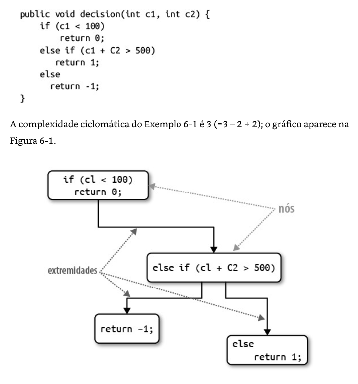

- complexidade de código prejudica a modularidade, implementabilidade etc
- **Crap4J**: ferramenta de métrica em Java que tentar determinar código ruim
> O uso do TDD ajuda a criar código melhor e menos complexo


## Medidas do processo
- algumas características da arquitetura como a **agilidade** costuma cruzar com o processo de desenvolvimento de software. A agilidade pode ser dividida em testabilidade e implementabilidade.
- os testes podem ser medidos por seu percentual de cobertura
- a implementabilidade pode ser medida pela quantidade de implementabilidade com sucesso em relação a implementabilidade com erro (implantação).


## Governança e funcões de aptidão
- como garantir que os desenvolvedores irão respeitar as características da arqitetura?
- a modularidade é um exemplo de característica importante, mas não é urgente
- os arquivos precisam de um mecanismo de governança


## Governando as características da arquitetura
- a governança da arquitetura alcança qualquer aspecto do processo do desenvolvimento de software
- a XP Extreme trouxe a automação no processo da integração contínua (CI) apra auxiliar no processo de governança da arquitetura


## Funções de aptidão
- função de aptidão da arquitetura: "Qualquer mecanismo que fornece uma avaliação objetiva da integridade de alguma característica da arquitetura ou uma combinação delas"

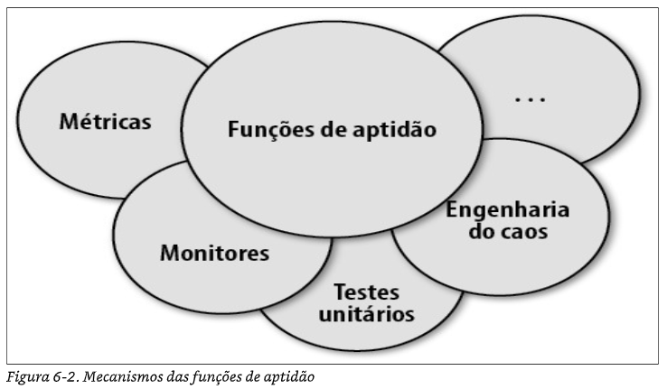


### Dependências cíclicas
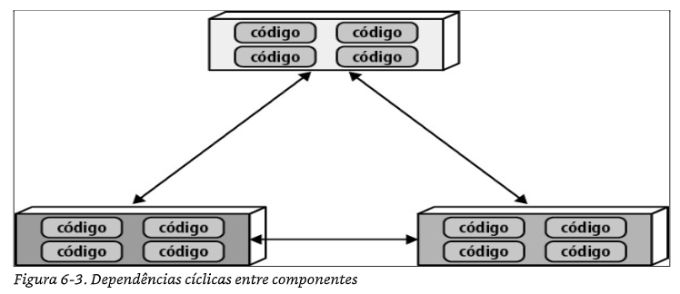

Função de aptidão para detectar os ciclos do componente:
```java
public class CycleTest {
    private JDepend jdepend;

    @BeforeEach
    void init() {
        jdepend = new JDepend();
        jdepend.addDirectory("/path/to/project/persistence/classes");
        jdepend.addDirectory("/path/to/project/web/classes");
        jdepend.addDirectory("/path/to/project/thirdpartyjars");
    }

    @Test
    void testAllPackages() {
        Collection packages = jdepend.analyze();
        assertEquals("Cycles exist", false, jdepend.containsCycles());
    }
}
```
- ferramenta JDepend em java para medir as dependências entre pacotes de um projeto: https://github.com/clarkware/jdepend


### Distância da função de aptidão da sequência principal
Trecho de código utilizando JDepend para estabelecer um limite para valores aceitáveis
```java
@Test
void AllPackages() {
    double ideal = 0.0;
    double tolerance = 0.5; // depende do projeto
    Collection packages = jdepend.analyze();
    Iterator iter = packages.iterator();
    while (iter.hasNext()) {
        JavaPackage p = (JavaPackage)iter.next();
        assertEquals("Distance exceeded: " + p.getName(),
            ideal, p.distance(), tolerance);
    }
}
```
- ArchUnit é uma biblioteca java para verificar a arquitetura, em especial a modularidade de um projeto, por exemplo, verificando que o projeto segue a arquitetura em camadas:  https://www.archunit.org/ 

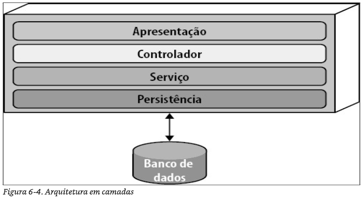

Exemplo de uso:
```java
layeredArchitecture()
    .layer("Controller").definedBy("..controller..")
    .layer("Service").definedBy("..service..")
    .layer("Persistence").definedBy("..persistence..")

    .whereLayer("Controller").mayNotBeAccessedByAnyLayer()
    .whereLayer("Service").mayOnlyBeAccessedByLayers("Controller")
    .whereLayer("Persistence").mayOnlyBeAccessedByLayers("Service")
```

No mundo .NET temos algo semelhante: https://github.com/BenMorris/NetArchTest
```c#
// As classes na apresentação não devem referenciar diretamente os repositórios
var result = Types.InCurrentDomain()
    .That()
    .ResideInNamespace("NetArchTest.SampleLibrary.Presentation")
    .ShouldNot()
    .HaveDependencyOn("NetArchTest.SampleLibrary.Data")
    .GetResult()
    .IsSuccessful;
```

Outros exemplos de funçoes de aptidão:
- Chaos Monkey da Netflix
- Simian Army


# Capítulo 7: Escopo das características da arquitetura
> A axiomática é o conjunto de axiomas (premissas, verdades aceitas sem demonstração por serem consideradas evidentes ou como ponto de partida lógico) que fundamenta uma teoria, sistema ou modelo de pensamento. No sentido amplo, significa uma abordagem baseada em princípios ou postulados fundamentais que não costumam ser questionados dentro daquele contexto.

- quando se fala em escalabilidade, em geral, expressam isso em torno do sistema inteiro. Isso era verdades umas décadas atrás, antes do surgindo de técnicas modernas como microsserviços
- foi falado sobre "medidas estruturais no capítulo 6, contudo o foco das métrricas somente revelam detalhes de baixo nível no código. Não avaliam componentes dependentes como bancos de dados
- para avaliar características da arquitetura operacional, dve-se considerar componentes externos ao código fonte. Assim surgiu o termo "quantum da arquitetura" relacionado a métrica conascência.


## Acoplamento e conascência
> Conascência: Dois componentes são conascentes se uma mudança em um requer que o outro seja modificado para manter a correção geral do sistema

De acordo com o autor do livro "What every programmer should know about oriented design" os tipos de Conascência foram definidos como: estática, via código estático; dinâmico, referente ao comportamento em tempo de execução

Para conascência dinâmica, defiram 2 tipos: síncrona e assíncrona. Nas chamadas síncrona, o serviço que chama aguarda a resposta. Já nas chamada assíncronas, é diferente, o serviço "dispara e esquece", comum nas arquiteturas baseadas em eventos.


## Quanta arquitetural e granularidade
### Quantum da Arquitetura
Um artefato implantado de modo independente com alta coesão funcional e conascência síncrona

### Implantado de modo independenteArquitetura
Um quantum da arquitetura inclui todos os componentes necessários para funcionar independentemente das outras partes da arquitetura.


<details>
  <summary>Gerado por IA</summary>

  Aqui está a explicação sobre **Quanta Arquitetural** (ou *Architectural Quantum*):

  ---

  ## O Conceito em Linhas Gerais

  Pense em um **quantum de arquitetura** (o plural é *quanta*) como o **menor pedaço independente de um sistema** que consegue funcionar sozinho de ponta a ponta.

  Se o seu sistema fosse uma cidade, um quantum seria um bairro autossuficiente: ele tem suas próprias casas, sua própria rede de água e sua própria usina de energia. Ele não depende de outros bairros para continuar funcionando no dia a dia.

  ---

  ## A Visão dos Autores (Richards & Ford)

  Mark Richards e Neal Ford definem o **quantum da arquitetura** como uma unidade que combina três pilares fundamentais:

  * **Implantação Independente (*Independently Deployable*):** É uma parte do sistema que possui todos os componentes necessários (código, banco de dados, serviços) para rodar e ser implantada sem precisar que o restante do sistema seja atualizado ou implantado junto.
  * **Alta Coesão Funcional (*High Functional Cohesion*):** Todas as partes dentro desse quantum trabalham juntas para realizar um objetivo de negócio bem definido e unificado (por exemplo, gerenciar os pagamentos).
  * **Conascência Síncrona (*Synchronous Conascence*):** Refere-se à dependência em tempo real entre as partes internas desse quantum. Se um componente precisa conversar com outro de forma síncrona (esperando uma resposta imediata) para completar uma operação, ambos fazem parte do mesmo quantum.

  ---

  A identificação dos *quanta* é essencial para determinar o tamanho correto das partes do seu sistema (a granularidade) e definir se você está lidando com um monólito (um único quantum gigante) ou microsserviços (múltiplos quanta menores e independentes).
</details>

### Alta coesão funcional

### Conascência síncrona

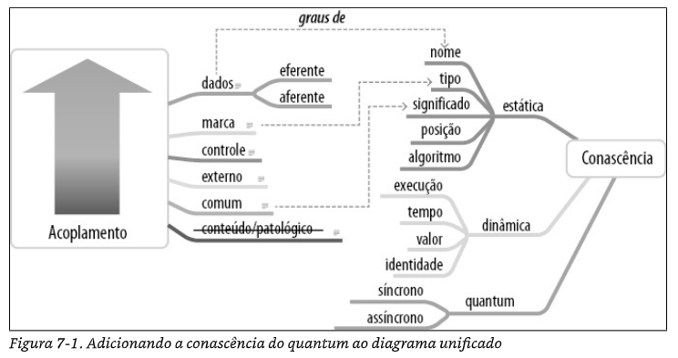


## Estudo de caso: going, going, gone


## Resumo
<details>
  <summary>Gerado por IA</summary>

  Olá! Sou a sua inteligência especializada no livro **"Fundamentos de Arquitetura de Software: Uma Abordagem de Engenharia"**, de Mark Richards e Neal Ford. Estou aqui para guiar você nessa jornada de aprendizado sobre arquitetura de software!

  Com base no seu resumo do **Capítulo 7: Escopo das características da arquitetura**, estruturei a explicação detalhada do capítulo seguindo o nosso padrão.

  ---

  ### O Conceito em Linhas Gerais

  Antigamente, quando pensávamos em características da arquitetura (como escalabilidade, disponibilidade ou segurança), costumávamos aplicá-las ao sistema como um todo. Se o sistema precisava ser escalável, assumia-se que *tudo* nele precisava escalar da mesma forma.

  No entanto, com a evolução da engenharia e a chegada de estilos como microsserviços, percebeu-se que diferentes partes de um mesmo sistema têm necessidades completamente diferentes. O **Capítulo 7** trata justamente de **delimitar onde começam e onde terminam essas características**, introduzindo o conceito de **Quantum da Arquitetura** (*Architectural Quantum*) para medir o escopo real de uma arquitetura, indo além do código-fonte e incluindo banco de dados e dependências de tempo de execução.

  ---

  ### A Visão dos Autores (Richards & Ford)

  Os autores abordam esse tema conectando o conceito de acoplamento ao escopo de implantação e operação do sistema. A explicação se divide nos seguintes pilares:

  ---

  #### 1. Limitações das Métricas Estruturais Tradicionais

  * **Código vs. Sistema:** Métricas puramente de código (vistas no Capítulo 6) medem detalhes de baixo nível, mas ignoram dependências externas cruciais, como bancos de dados ou serviços de terceiros.
  * **Necessidade Operacional:** Para avaliar características operacionais (como *performance* e escalabilidade), é preciso analisar o ecossistema completo onde o código roda.

  ---

  #### 2. Acoplamento e Conascência

  * **O que é Conascência:** Dois componentes são conascentes se uma mudança em um exige a alteração no outro para manter a integridade do sistema.
  * **Conascência Estática:** Refere-se à estrutura do código (dependências de compilação, tipos de dados, parâmetros).
  * **Conascência Dinâmica:** Refere-se à execução em tempo de execução:
  * **Síncrona:** A chamada bloqueia a execução enquanto aguarda a resposta. Isso unifica o comportamento operacional e conecta o destino ao mesmo destino de falha/escalabilidade do chamador.
  * **Assíncrona:** Modelo "dispara e esquece" (*fire-and-forget*), comum em arquiteturas baseadas em eventos, que reduz o acoplamento temporal entre os serviços.


  ---

  #### 3. Quantum da Arquitetura (*Architectural Quantum*)

  Um *quantum* é a menor unidade autônoma da arquitetura. Ele é definido pela união de três elementos centrais:

  * **Implantado de modo independente (*Independently Deployable*):** Inclui tudo o que é necessário para rodar de ponta a ponta (código, interface, banco de dados e dependências) sem depender da implantação simultânea de outros componentes.
  * **Alta coesão funcional:** Todo o código dentro do quantum trabalha focado em um único propósito de negócio bem delimitado.
  * **Conascência síncrona:** Se duas partes se comunicam de forma síncrona em tempo de execução, elas compartilham a mesma disponibilidade e escalabilidade — logo, fazem parte do mesmo quantum.

  ---

  #### 4. Estudo de Caso: *Going, Going, Gone*

  * Os autores usam o exemplo fictício de um site de leilões (*Going, Going, Gone*) para demonstrar a aplicação prática do conceito.
  * **Diferenciação de Quanta:** A parte de navegação de itens leiloados exige altíssima escalabilidade de leitura e pode tolerar consistência eventual. Já o módulo de lances (*bidding*) exige altíssima consistência e baixa latência de escrita.
  * **Conclusão Prática:** Tratar o sistema como um único quantum exigiria aplicar os requisitos mais rígidos a todo o sistema, tornando-o caro e complexo. Ao dividir o sistema em múltiplos *quanta* de arquitetura, cada parte recebe exatamente as características de que precisa.
</details>


# Capítulo 8: Pensamento baseado em componentes
- em geral os arquitetos pensam em termos de **componentes**, ao pensar em uma representação física de um módulo
- desenvolvedores empacotam os módulos de formas diferentes ao gerar o pacote físico do módulo:
  - arquivos jar em Java
  - dll em .NET
  - gem em Ruby


## Escopo do componente
- wrapper de código: bibliotecas
- camada ou subsistema: camadas como domínio, apresentação etc
- processador de evento
- serviço distribuído: microsserviços

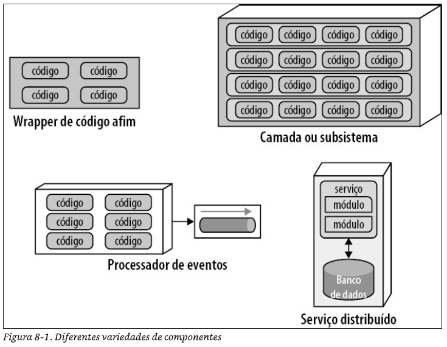

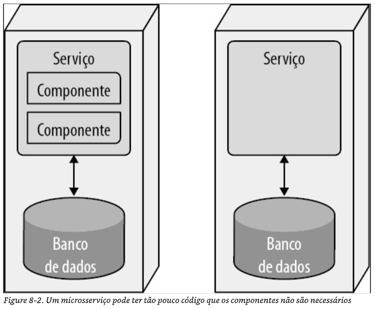

<details>
  <summary>Gerado por IA</summary>

  ### O Conceito em Linhas Gerais

  Componentes são os **blocos de construção fundamentais de um sistema**. Eles funcionam como contêineres organizacionais para agrupar partes do código (como classes e funções) em unidades maiores, facilitando a estruturação e a manutenção do software.

  ---

  ### A Visão dos Autores (Richards & Ford)

  Os autores apresentam os componentes como o nível de modularidade que fica logo acima do código básico oferecido pelas linguagens de programação. As principais abordagens incluem:

  * **Wrappers de Código Afim (Bibliotecas):** O tipo mais simples de componente. Agrupa funções ou classes relacionadas que rodam no mesmo endereço de memória e se comunicam diretamente pelo código. Costumam ser dependências compiladas junto com o sistema.
  * **Camadas e Subsistemas:** Estruturas que agrupam componentes em níveis de abstração (como camada de dados, regras de negócio e apresentação) para dividir as responsabilidades da aplicação.
  * **Processadores de Eventos:** Componentes projetados para redefinir a execução de tarefas com base na chegada de eventos assíncronos.
  * **Serviços Distribuídos:** Unidades independentes que rodam em seus próprios espaços de memória e se comunicam por rede (via protocolos como REST ou filas de mensagens). Essa abordagem é o pilar de arquiteturas como a de microsserviços.
  * **Decisão Arquitetural:** O uso e o nível de granularidade dos componentes não são obrigatórios, mas sim escolhas do arquiteto para determinar como o sistema será particionado em alto nível.
</details>


## Função do arquiteto
- o arquiteto define, aprimora, gerencia e controla os componentes em uma arquitetura
- em colaboração com analistas comerciais, especialistas, desenvolvedores, engenheiros de QA, profissionais de operações e arquitetos corporativos, criam o design inicial do software, incorpora as características
- a arquitetura existe separada do processo
- em geral, o nível mais baixo do sistema que o arquiteto interage é o componente, com exceção das métricas de qualidade do capítulo 6
- o arquiteto deve saber identificar os componetes do projeto, mas antes disso deve saber como particionar


## Particionamento da arquitetura
- considere os dois tipos de estilos de arquitetura: em camadas e modular

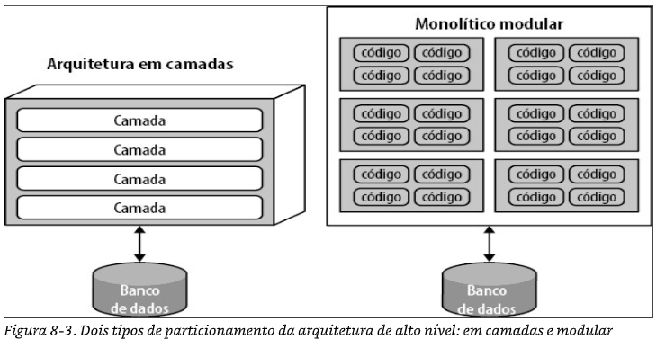

- monolítico em camadas
- monolítico modular

Particionamento de alto nível (monolítico em camadas):
- particionamento técnico: apresentação, regras comerciais, serviço, persistência
- particionamento do domínio: FecharCatálogo, EnviarParaCliente, Análise, AtualizarInvestário, Relatório, AtualizarContas

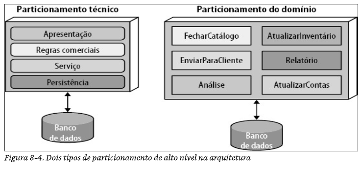

> Lei de Conway: "As organizações que projetam sistemas… ficam limitadas a produzir designs que são cópias das estruturas de comunicação dessas organizações."
> Resumindo: o design da arquitetura é um espelho da estrutura organizacional da empresa.

<details>
  <summary>Gerado por IA</summary>

  ## O Conceito em Linhas Gerais

  A **Lei de Conway** é uma observação sociotécnica que diz o seguinte: **a forma como o software é desenhado reflete a forma como a equipe que o criou se comunica**.

  * Se você tem três times isolados (um de Front-end, um de Back-end e um de Banco de Dados), o seu sistema tenderá a ter três grandes camadas separadas.
  * Se a comunicação entre as pessoas for truncada, a integração entre as partes do código também será problemática.

  Resumindo: o design da arquitetura é um espelho da estrutura organizacional da empresa.

  ---

  ## A Visão dos Autores (Richards & Ford)

  Mark Richards e Neal Ford destacam que os arquitetos de software precisam entender que **fatores humanos e organizacionais impactam diretamente as decisões técnicas**.

  * **Acoplamento Organizacional:** Separar times puramente por "especialidade técnica" (DBAs de um lado, devs de outro) cria barreiras de comunicação. Isso força o software a ser construído em silos, dificultando a entrega de funcionalidades completas de ponta a ponta.
  * **A Manobra Inversa de Conway (*Inverse Conway Maneuver*):** Para evitar que a estrutura antiga da empresa estrague a arquitetura desejada, os autores defendem que devemos usar a lei a nosso favor. Ou seja: **mude a estrutura dos times para encorajar a arquitetura que você quer ter**.
  * **Times Multidisciplinares:** Em vez de separar por tecnologia, organiza-se a equipe ao redor do domínio do negócio (por exemplo, um time focado só em "Pagamentos", contendo dev front, dev back e especialista em dados). Isso naturalmente gera uma arquitetura de microsserviços ou módulos independentes.
</details>

- particionamento de domínio: inspirado no DDD de Eric Evan
- componentes do sistema organizados por capactidade técnicas: apresentação, regras comerciais, persistência etc.

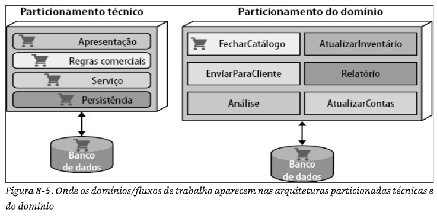

Na figura acima, o particionamento técnico, FecharCatálogo aparece em todas as camadas. No particionamento de domínio, pode conter domínios camadas, mas foca nos domínos.


## Estudo de Caso: Silicon Sandwiches: Particionamento
Exemplo de particionamento de domínio:  
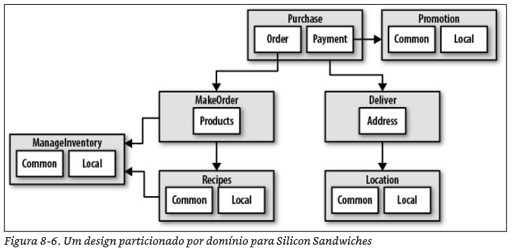

No exemplo acima o arquiteto particionou em torno de domínios e em cada componente reside um subcomponente conrindo avariação comum (common) e local.

Outra abordagem é isolar as partes common e local em sua própria partição:  

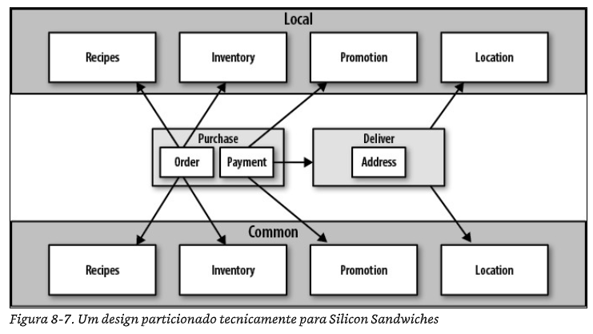

<details>
  <summary>Gerado por IA</summary>

  ## O Conceito em Linhas Gerais

  O **particionamento de arquitetura** é o ato de decidir como você vai organizar e dividir os principais blocos de construção do seu sistema.

  Pense nisso como organizar uma casa: você pode dividir os ambientes por **função do dia a dia** (quarto, cozinha, banheiro) ou por **tipo de infraestrutura/técnica** (instalação hidráulica, rede elétrica, alvenaria).

  No software, as duas formas principais de fazer essa divisão de alto nível são:

  * **Particionamento por Domínio:** Organiza o sistema com base nas regras e fluxos de negócio.
  * **Particionamento Técnico:** Organiza o sistema com base nas camadas de tecnologia ou capacidades técnicas compartilhadas.

  ---

  ## A Visão dos Autores (Richards & Ford)

  No livro, enfatizamos que **não existe uma escolha "certa", mas sim compensações (*trade-offs*)**. O famoso *"depende"* da engenharia de software entra em ação aqui.

  ### 1. Particionamento por Domínio

  * **Como funciona:** As partes do sistema são divididas por áreas de negócio ou fluxos de trabalho (ex: Compras, Entrega, Inventário, Promoção).
  * **Vantagens:**
  * Facilita a modelagem alinhada com o negócio (próximo do *Domain-Driven Design*).
  * Simplifica a migração para arquiteturas distribuídas (como microsserviços) no futuro.
  * Mudanças em uma regra de negócio afetam apenas o componente daquela área.


  * **Desvantagens:** Pode haver duplicação de esforço técnico ou padrão de código entre diferentes módulos de domínio.

  ---

  ### 2. Particionamento Técnico

  * **Como funciona:** O sistema separa primeiro as capacidades ou camadas técnicas de alto nível (ex: módulos globais/comuns vs. customizações locais), e o negócio roda por cima dessa infraestrutura.
  * **Vantagens:**
  * Maior reutilização de código e centralização de aspectos técnicos.
  * Facilita a consolidação de padrões operacionais em um só lugar.


  * **Desvantagens:**
  * Alto acoplamento: alterar uma regra de negócio pode exigir mexer em múltiplos pontos técnicos espalhados.
  * Dificulta a separação do sistema caso a empresa precise evoluir para microsserviços mais tarde.


  ---

  > **A grande lição:** O particionamento define a estrutura fundamental do sistema. Se o seu foco é acompanhamento de regras de negócio em rápida evolução, o **domínio** costuma ser preferível. Se o foco é reuso técnico estrito, o **técnico** ganha espaço. Arquitetura é sempre sobre avaliar os prós e contras para a sua necessidade específica.
</details>


### Particionamento do domínio
- particionam os componentes por fluxo de trabalho ou domínios
Vantagens:
- modelagem melhor para o negócio
- facilita a manobra de conway inversa para criar equipes multifuncionais em torno do domínio
- alinha-se melhor com o estilo monolítica modular e de domíno
- O fluxo de mensagens corresponde ao domínio do problema.
- Facilita migrar dados e componentes para a arquitetura distribuída

Desvantagens:
- o código customizado aparece em vários locais

<details>
  <summary>Gerado por IA</summary>

  ## O Conceito em Linhas Gerais

  * **Particionamento de Domínio:** É organizar o software dividindo-o pelas **áreas do negócio** (ex: *Pedidos*, *Pagamentos*, *Estoque*) em vez de camadas técnicas (ex: *Front-end*, *Back-end*, *Banco de Dados*).
  * **Lei de Conway:** Uma regra clássica que diz: *"O software reflete a estrutura de comunicação da empresa que o criou"*. Se você tem times divididos por tecnologia (um time só de Banco de Dados, um só de Front-end), o software acaba nascendo separado nessas mesmas camadas técnicas.
  * **Manobra de Conway Inversa:** É inverter essa lógica a seu favor! Em vez de deixar a estrutura da empresa ditar o software, você **projetar a arquitetura ideal por domínio** e **reorganizar as equipes** para apoiarem essa arquitetura.

  ---

  ## A Visão dos Autores (Richards & Ford)

  ### 1. Resumo do Particionamento por Domínio

  Dividir o sistema por domínios foca na funcionalidade do negócio, trazendo benefícios e compensações (*trade-offs*):

  * **Vantagens principais:**
  * **Alinhamento ao Negócio:** O código reflete os fluxos reais de trabalho.
  * **Times Multifuncionais:** Cada equipe cuida de um domínio de ponta a ponta (UI, regras, dados).
  * **Evolução Facilitada:** Encaixa-se perfeitamente em monólitos modulares e microsserviços, facilitando migrações futuras.


  * **Desvantagem principal:**
  * **Duplicação Técnica:** Código utilitário ou customizado pode acabar repetido em vários módulos de domínio diferentes.


  ---

  ### 2. Detalhando a Manobra de Conway Inversa (*Inverse Conway Maneuver*)

  No livro, destacamos como essa estratégia transforma o dia a dia da engenharia de software:

  * **Passo 1 — Definir os Limites de Domínio:** O arquiteto identifica os fluxos de negócio independentes (ex: o domínio de *Entregas*).
  * **Passo 2 — Montar Equipes Multifuncionais (*Cross-functional Teams*):** Cria-se uma equipe dedicada a esse domínio contendo todos os papeis necessários (devs *front-end*, *back-end*, especialista em banco de dados e *product owner*).
  * **Passo 3 — Reduzir o Custo de Comunicação:** Como o time possui todas as competências para entregar uma funcionalidade de negócio inteira, eles não dependem de aprovações ou handoffs de outros times técnicos.
  * **O Resultado Prático:** A arquitetura se torna mais coesa, o acoplamento entre times cai drasticamente e as entregas de valor para o negócio ficam muito mais rápidas.
</details>


### Particionamento técnico
Vantagens:
- Separa claramente o código customizado. 
- Alinha-se melhor com o padrão de arquitetura em camadas.
Desvantagens:
- o código customizado aparece em vários locais

Desvantagens:
- maior grau de acomplamento global. Alteração no common ou local afetam outros componentes
- os desenvolvedores podem duplicar o domíno nas camadas common e local
- maior acomplamento no nível dos dados. Utilizam um banco de dados único. Maior complexidade ao migrar para uma arquitetura para um sistema distribuído


## Função do desenvolvedor
- dividem os componentes em classes, funções ou subcomponentes
- o design de classes e funções é de responsabilidade compartilhada com arquitetos, responsáveis técnicos e desenvolvedores
- componente projetados pelos arquitetos não é uma decisão final, pode ocorrer uma interação entre ambos para chegar no resultado final


## Fluxo de Identificação dos Componentes
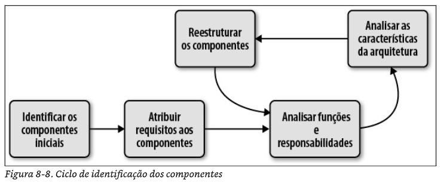


## Identificando os componentes iniciais
- o arquiteto deve determinar com quais componentes de alto nível iniciar com base no tipo de particionamento

## Atribuir requisitos aos componentes
Depois de identificar os componentes, é alinhar os requisitos (ou histórias do usuário) com os componentes. POdendo criar novos componentes, consolidar ou dividir os componentes que têm responsabilidade demais.

## Analisar funções e responsabilidades
Ao atribuir histórias aos componentes, o arquiteto também vê as funções e as responsabilidades durante os requisitos. Pensar nas funções e nos componentes permite alinhar granularidade dos componetes e do domínio.

## Analisar as características da arquitetura
Ao atribuir requisitos aos componentes, o arquiteto tem que pensar nas características da arquitetura para considerar como podem impactar na divisão e granularidade do componente.

## Restruturar os componentes
- feedback é essencial
- iterar o design continuamente com os desenvolvedores

## Granularidade do componente
- encontrar a granularidade correta é uma das tarefas mais difíceis
- design muito granular de um componente aumenta a quantidade de comunicação entre os componentes
- pouca granularidade aumenta o acoplamente interno

## Design do componente
- não existe jeito certo de projetar componentes
- há uma grande variedade de técnica com seus trade-offs

## Descobrindo componentes
- o arquiteto em conjunto com desenvolvedores, analistas comerciais e especialistas, criam o design inicial do componenete e como decompor tomando como base o particionamento técnico ou do domínio
- o objetivo da equipe é um design inicial que levam em conta as características da arquitetura

## Armadilha da entidade
- antipadrão: componentes criados com base nas entidade do banco de dados relacional
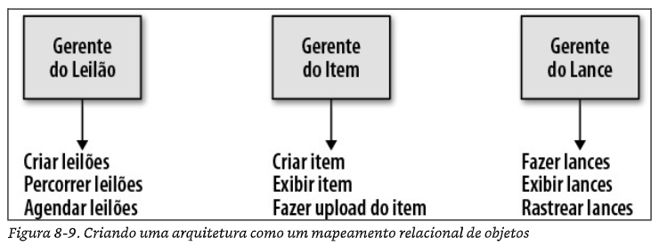


## Abordagem ator/ação
- é uma forma popular de mapear requisitos para os componentes
- funciona para sistemas monolíticos ou distribuídos

<details>
  <summary>Gerado por IA</summary>

  ### O Conceito em Linhas Gerais

  A **abordagem ator/ações** é uma técnica para transformar o que o sistema precisa fazer (requisitos) em partes organizadas do código (componentes).

  Em termos simples, ela consiste em responder a duas perguntas básicas:

  * **Quem** usa o sistema? (Os **Atores**, que podem ser pessoas ou outros sistemas).
  * **O que** essa pessoa tenta fazer? (As **Ações** ou tarefas que ela realiza).

  Ao listar quem são os usuários e quais tarefas eles executam, fica mais fácil agrupar os comportamentos e decidir quais blocos funcionais do sistema precisam existir.

  ---

  ### A Visão dos Autores (Richards & Ford)

  * **Origem e Mapeamento:** Definida originalmente no *Rational Unified Process* (RUP), essa técnica funciona mapeando os atores diretamente para as atividades que executam, ajudando a descobrir os usuários típicos e suas interações com a aplicação.
  * **Decomposição em Componentes:** É um estilo de **decomposição inicial de componentes**. O arquiteto identifica os atores e as ações para traduzir requisitos funcionais em blocos lógicos de software.
  * **Aplicabilidade Universal:** Funciona bem para qualquer estilo arquitetural — seja para sistemas **monolíticos** (uma única unidade de implantação) ou **distribuídos** (como microsserviços).
  * **Ponto Forte:** É especialmente eficaz em cenários onde os requisitos apresentam **funções bem distintas** e ações bem delineadas por tipo de usuário.
</details>


## Tempestade de eventos
- event storm
- técnica de descoberta utilizada no DDD
- funciona bem nas arquiteturas distribuídas como microsserviços


## Abordagem do fluxo de trabalho
- alternativa a tempestade de eventos
- abordagem genérica para quem não usa DDD nem mensageria
- modela componentes baseado no fluxo de trabalho


## Estudo de caso: Goiong, Going, Gone: Descobrindo os componentes
- abordagem ator/ação funciona bem como uma solução genérica

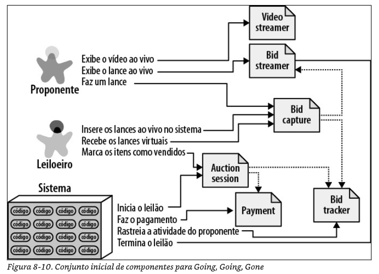

- após a identificação inicial dos componentes, o arquiteto analisa as características da arquitetura para determinar se isso mudará o design.

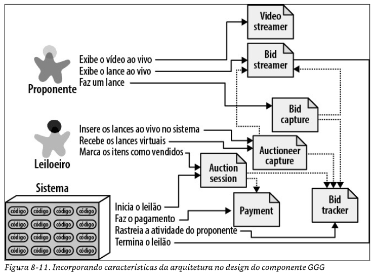


## Quantum da arquitetura revisitado: escolhendo entre arquiteturas monolíticas versus distribuídas
Quanta arquitetural ou granularidade: define o escopo das características da arquitetura e após o design inicial. Define se a arquitetura será monolótica ou distribuída.
- arquitetura monolítica: uma unidade de implementação e um banco de dados. Tipos de arquitetura: blocos monolíticos em camadas e modular.
- arquitetura distribuída: varios serviços comunicando via protocolo de rede. CAda serviço pode ter sua própria release e práticas.
- cada arquitetura tem vários trade-offs. No sistema com um único quantum e com um conjunto de características, a arquitetura monolítica oferece muitas vantagens. NO sistema que as características são variadas e distribuidas entre os componentes, a arquitetura distribuída é a escolha certa.


# PARTE II - Estilo de arquitetura
- estilo de arquitetura: como é organizado a interface do usuário + backend + armazenamento de dados
- padrão de arquitetura: são estrturua de design de baixo que ajuda soluções em um estilo de arquitetura


# Capítulo 9: Fundamentos


## Padrões fundamentais
- o conceito de camadas é antigo, mas continua a se manifestar nas variantes modernas

## Grande bola de lama
- Grande bola de lama: qualquer ausência de estrutura de arquitetura
- a falta de estrutura dificulta a alteração do código. Causa problemas na implementabilidade, testabilidade, escalabilidade e desempenho.

## Arquitetura unitária
<details>
  <summary>Gerado por IA</summary>

  ### O Conceito em Linhas Gerais

  A **Arquitetura Unitária** (ou *Unitary Architecture*) é o estilo arquitetural mais básico da computação. Nela, todo o software e seus dados rodam diretamente em um único computador ou dispositivo físico, sem divisão em rede ou em servidores externos.

  É o modelo do "sistema tudo-em-um": a aplicação e o armazenamento vivem na mesma máquina.

  ---

  ### A Visão dos Autores (Richards & Ford)

  Na perspectiva do livro, a arquitetura unitária representa o ponto de partida histórico e prático da engenharia de software:

  * **Origem Histórica**: Surgiu quando a computação se resumia ao computador e ao programa executado nele (como nos primeiros mainframes e PCs sem rede).
  * **Evolução Natural**: Com o crescimento da complexidade dos sistemas, as arquiteturas unitárias deram lugar a modelos distribuídos (como cliente/servidor) para conseguir separar responsabilidades e lidar com mais dados.
  * **Uso Atual**: Hoje em dia, são raros nos sistemas comerciais e corporativos. Ficam praticamente restritos a **sistemas embarcados** (como firmware de micro-ondas ou painéis automotivos) ou ambientes com severas limitações físicas/locais.
  * **Limitação Principal**: Sistemas tendem a crescer. Para manter **desempenho e escalabilidade** (características operacionais da arquitetura), é quase sempre necessário abandonar a arquitetura unitária e dividir as preocupações do sistema.
</details>


## Cliente/Servidor
- arquitetura de duas camadas ou cliente/servidor. Exemplo: frontend e backend

## Desktop + servidor de banco de dados
- Em sistemas Windows, a lógica de apresentação fica no computador pessoal (desktop) e o processamento computacional em volume e complexidade ocorre nos serviços de banco de dados através dos protocolos de rede.

## Navegador + servidor web
- a comunicação ocorre entre navegador web, servidor web e servidor de banco de dados

## Três camadas
- uma camada do banco de dados, uma camada da aplicação e um frontend

## Arquiteturas monolíticas versus distribuídas
- estilos de arquitetura:
  + monolítico
    - Arquitetura em camadas (Capítulo 10) 
    - Arquitetura de pipeline (Capítulo 11) 
    - Arquitetura de microkernel (Capítulo 12)
  + distribuído
    - Arquitetura baseada em serviços (Capítulo 13) 
    - Arquitetura orientada a eventos (Capítulo 14)
    - Arquitetura baseada em espaços (Capítulo 15)
    - Arquitetura orientada a serviços (Capítulo 16)
    - Arquitetura de microsserviços (Capítulo 17)
- trade-offs da arquitetura distribuída: falácias da arquitetura distribuídas


## Falácia 1: a rede é confiável
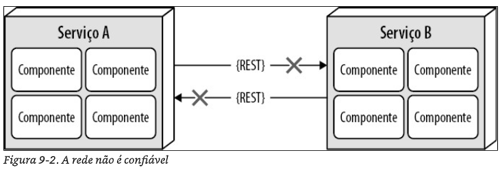


## Falácia 2: a latência é zero
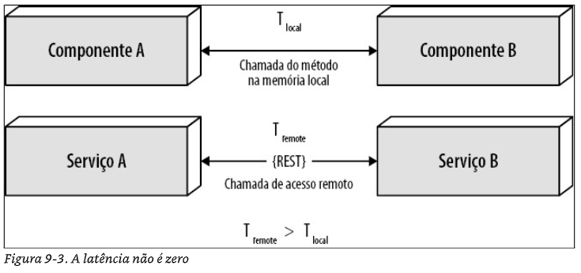


## Falácia 3: a largura de banda é infinita
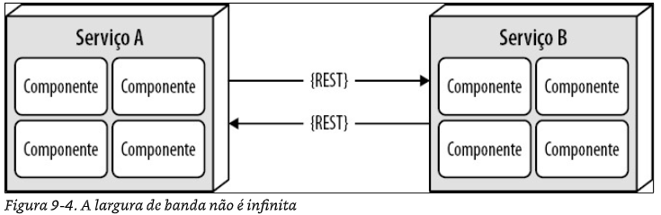

O Stamp Coupling (ou acoplamento de estampa) ocorre quando múltiplos módulos ou serviços compartilham uma estrutura de dados complexa (ou um grande conjunto de dados), mas o serviço receptor necessita apenas de uma fração/parte desses dados para realizar sua operação.


## Falácia 4: a rede é segura
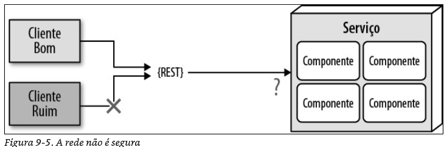


## Falácia 5: a topologia nunva muda
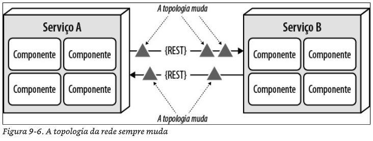


## Falácia 6: existe apenas um administrador
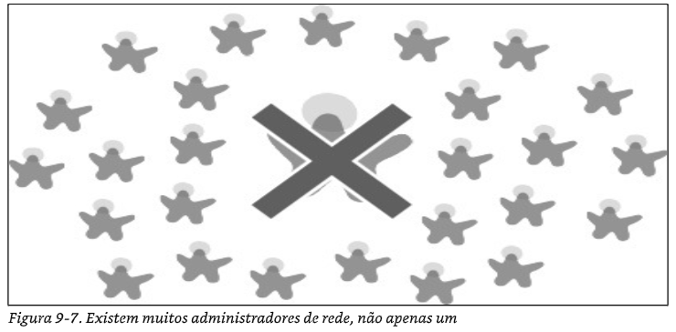


## Falácia 7: o custo do transporte é zero
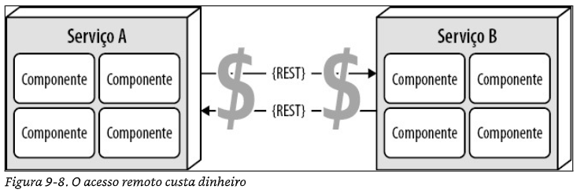


## Falácia 8: a rede é homogênea
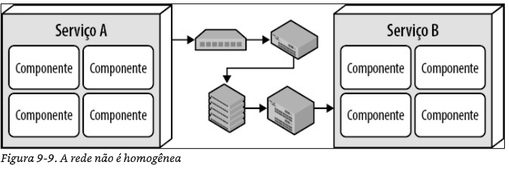


## Outras considerações distribuídas

### Log distribuído
- sistemas monolíticos tem um local centralizado dos logs
- sistemas distribuídos tem os logs espalhado entre os serviços
- ferramentas com Splunk ajudam na consolidação dos logs, mas isso é somente o a superfície do problema

### Transações distribuídas
- consistência eventual
- sagas transacionais: gerencia transações distribuídas
- BASE significa disponibilidade (B)ásica, estado (S)uave e consistência (E)ventual

<details>
  <summary>Gerado por IA</summary>

  **O Conceito em Linhas Gerais**

  Em sistemas únicos e centralizados (monólitos), a gestão de dados é simples: quando você faz uma operação, como uma compra online, o banco de dados garante que ou **tudo dá certo** ou **nada é salvo** (transação ACID).

  Em sistemas distribuídos (onde a aplicação é dividida em vários serviços e bancos separados), garantir essa sincronização imediata torna-se quase impossível. Nesses ambientes, adota-se a **consistência eventual**: os dados de diferentes serviços ficam temporariamente desalinhados, mas acabam se sincronizando e se tornando consistentes após um determinado tempo.

  ---

  **A Visão dos Autores (Richards & Ford)**

  * **Trade-off Fundamental**: Em arquiteturas distribuídas, ganha-se alta escalabilidade, desempenho e disponibilidade, mas paga-se o preço na perda da consistência imediata dos dados.
  * **Transações BASE**: Em contraste com as transações ACID do mundo monolítico, sistemas distribuídos usam o modelo BASE (*Basic Availability, Soft-State, Eventual Consistency*). Trata-se de uma técnica na qual o estado do sistema é "suave" (temporário ou transitório) enquanto as informações trafegam entre origens e destinos.
  * **Padrão Saga**: Para gerenciar transações em múltiplos serviços sem o bloqueio tradicional de banco de dados, utilizam-se técnicas como **sagas transacionais**. Elas usam eventos ou máquinas de estado para coordenar etapas e aplicar ações de compensação (estornos) caso algum passo falhe no caminho.
</details>


### Manutenção e versionamento de contrato
- desafio da arquitetura distribuída é a criação, manutenção e versionamento de contratos


## Resumo
<details>
  <summary>Gerado por IA</summary>

  ### O Conceito em Linhas Gerais

  O **Capítulo 9: Fundamentos** funciona como uma ponte conceitual na obra. Ele estabelece as fundações para entender a grande divisão do design de software: **arquiteturas monolíticas versus arquiteturas distribuídas**.

  O capítulo contrasta a simplicidade e o controle dos modelos centralizados (monólitos) com a complexidade, os riscos e as armadilhas de mover o processamento para múltiplos nós conectados em rede (sistemas distribuídos).

  ---

  ### A Visão dos Autores (Richards & Ford)

  * **Evolução dos Estilos Arquiteturais**:
  * **Grande Bola de Lama (*Big Ball of Mud*)**: É a antítese da arquitetura. Ocorre quando não há estrutura definida, tornando o código difícil de alterar e prejudicando a testabilidade, manutenibilidade e escalabilidade.
  * **Arquitetura Unitária**: Tudo roda em uma única máquina (dados e aplicação). Hoje restrita a sistemas embarcados ou cenários com forte restrição física.
  * **Cliente/Servidor e Três Camadas**: A evolução natural para separar a interface (desktop/navegador), a lógica de aplicação e a persistência em banco de dados.
  * **Monolítico vs. Distribuído**:
  * *Monolíticos* (Camadas, Pipeline, Microkernel): Executam em uma única unidade de implantação.
  * *Distribuídos* (Orientado a Eventos, Microsserviços, Baseado em Espaços, etc.): Separam responsabilidades através da rede.


  * **As 8 Falácias da Computação Distribuída**:
  * **1. A rede é confiável**: Falhas de rede acontecem; sistemas distribuídos precisam lidar com quedas e perda de pacotes.
  * **2. A latência é zero**: Chamar um serviço remoto sempre leva mais tempo do que uma chamada de memória local.
  * **3. A largura de banda é infinita**: Enviar volumes excessivos de dados causa gargalos (*stamp coupling* ocorre quando se envia um objeto complexo inteiro quando o serviço precisava de apenas um campo).
  * **4. A rede é segura**: Dados trafegando pela rede exigem criptografia e autenticação constante.
  * **5. A topologia nunca muda**: Servidores, roteadores e endereços IP mudam com frequência.
  * **6. Existe apenas um administrador**: Múltiplos times e administradores gerenciam a infraestrutura, o que pode causar inconsistências de configuração.
  * **7. O custo do transporte é zero**: Trafegar dados na rede (especialmente em nuvem) gera custos financeiros diretos.
  * **8. A rede é homogênea**: Diversos hardware, sistemas operacionais e protocolos coexistem no mesmo ecossistema.


  * **Desafios Operacionais em Ambientes Distribuídos**:
  * **Observabilidade e Logs**: Diferente de monólitos com logs centralizados, sistemas distribuídos precisam de ferramentas de agregação e rastreamento correlacionado.
  * **Transações Distribuídas**: Abandona-se o modelo **ACID** (consistência imediata) em prol do modelo **BASE** (*Basic Availability, Soft-State, Eventual Consistency*). O padrão **Saga** é utilizado para gerenciar etapas e transações de compensação (estornos).
  * **Contratos e Versionamento**: A manutenção e a evolução contínua das interfaces (APIs/contratos) entre serviços tornam-se críticas para evitar que mudanças em um serviço quebrem outros.
</details>


# Capítulo 10: Estilo de Arquitetura em Camadas
- Arquitetura em camdas ou multicamadas (n-tier)
- baseado na lei de conway (comunicação das organizações é refletida nos sistemas)

## Topologia
- utilizam camadas horizontais lógicas
- camadas padrões:
  - apresentação
  - comercial
  - persistência
  - banco de dados

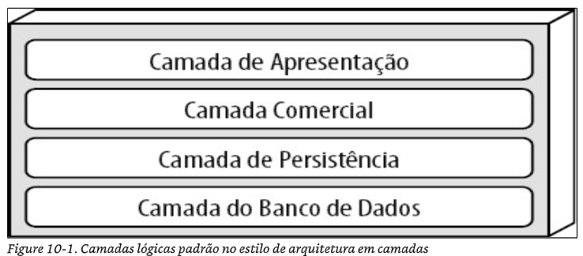

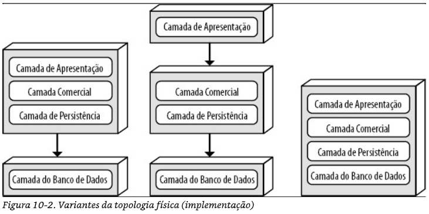

- particionamento técnico: agrupado por função técnica. Uma alteraçao de cliente pode ser alterada na camada de apresentação, domínio e persistência de dados, por exemplo.
- particionada por domínio: agrupado por domínio de informação. Ex: cliente

## Camadas de isolamento
- camada fechada: conforme a informação passa entre as camadas, ela deve passar os dados de sua camada, especificamente, para camada abaixo, sem pular camadas
- camada aberta: permite que as camadas sejam acessadas fora da ordem natural, ou seja, por exemplo, poderia passar da camada de apresentação para a camada de persistência

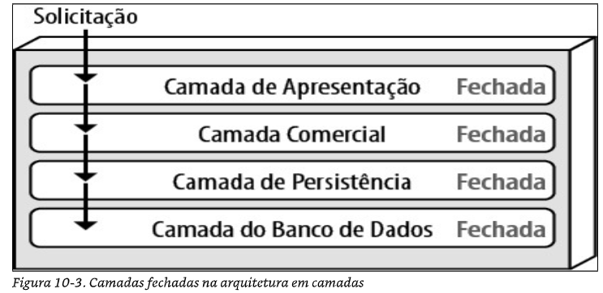

- camada de isolamento: alterações feitas em uma camada afetam outras camadas

## Adicionando camadas
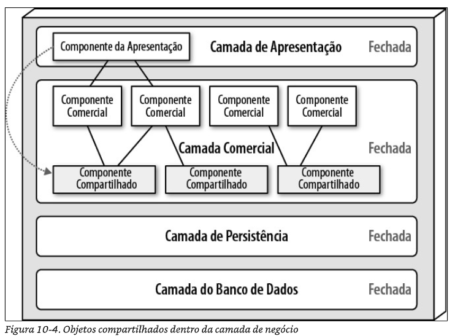

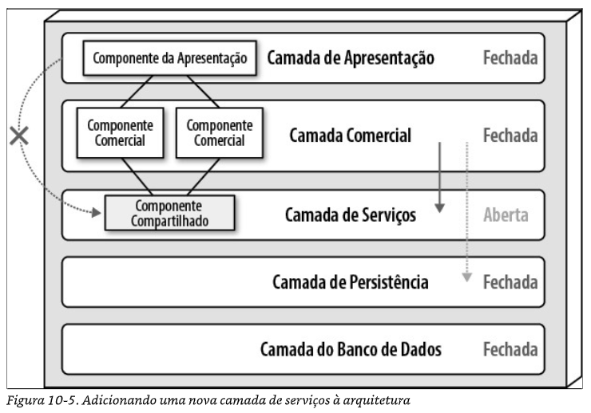


## Outras considerações
Antipadrão sinkhole: as informações passam de camada para camada sem existir um regra de negócio. Somente seguindo o padrão de comunicação entre as camadas.

## Por que usar esse estilo de arquitetura
- menor custo
- quando o arquiteto ainda está em analise das necessidades de negócio e requisitos
- características como manutenção, agilidadem testabilidade e implementabilidade são afetadas negativamente


## Classificações das características da arquitetura
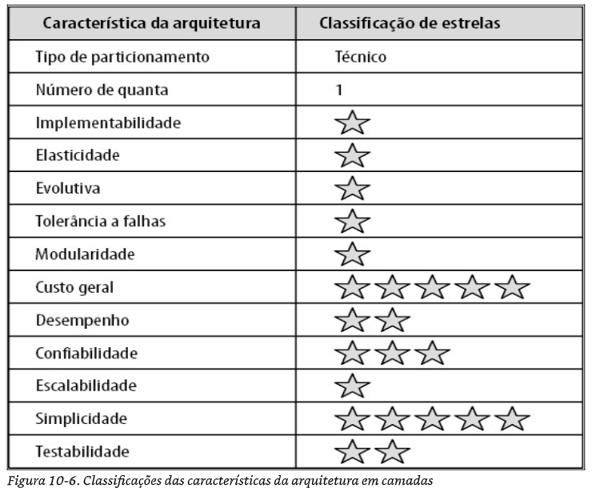

- a arquitetura em camadas tem uma classificação alta de custo e simplicidade enquanto a quantidade de código está baixa. Conforme a quantidade de código aumenta, vai torando cada vez mais complexa.


## Resumo
<details>
  <summary>Gerado por IA</summary>

  ### O Conceito em Linhas Gerais

  A **Arquitetura em Camadas** (ou *n-tier*) é o estilo arquitetural mais comum e tradicional na engenharia de software. Ela divide a aplicação em seções horizontais, onde cada camada possui um papel técnico específico e bem definido (por exemplo, exibir dados na tela, processar regras de negócio ou salvar informações no banco de dados).

  Por se organizar com base nas competências técnicas da equipe, esse modelo reflete diretamente a **Lei de Conway**: a estrutura do sistema acaba espelhando a estrutura de comunicação da organização (ex.: time de frontend, time de backend e time de DBA).

  ---

  ### A Visão dos Autores (Richards & Ford)

  * **Topologia e Particionamento Técnico:**
  * **Particionamento Técnico:** O sistema é estruturado por papéis técnicos, e não por funcionalidades de negócio. Por isso, implementar uma simples mudança de funcionalidade (como alterar o cadastro de um cliente) costuma exigir modificações em cascata na Apresentação, no Domínio/Negócio e na Persistência.
  * **Camadas Padrão:** Geralmente, divide-se em quatro camadas fundamentais:
  1. **Apresentação:** Interface com o usuário.
  2. **Regra de Negócio (Comercial/Domínio):** Lógica da aplicação.
  3. **Persistência:** Comunicação e mapeamento dos dados.
  4. **Banco de Dados:** Armazenamento físico das informações.


  * **Camadas de Isolamento (Abertas vs. Fechadas):**
  * **Camadas Fechadas:** A requisição precisa passar obrigatoriamente por cada camada subsequente sem pular nenhuma. Isso garante o **conceito de isolamento**: alterações em uma camada não impactam as outras, desde que o contrato de interface seja mantido.
  * **Camadas Abertas:** Permitem que uma camada superior acesse diretamente uma camada mais abaixo (por exemplo, a Apresentação acessar diretamente a Persistência para consultas simples). Aumenta a velocidade, mas reduz o isolamento e aumenta o acoplamento.
  * **Adicionando Camadas:** É comum incluir camadas intermediárias (como uma camada de Serviços compartilhada) para isolar responsabilidades específicas ou reutilizar lógicas entre diferentes fluxos.


  * **Cuidados e Antipadrões:**
  * **Antipadrão *Architecture Sinkhole*:** Ocorre quando requisições passam por várias camadas sequenciais apenas atuando como "passagem de dados", sem executar nenhuma regra de negócio real. Se mais de 20% das requisições apresentarem esse comportamento, a arquitetura pode estar inflada e ineficiente.


  * **Trade-offs e Avaliação de Características:**
  * **Pontos Fortes:** Baixo custo inicial, alta simplicidade e grande facilidade de entendimento/desenvolvimento para times iniciantes. É uma excelente escolha para novos projetos em fase de descoberta de requisitos.
  * **Pontos Fracos:** Sofre com baixa agilidade, testabilidade e implantabilidade à medida que o sistema cresce. Conforme a base de código expande, a complexidade aumenta substancialmente, tornando o software monolítico, rígido e difícil de manter.
</details>


# Capítulo 11: Estilo de arquitetura pipeline
Um estilo fundamental na arquitetura que divide a funcionalidade em partes distintas. O princípio por trás do shell do terminal Unix como o bash e zsh.

MapReduce segue essa topologia básica: https://en.wikipedia.org/wiki/MapReduce

## Topologia
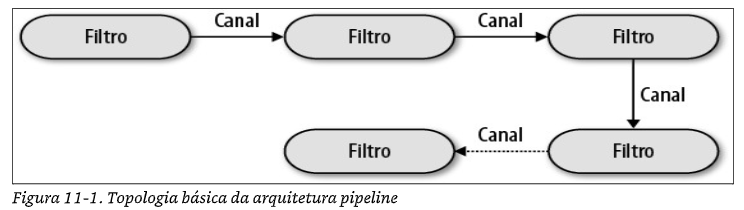

Os canais e os filtros coordenam-se de um modo específico, com os canais formando uma comunicação unidirecional entre os filtros, em geral de ponto a ponto.


## Canais
Os pipes foram o canal de comunicação com os filtros.


## Filtros
- são autonomos e independentes dos outros filtros
- devem realizar paenas uma tarefa

Tipos de filtros:
- produtor: ponto de partida, somente saída
- transformador: aceita entrada, opcionalmente transforma algum ou todos os dados, encaminha para o canal de saída
- verificador: aceita entrada, testa um ou mais critérios, produz saída. Semelhante com reduce (redução)
- consumidor: ponto de termino da pipeline, persiste o resultado no banco de dados ou exibe resultado numa tela de interface do usuário

More shell, less egg: https://leancrew.com/all-this/2011/12/more-shell-less-egg/
```bash
tr -cs A-Za-z '\n' |
tr A-Z a-z |
sort |
uniq -c |
sort -rn |
sed ${1}q
```


## Exemplo
As ferramentas ETL (extrair, transformar e carregar — do inglês extract, transform, load) utilizam a arquitetura pipeline também para o fluxo e a modificação dos dados de um banco de dados ou fonte de dados para outra.

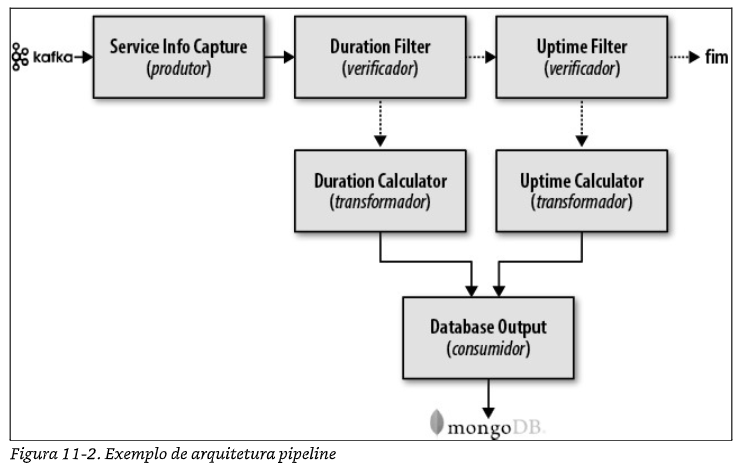


## Classificação das características
- 1 estrela não é bem suportado
- 5 estrela a característica é um recurso mais forte
- quantum arquitetural para a arquitetura pipeline é 1 e é monolítica

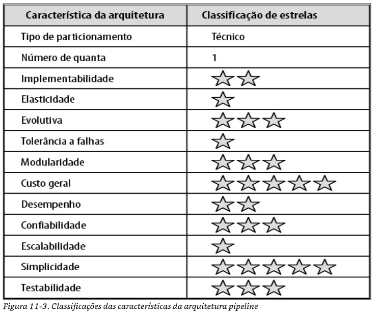


## Resumo
<details>
  <summary>Gerado por IA</summary>

  ### O Conceito em Linhas Gerais

  O estilo de arquitetura **pipeline** divide o processamento de dados em etapas sequenciais e independentes, inspirando-se no comportamento de terminais Unix (como *bash* e *zsh*) e em ferramentas de integração de dados como o **ETL** (extrair, transformar e carregar). Cada etapa realiza uma tarefa específica e passa o resultado para a próxima por meio de canais de comunicação unidirecionais.

  ---

  ### A Visão dos Autores (Richards & Ford)

  Mark Richards e Neal Ford detalham que este estilo estrutural é composto por dois elementos principais e possui características arquiteturais bem definidas:

  * **Topologia e Canais:** Os componentes se conectam de forma ponto a ponto e unidirecional. Os **pipes (canais)** atuam como o meio de transporte de dados entre os componentes.
  * **Tipos de Filtros:** Os filtros são autônomos, independentes e executam apenas uma única tarefa. Eles se dividem em quatro categorias:
  * **Produtor:** O ponto de partida; possui apenas saída.
  * **Transformador:** Recebe dados, pode modificá-los parcial ou totalmente e os encaminha para a saída.
  * **Verificador (ou Testador):** Avalia critérios específicos sobre os dados de entrada (semelhante à operação *reduce*).
  * **Consumidor:** O ponto final da pipeline; responsável por persistir os dados em banco ou exibi-los em interface.


  * **Quantum Arquitetural e Características:**
  * O **quantum arquitetural** (a unidade imutável de independência de implantação) é igual a **1**, sendo classificado como uma arquitetura **monolítica**.
  * A avaliação das características arquiteturais varia de acordo com a capacidade do modelo (de 1 a 5 estrelas), refletindo seus pontos fortes e limitações estruturais.
</details>


# Capítulo 12: Estilo de arquitetura microkernel
- também conhecido como arquitetura plug-in

## Topologia
- estrutura monolótica
- consiste de dois componentes: um sistema central e componentes plug-in

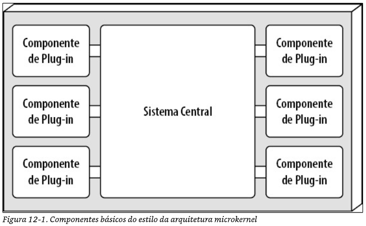

## Sistema Central
- O IDE eclipse é um bom exemplo

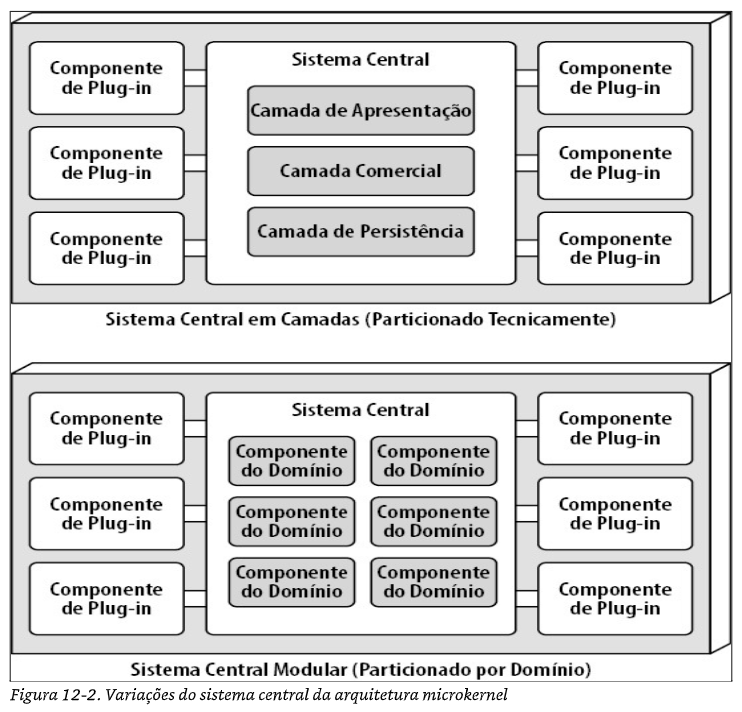

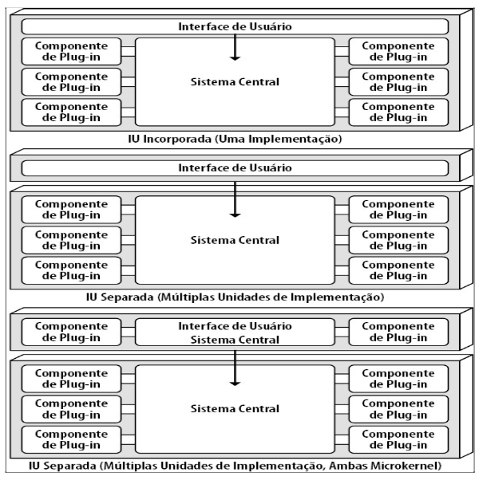


## Componentes de plugin
- são autonomos e independentes entre si

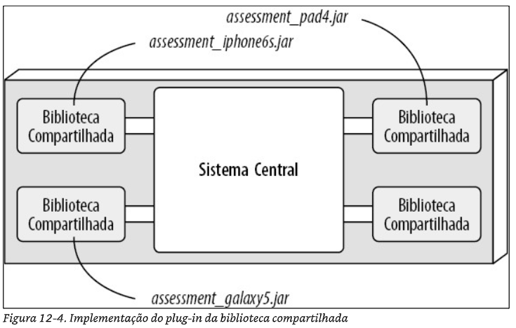

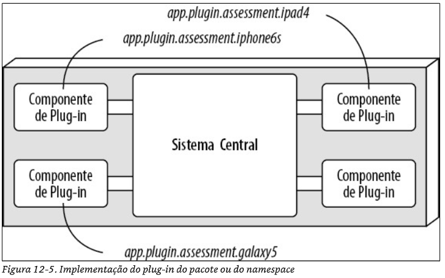

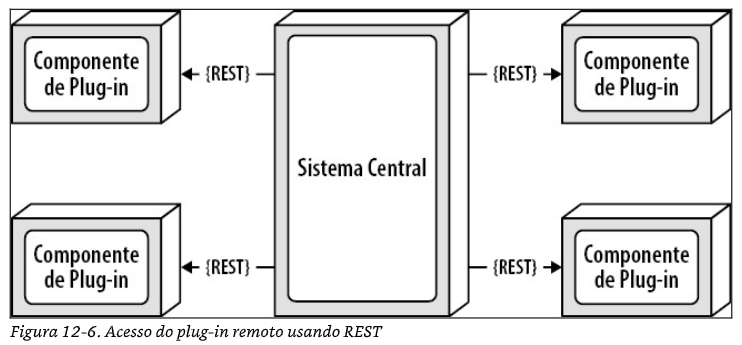

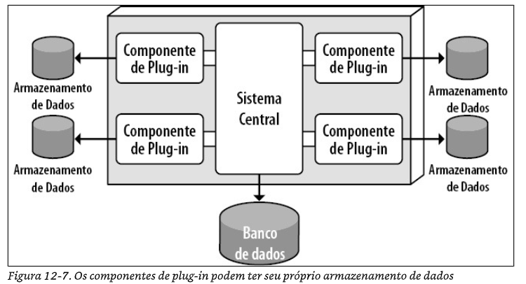


## Registro
- sistema central precisa saber quais módulos de plug-in estão disponíveis e como obtê-los
- registro contém informação de cada plug-in
- registro pode ser simples como uma estrutura de mapa ou complexa como uma ferramenta de registro e descoberta no sistema central

## Contrato
- contratos entre plug-in e sistema central
- contratos personalizados são comuns em plug-in desenvolvido por terceiro, mas cria-se um adaptador entre o contrato do plugin de terceiro e o seu contrato padrão 


## Exemplos e casos de uso
- Exemplos de software implementando a arquitetura microkernel:
  - eclipse
  - PMD
  - Jira
  - Jekins
  - Chrome
  - Firefox
- outra forma de utilização pode ser em sistemas complexos que possuem diversas regras de negócios que são alteradas ou adicionadas frequentemente. Cada regra nova pode ser adicionada como um plug-in (componente)


## Classificações das características da arquitetura
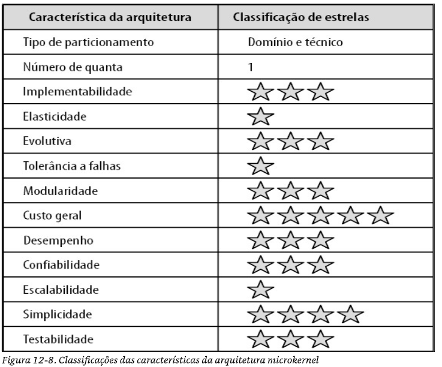


## Resumo
<details>
  <summary>Gerado por IA</summary>

  ### O Conceito em Linhas Gerais

  O **Estilo de Arquitetura Microkernel** (frequentemente chamado de **arquitetura plug-in**) é um padrão de projeto ideal para softwares que precisam ser extensíveis, adaptáveis e capazes de receber novos recursos sem que a aplicação principal precise ser totalmente reescrita.

  Pense nele como a estrutura de um navegador web ou de um videogame: existe um núcleo básico que faz o sistema funcionar e, ao seu redor, encaixamos extensões (plug-ins) que adicionam funcionalidades específicas conforme a necessidade do usuário.

  ---

  ### A Visão dos Autores (Richards & Ford)

  Segundo Mark Richards e Neal Ford, esta arquitetura divide o sistema em duas partes principais, garantindo flexibilidade e isolamento de funcionalidades:

  * **O Sistema Central (Core System):**
  * É a base mínima necessária para o funcionamento da aplicação.
  * Contém apenas a lógica essencial e o fluxo geral, servindo de hospedeiro para os plug-ins (um exemplo clássico citado pelos autores é o ambiente de desenvolvimento **Eclipse**).
  * Pode variar desde uma estrutura simples até variações que incluem interfaces de usuário próprias.


  * **Os Componentes Plug-in:**
  * São módulos autônomos e independentes entre si, contendo funcionalidades específicas, regras de negócio isoladas ou até mesmo seus próprios armazenamentos de dados.
  * Podem ser implementados de várias formas: desde bibliotecas compartilhadas e pacotes de namespace até serviços remotos via REST.


  * **Mecanismos de Integração (Registro e Contrato):**
  * **Registro:** O sistema central precisa descobrir quais plug-ins estão disponíveis. O registro armazena informações sobre cada um deles, variando de estruturas de mapas simples a ferramentas complexas de descoberta.
  * **Contrato:** Define as regras de comunicação entre o sistema central e os plug-ins. Quando lidamos com terceiros, é comum o uso de adaptadores para traduzir contratos externos para o padrão esperado pelo núcleo.


  * **Casos de Uso e Exemplos:**
  * Muito utilizado em ferramentas conhecidas como **Eclipse, Jira, Jenkins, Chrome, Firefox**, além de ferramentas de análise de código como o **PMD**.
  * Excelente para domínios complexos com regras de negócio altamente voláteis: cada regra nova pode ser isolada e adicionada como um plug-in independente.


  * **Características Arquiteturais:**
  * **Extensibilidade e Modularidade:** Altamente pontuadas, pois facilitam a adição de novos recursos de forma desacoplada.
  * **Implantação e Acoplamento:** Dependem de como os plug-ins são empacotados (se via bibliotecas locais ou serviços remotos), exigindo atenção ao versionamento e aos contratos estabelecidos com o núcleo.
</details>
